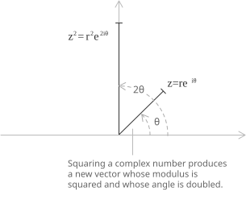
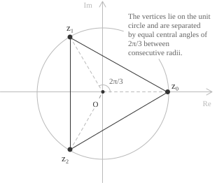

## Motivation

To compute a power of a complex number, the most direct approach is to start from its algebraic form](../complex-numbers-introduction/) and expand the expression term by term. For $z = a + ib$, squaring gives:

$$
\begin{aligned}
z^2 &= (a + ib)^2 \\
    &= a^2 + i2ab - b^2
\end{aligned}
$$

The procedure is valid for any integer exponent, but it becomes increasingly cumbersome as $n$ grows. The number of terms produced by the binomial expansion](../binomial-theorem/) of $(a+ib)^n$ grows with $n$, and the separation into real and imaginary parts requires repeated application of the identity $i^2 = -1$. Beyond the third or fourth power, the direct expansion is impractical. De Moivre's theorem provides a procedure based on the trigonometric form](../complex-numbers-trigonometric-form/) of $z$ that bypasses these manipulations entirely.

## Statement and exponential reformulation

Consider a complex number $z$ raised to an integer power $n \in \mathbb{Z}$, that is the expression:

$$z^n \qquad n \in \mathbb{Z}$$

Writing $z$ in trigonometric form gives:

$$z = r(\cos\theta + i\sin\theta)$$

For any integer $n$, the power $z^n$ is obtained by raising the modulus to the $n$-th power and multiplying the argument by $n$. The result is a new complex number in trigonometric form:

$$z^n = r^n(\cos(n\theta) + i\sin(n\theta))$$

The identity holds for every integer $n$, both positive and negative. When $n$ is a rational number $n = p/q$, the same expression continues to make sense, but the right-hand side produces only one of the $q$ distinct values of $z^{p/q}$. The full set of values is recovered by replacing $\theta$ with $\theta + 2k\pi$ for $k = 0, 1, \ldots, q-1$.

- - -

The trigonometric form admits an equivalent exponential reformulation. By Euler's formula the identity:

$$e^{i\theta} = \cos\theta + i\sin\theta$$

gives the exponential representation of $z$:

$$z = re^{i\theta}$$

In this form, De Moivre's theorem reduces to a direct application of the usual rules of exponentiation. Raising both sides to the integer power $n$ gives:

$$z^n = (re^{i\theta})^n = r^n e^{in\theta}$$

The modulus is raised to the $n$-th power and the argument is multiplied by $n$, with no algebraic expansion or trigonometric manipulation required.

## A proof by induction

De Moivre's theorem asserts that for every integer $n$ and every complex number $z = r(\cos\theta + i\sin\theta)$, the following identity holds.

$$z^n = r^n(\cos(n\theta) + i\sin(n\theta))$$

The formula is proved by induction on $n$. The argument has two parts:

+ verifying the base case
+ showing that validity at step $n$ forces validity at step $n+1$

- - -

For the base case, setting $n = 1$ reduces the formula to $z = r(\cos\theta + i\sin\theta)$, which is the trigonometric form of $z$ by definition. For the inductive step, suppose the formula holds for some integer $n \geq 1$:

$$z^n = r^n(\cos(n\theta) + i\sin(n\theta))$$

Multiplying both sides by $z = r(\cos\theta + i\sin\theta)$ and expanding the product gives:

$$z^{n+1} = r^{n+1}\bigl[(\cos(n\theta)\cos\theta - \sin(n\theta)\sin\theta) + i(\sin(n\theta)\cos\theta + \cos(n\theta)\sin\theta)\bigr]$$

The two expressions in brackets are the addition formulas for cosine and sine](../sine-and-cosine/). Applying these trigonometric identities](../trigonometric-identities/) collapses them to a single cosine and a single sine, and yields:

$$z^{n+1} = r^{n+1}(\cos((n+1)\theta) + i\sin((n+1)\theta))$$

The identity holds at step $n+1$, which completes the induction. The extension to negative integers follows from the formula $z^{-n} = 1/z^n$ combined with the identity $1/(\cos\alpha + i\sin\alpha) = \cos(-\alpha) + i\sin(-\alpha)$, which is a direct consequence of the parity of cosine and sine.

- - -

As a first illustration, squaring the complex number $z = re^{i\theta}$ gives:

$$z^2 = (re^{i\theta})^2 = r^2 e^{i2\theta}$$

  

The result is a complex number whose modulus is $r^2$ and whose argument is $2\theta$. Geometrically, the vector representing $z$ is stretched by a factor of $r$ in length and rotated to twice its original angle in the complex plane.

- - -

Consider the complex number $z = 2 + 2i$ and compute $z^4$. The modulus of $z$ is obtained by direct application of its definition:

$$|z| = \sqrt{2^2 + 2^2} = \sqrt{8} = 2\sqrt{2}$$

> The modulus of a complex number is its distance from the origin in the complex plane and is computed via the Pythagorean theorem](../pythagorean-theorem/) applied to its real and imaginary parts.

- - -

The argument of $z$ is determined by the arctangent of the ratio between imaginary and real parts:

$$\theta = \arg(z) = \arctan\left(\frac{2}{2}\right) = \frac{\pi}{4}$$

> Since real and imaginary parts are equal and both positive, $z$ lies on the bisector of the first quadrant, and the argument is exactly $45^\circ$, or $\pi/4$ radians.

- - -

Writing $z$ in exponential form gives:

$$z = 2\sqrt{2}e^{i\frac{\pi}{4}}$$

Applying De Moivre's theorem to compute $z^4$ produces:

$$z^4 = (2\sqrt{2})^4 \cdot e^{i \cdot 4 \cdot \frac{\pi}{4}} = (2\sqrt{2})^4 \cdot e^{i\pi}$$

The modulus is simplified using the rules for powers:

$$(2\sqrt{2})^4 = (2^1 \cdot 2^{1/2})^4 = (2^{3/2})^4 = 2^6 = 64$$

- - -

By Euler's formula evaluated at $\theta = \pi$ one has $e^{i\pi} = -1$, and the fourth power becomes:

$$z^4 = 64 \cdot (-1) = -64$$

> The same result can be verified by expanding $(2 + 2i)^4$ algebraically with the binomial theorem](../binomial-theorem/) and simplifying.

Hence the fourth power of $z = 2 + 2i$ is the real number $-64$.

## Deriving trigonometric identities

One of the practical applications of De Moivre's theorem is the derivation of explicit formulas for sine and cosine](../sine-and-cosine/) of multiple angles. The procedure expands the left-hand side of the theorem using the binomial theorem](../binomial-theorem/) and then separates the result into real and imaginary parts.

For $n = 3$, the theorem gives:

$$(\cos\theta + i\sin\theta)^3 = \cos(3\theta) + i\sin(3\theta)$$

Expanding the left-hand side with the binomial formula produces four terms:

$$(\cos\theta + i\sin\theta)^3 = \cos^3\theta + 3i\cos^2\theta\sin\theta + 3i^2\cos\theta\sin^2\theta + i^3\sin^3\theta$$

Using the identities $i^2 = -1$ and $i^3 = -i$, the expression collapses into a real and an imaginary part:

$$= (\cos^3\theta - 3\cos\theta\sin^2\theta) + i(3\cos^2\theta\sin\theta - \sin^3\theta)$$

Equating real and imaginary parts with the right-hand side of the theorem yields the triple-angle formulas:

$$\cos(3\theta) = \cos^3\theta - 3\cos\theta\sin^2\theta$$

$$\sin(3\theta) = 3\cos^2\theta\sin\theta - \sin^3\theta$$

Both follow from a single application of the binomial expansion, with no need for repeated use of the angle-sum trigonometric identities](../trigonometric-identities/). The procedure extends to any integer $n$: the binomial expansion of $(\cos\theta + i\sin\theta)^n$ always yields $\cos(n\theta)$ as its real part and $\sin(n\theta)$ as its imaginary part.

## Finding complex roots with De Moivre's theorem

De Moivre's theorem also produces the $n$-th roots of a complex number. Consider the equation:

$$z^n = w$$

where $w \in \mathbb{C}$. The unknowns are the complex numbers $z$ whose $n$-th power equals $w$. Since the argument of a complex number is defined modulo $2\pi$, the number $w$ is written in exponential form as:

$$w = re^{i(\theta + 2k\pi)} \qquad k \in \mathbb{Z}$$

Applying De Moivre's theorem to the equation $z^n = w$ and taking the $n$-th root of both sides gives the general formula for the $n$-th roots of $w$:

$$z_k = \sqrt[n]{r}\cdot e^{i\left(\frac{\theta + 2k\pi}{n}\right)} \qquad k = 0, 1, \ldots, n-1$$

The values $z_0, z_1, \ldots, z_{n-1}$ are exactly the $n$ distinct complex roots. They lie on a circle of radius $\sqrt[n]{r}$ centered at the origin, equally spaced by an angle of $2\pi/n$. Geometrically, the roots are the vertices of a regular polygon with $n$ sides inscribed in that circle. The case $w = 1$ recovers the roots of unity](../roots-of-unity/), and is treated in detail in the next example.

## Example 1

Consider the equation:

$$z^3 = 1$$

The real solution $z = 1$ is immediate, but in $\mathbb{C}$ the equation has three distinct solutions, equally spaced around the unit circle](../unit-circle/). 

  

Since the argument of $1$ is defined modulo $2\pi$, the number is written in exponential form as:

$$1 = e^{i \cdot 2k\pi} \qquad k \in \mathbb{Z}$$

Applying the general root formula with $r = 1$ and $\theta = 0$ gives:

$$z_k = \sqrt[3]{1}\cdot e^{i\left(\frac{2k\pi}{3}\right)} = e^{i \cdot \frac{2k\pi}{3}} \qquad k = 0, 1, 2$$

Evaluating the three roots explicitly via Euler's formula produces:

$$
\begin{aligned}
z_0 &= e^{i \cdot 0} = \cos(0) + i\sin(0) = 1 \\
z_1 &= e^{i \cdot \frac{2\pi}{3}} = \cos\left(\frac{2\pi}{3}\right) + i\sin\left(\frac{2\pi}{3}\right) = -\frac{1}{2} + i\frac{\sqrt{3}}{2} \\
z_2 &= e^{i \cdot \frac{4\pi}{3}} = \cos\left(\frac{4\pi}{3}\right) + i\sin\left(\frac{4\pi}{3}\right) = -\frac{1}{2} - i\frac{\sqrt{3}}{2}
\end{aligned}
$$

These are the three cube roots of unity](../roots-of-unity/), arranged in the complex plane as the vertices of an equilateral triangle inscribed in the unit circle.
