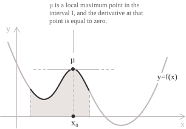
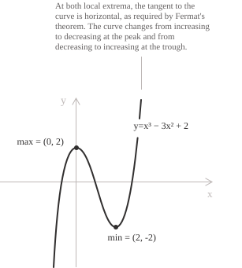
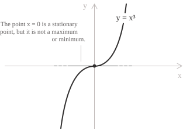
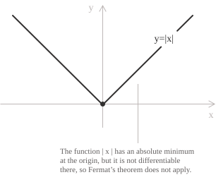

## Statement

Fermat's theorem is an important theorem in differential calculus. It states that every local maximum or minimum](../maximum-minimum-and-inflection-points/) of a differentiable function at an interior point of its domain is a stationary point, that is, a point where the first derivative of the function is zero and the tangent line is therefore parallel to the $x$-axis. To state the theorem formally, consider a function $y = f(x)$ defined on a closed and bounded interval $a, b]$ and differentiable on the open interval $(a, b).$ If $f(x)$ attains a local maximum or minimum at a point $x_0 \in (a, b),$ then the derivative of the function at that point is zero:

$$
f'(x_0) = 0 
$$

This situation is illustrated in the following graph, which shows a function $f(x)$ with a local maximum point $\mu$ inside a given interval. At that point, the tangent line to the graph is horizontal, parallel to the $x$-axis, so $(1)$ holds:

  

This condition is necessary but not sufficient, since a zero derivative at a point does not necessarily imply that the point is a maximum or minimum. Stationary points that are not extrema include, for example, inflection points with a horizontal tangent, where the derivative is zero but the function does not change from increasing to decreasing or vice versa.

> An interesting connection is that Fermat's theorem is also important because it is used in the proof of Rolle's theorem, which underlies the proof of Lagrange's theorem and, through it, Cauchy's theorem and l'Hôpital's rule for evaluating limits involving indeterminate forms](../indeterminate-forms/) such as $0/0$ and $\infty/\infty.$

- - -

We prove $(1)$ by assuming that the function has a local maximum point $\mu$ at $x_0.$ A neighborhood $I$ of $x_0$ therefore exists in which the following inequality holds:

$$
f(x) \leq f(x_0) \quad \forall \ x \in I 
$$

In $(2),$ set $x = x_0 + h,$ with $h \neq 0$ and sufficiently small in absolute value for $x_0 + h$ to belong to the interval $I.$ We can then rewrite $(2)$ as $f(x_0 + h) \leq f(x_0)$ and obtain:

$$
f(x_0 + h) - f(x_0) \leq 0 
$$

Looking at $(3),$ we can recognize the numerator of the difference quotient](../difference-quotient/) used to define derivatives. Dividing by $h$ gives two cases. When $h > 0,$ we obtain:

$$
\frac{f(x_0 + h) - f(x_0)}{h} \leq 0 
$$

For $h < 0,$ the direction of the inequality is reversed, and we obtain:

$$
\frac{f(x_0 + h) - f(x_0)}{h} \geq 0 
$$

By the definition of the derivative as the limit of the difference quotient, the limits in $(4)$ and $(5)$ satisfy the relations:

$$
\lim_{h \to 0^+} \frac{f(x_0 + h) - f(x_0)}{h} \leq 0 
$$

$$
\lim_{h \to 0^-} \frac{f(x_0 + h) - f(x_0)}{h} \geq 0 
$$

Since $f(x)$ is differentiable at $x_0,$ the right-hand and left-hand limits exist and both equal the derivative. Thus, $(6)$ and $(7)$ give the conclusion of the theorem:

$$
f'(x_0) = 0
$$

The proof above assumes that $x_0$ is a local maximum point. If $x_0$ is a local minimum point instead, the proof follows the same steps, but the directions of inequalities $(6)$ and $(7)$ are reversed, yielding the same conclusion.

## Example

To illustrate an application of the theorem, consider the following polynomial function](../polynomial-function/), which is continuous and differentiable throughout $\mathbb{R}:$

$$
f(x) = x^{3} - 3x^{2} + 2
$$

Assuming that a local maximum or minimum exists at an interior point of its domain, Fermat's theorem states that the derivative of the function at that point is zero. To find the maximum or minimum, we calculate the derivative of the function and determine where it vanishes:

$$ 
\begin{aligned}
f'(x) &= 3x^{2} - 6x \\
      &= 3x(x - 2)
\end{aligned}
$$

The expression in $(8)$ vanishes at $x = 0$ and $x = 2.$ We must now determine the nature of these points by examining the behavior of the derivative on the three intervals they define. For $x < 0,$ the derivative is positive and the function is increasing. Between $0$ and $2,$ the derivative is negative and the function is decreasing. For $x > 2,$ the derivative is positive and the function is increasing again.

  

[class="table-sign"]

The following sign chart summarizes the behavior of the derivative and the corresponding monotonicity of the function.

|         |            |    $0$     |    $2$     |
| :-----: | :--------: | :--------: | :--------: |
| $f'(x)$ |    $+$     |    $-$     |    $+$     |
| $f(x)$  | $\nearrow$ | $\searrow$ | $\nearrow$ |

[/class]

We can therefore conclude that the function has a local maximum at $x = 0$ and a local minimum at $x = 2.$ Calculating the corresponding function values gives $f(0) = 2$ and $f(2) = -2.$ On the graph, the local maximum point therefore has coordinates $(0, 2),$ while the local minimum point has coordinates $(2, -2).$

> Keep in mind that, in this example, Fermat's theorem identifies $x = 0$ and $x = 2$ as candidates for local extrema, while the change in sign of the derivative allows us to classify them as such.

- - -

As we have already stated, not all stationary points are necessarily maximum or minimum points. We take, for example, the function $f(x) = x^3$ to show that a zero derivative does not necessarily imply a local extremum.

  

Calculating the derivative gives:

$$
f'(x) = 3x^2
$$

At $x = 0,$ we have $f'(0) = 0,$ so $x = 0$ is a stationary point. However, although the derivative is zero, the point is neither a local maximum nor a local minimum, as is also evident from the graph. It is an inflection point with a horizontal tangent, where the derivative is zero while the function remains increasing on both sides.

## The second-derivative test

In the preceding example, we classified the stationary points by examining the sign of the first derivative. An alternative test for obtaining the same classification uses the second derivative](../higher-order-derivatives/), which gives a sufficient condition rather than only a necessary one. Consider a function $f$ that is twice differentiable in a neighborhood of a point $x_0$ where $f'(x_0) = 0.$ Depending on the value of $f''(x_0),$ we can distinguish three cases.

+ If $f''(x_0) > 0,$ then $x_0$ is a local minimum point of $f.$
+ If $f''(x_0) < 0,$ then $x_0$ is a local maximum point of $f.$
+ If $f''(x_0) = 0,$ the test does not determine whether $x_0$ is a maximum or minimum, and further information is needed.

To prove the first two cases, we compare the value $f(x_0)$ with the function values at nearby points $x_0 + h.$ For this purpose, we use a second-order Taylor expansion](../taylor-formula-with-remainder/) and obtain:

$$
f(x_0 + h) = f(x_0) + \tfrac{1}{2} f''(x_0) h^2 + o(h^2) 
$$

Subtracting $f(x_0)$ from both sides of $(9)$ and dividing by $h^2$ gives:

$$
\frac{f(x_0 + h) - f(x_0)}{h^2} = \frac{1}{2}f''(x_0) + \frac{o(h^2)}{h^2} 
$$

As $h \to 0,$ the term $o(h^2)/h^2$ tends to zero, so the expression in $(10)$ tends to $\frac{1}{2}f''(x_0).$ If $f''(x_0) \neq 0,$ then for nonzero $h$ sufficiently small in absolute value, the quotient has the same sign as $f''(x_0).$ The following conclusions therefore hold:

+ If $f''(x_0) > 0,$ then $f(x_0 + h) > f(x_0),$ so at every point sufficiently close to $x_0$ and distinct from it, the function value is greater than $f(x_0).$ Thus, $x_0$ is a local minimum point.
+ If $f''(x_0) < 0,$ the reverse inequality holds, so $x_0$ is a local maximum point.

- - -

In the third case, suppose that $f$ is differentiable up to order $k$ in a neighborhood of $x_0$ and that $f^{(k)}(x_0)$ is the first nonzero derivative, with $k \geq 2.$ We distinguish two cases:

+ If $k$ is even, $x_0$ is a local minimum point if $f^{(k)}(x_0) > 0$ or a local maximum point if $f^{(k)}(x_0) < 0.$
+ If $k$ is odd, $x_0$ is an inflection point with a horizontal tangent and is not an extremum.

For example, return to the function $f(x) = x^3$ considered earlier. At $x = 0,$ the first and second derivatives vanish, so the point is stationary, but the second-derivative test does not classify it. We therefore calculate the third derivative, which gives $f'''(0) = 6.$ Thus, the first nonzero derivative at the point has order $k = 3,$ and since this order is odd, $x = 0$ is an inflection point with a horizontal tangent.

As another example, consider the function $f(x) = x^4.$ Again, the first and second derivatives vanish at $x = 0,$ but continuing the calculation gives $f'''(0) = 0$ as well. Calculating the fourth derivative instead gives $f^{(4)}(0) = 24.$ This time, the first nonzero derivative at the point has even order, $k = 4,$ and its value is positive, so we can conclude that $x = 0$ is a local minimum point.

## Why the hypotheses are necessary

In the preceding examples, we looked for extrema among the stationary points and then studied their nature. To apply Fermat's theorem to a local extremum, the point must be interior to the domain, and the function must be differentiable there. The following examples show what happens when one of these conditions is missing. Consider the absolute value function](../absolute-value-function/), defined on the entire real line by the formula:

$$
y = f(x) = |x| =
\begin{cases}
+x & \text{if } x \ge 0\\
-x & \text{if } x < 0
\end{cases}
$$

Since $|x| \geq 0$ for every $x \in \mathbb{R}$ and $f(0) = 0,$ the function has an absolute minimum at $x = 0.$ This point is interior to the domain, but the function is not differentiable](../points-of-non-differentiability/) there because its left-hand derivative is $-1,$ while its right-hand derivative is $1.$ As the graph also shows, a minimum point exists, but the differentiability hypothesis required by the theorem is not satisfied.

  

For one further example, consider the function $f(x) = x$ and restrict its domain to the interval $[0,1].$ The function then attains an absolute minimum at $(0,0)$ and an absolute maximum at $(1,1),$ yet its derivative is $f'(x) = 1$ throughout the open interval $(0,1),$ so there are no stationary points. Fermat's theorem therefore does not apply at $x = 0$ and $x = 1,$ because these points are not interior to the interval.
