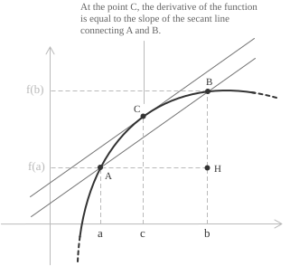

## Statement

**Theorem.** Consider a function $f(x)$, continuous in the closed and bounded interval $a, b]$ and differentiable at every point inside the interval. Then, there exists at least one point $c$ inside the interval such that the following relation holds:

$$
f'(c) = \frac{f(b)-f(a)}{b-a}
$$

This means that there exists at least one point where the derivative of the function is equal to the slope of the secant line connecting $a$ and $b$. In other words, at some point in the interval, the instantaneous rate of change of the function matches its average rate of change.

This theorem (also known as the Mean Value Theorem) states, from a geometric point of view, that there exists at least one point $c$ where the tangent line at that point is parallel to the secant line connecting points $A$ and $B$ on the graph.

  

In the right-angled triangle $ABH$, we have $\overline{BH} = \overline{AH} \cdot \tan{\alpha}$ that is:

$$\tan{\alpha} = \frac{\overline{BH}}{\overline{AH}} $$

We have:

$$  
\begin{aligned}  
\overline{BH} &= f(b)-f(a) \\  
\overline{AH} &= b-a
\end{aligned}  
$$

The slope of segment $AB$ is equal to $\tan\alpha$ that is:

$$\tan{\alpha} = \frac{f(b)-f(a)}{b-a} $$

Since the tangent at $c$ to the curve is parallel to $AB$, both have the same slope, hence:

$$f'(c) = \frac{f(b)-f(a)}{b-a} $$

## Proof

To prove Lagrange's theorem we define an auxiliary function $\varphi(x)$ as follows:

$$
\varphi(x) = f(x)-f(a)-\frac{f(b)-f(a)}{b-a} \cdot (x-a)
$$

We verify that $\varphi(x)$ satisfies the hypotheses of Rolle's Theorem:

+ $f(x)$ is continuous on the closed interval $a, b]$.  
+ $f(x)$ is differentiable on the open interval $(a, b)$.  
+ $\varphi(a) = \varphi(b)$.

By calculating $\varphi(a)$ and $\varphi(b)$, we obtain:

 $$
  \varphi(a) = f(a)-f(a)-\frac{f(b)-f(a)}{b-a} \cdot (a-a) = 0
  $$
  $$
\begin{aligned}
  \varphi(b) &= f(b)-f(a)-\frac{f(b)-f(a)}{b-a} \cdot (b-a)\\[0.5em]
             &= f(b)-(f(b)-f(a)) = 0
\end{aligned}
  $$

Therefore, $\varphi(a) = \varphi(b) = 0$.

Applying Rolle's Theorem to $\varphi(x)$, we find that there exists at least one point $c$ within the interval $]a, b$ such that $\varphi'(c) = 0$. Calculating the [derivative of $\varphi(x)$, we have:

$$ \varphi'(x) = f'(x)-\frac{f(b)-f(a)}{b-a}$$

Now, we calculate the derivative of $\varphi(x)$ at the point $c$ and set it equal to 0. From this, we obtain:

$$ \varphi'(c) = f'(c)-\frac{f(b)-f(a)}{b-a} = 0$$

That is:

$$ f'(c)=\frac{f(b)-f(a)}{b-a}$$

which corresponds exactly to the thesis we wanted to prove.

> The mean value theorem is itself a special case of Cauchy's theorem, in which the second function is taken to be the identity. From this more general statement one also obtains L'Hopital's rule for the evaluation of indeterminate limits.

## Corollaries on monotonicity

Lagrange's theorem yields three corollaries that connect the sign of the derivative to the qualitative behaviour of the function. Let $f$ be continuous on $a, b]$ and differentiable on $(a, b)$. The following statements hold.

+ If $f'(x) > 0$ for every $x \in (a, b)$, then $f$ is strictly increasing on $a, b]$.
+ If $f'(x) < 0$ for every $x \in (a, b)$, then $f$ is strictly decreasing on $a, b]$.
+ If $f'(x) = 0$ for every $x \in (a, b)$, then $f$ is constant on $a, b]$.

The argument is uniform across the three cases. Take any two points $x_1, x_2 \in a, b]$ with $x_1 < x_2$, and apply Lagrange's theorem on the subinterval $[x_1, x_2]$. There exists $c \in (x_1, x_2)$ such that:

$$
f(x_2) - f(x_1) = f'(c) \cdot (x_2 - x_1)
$$

The factor $x_2 - x_1$ is positive by construction, so the sign of $f(x_2) - f(x_1)$ coincides with the sign of $f'(c)$. If $f'$ is positive throughout $(a, b)$, then $f(x_2) > f(x_1)$ and the function is strictly increasing. 

The case $f' < 0$ is symmetric and yields the decreasing behaviour. If $f'$ vanishes identically, then $f(x_2) = f(x_1)$ for every pair $x_1, x_2$, hence $f$ is constant.

> The hypothesis $f'(x) > 0$ on the open interval is enough to conclude strict monotonicity on the closed interval, including the endpoints. The derivative need not exist at $a$ or $b$, only the values $f(a)$ and $f(b)$ are involved through continuity.

- - -

A consequence of the third corollary is the characterisation of two functions having the same derivative. Suppose that $f$ and $g$ are continuous on $a, b]$, differentiable on $(a, b)$, and satisfy $f'(x) = g'(x)$ for every $x \in (a, b)$. Setting $h(x) = f(x) - g(x)$, the derivative $h'(x) = f'(x) - g'(x)$ vanishes identically on $(a, b)$. By the third corollary, $h$ is constant on $a, b]$, that is, there exists $C \in \mathbb{R}$ such that:

$$
f(x) - g(x) = C \quad \forall \ x  \in a, b]
$$

Two functions with the same derivative on a connected interval differ therefore by an additive constant. The result is the foundation of the theory of indefinite integrals](../indefinite-integrals/), where it justifies the appearance of the integration constant. The same identity is also the analytic bridge to the fundamental theorem of calculus](../fundamental-theorem-of-calculus/), which converts this qualitative statement into the explicit rule for computing definite integrals from any antiderivative.

> Connectedness of the domain is essential. On the disjoint union of two intervals, two functions with the same derivative may differ by distinct constants on each component, so the conclusion no longer reduces to a single constant.

## A Lipschitz-type estimate

Lagrange's theorem provides a quantitative bound on the increment of $f$ in terms of the magnitude of its derivative. If $|f'(x)| \leq M$ for every $x \in (a, b)$, then for any pair of points $x_1, x_2 \in a, b]$:

$$
|f(x_2) - f(x_1)| \leq M \, |x_2 - x_1|
$$

The estimate follows by applying the theorem on $[x_1, x_2]$ and taking absolute values: 

$$|f(x_2) - f(x_1)| = |f'(c)| \, |x_2 - x_1| \leq M \, |x_2 - x_1|$$

A function whose derivative is bounded on an interval is therefore Lipschitz continuous on that interval, with Lipschitz constant at most $M$. This inequality form of the mean value theorem is the one most frequently used in error estimates and stability arguments in real analysis.

## Example 1

To see the theorem at work, let us examine a concrete case. We want to identify a point $c$ inside a given interval where the instantaneous rate of change of a function coincides with its average rate of change on that interval. The computation also shows that such a point is not something one can usually predict by inspection. Consider the polynomial:

$$
f(x) = x^3 - 4x^2 + x + 6
$$

on the closed interval $[1,4]$. Being a polynomial, $f$ is continuous on $[1,4]$ and differentiable on $(1,4)$. The assumptions of Lagrange's theorem are therefore satisfied. We begin by evaluating the function at the endpoints:

$$
f(1) = 1 - 4 + 1 + 6 = 4
$$
$$
f(4) = 64 - 64 + 4 + 6 = 10
$$

The slope of the secant line through the points $(1,4)$ and $(4,10)$ is:

$$
\begin{aligned}
\frac{f(4) - f(1)}{4 - 1}
  &= \frac{10 - 4}{3} \\
  &= 2
\end{aligned}
$$

This number represents the average rate of change of $f$ over $[1,4]$. Next we compute the derivative:

$$
f'(x) = 3x^2 - 8x + 1
$$

We look for values of $c$ such that $f'(c) = 2.$ This leads to the equation:

$$
3c^2 - 8c + 1 = 2
$$
$$
3c^2 - 8c - 1 = 0
$$

Applying the quadratic formula](../quadratic-formula/) gives:

$$
\begin{aligned}
c &= \frac{8 \pm \sqrt{64 + 12}}{6} \\
  &= \frac{8 \pm \sqrt{76}}{6} \\
  &= \frac{4 \pm \sqrt{19}}{3}
\end{aligned}
$$

We obtain two candidates:

$$
c_1 = \frac{4 - \sqrt{19}}{3} \approx 0.21
$$
$$
c_2 = \frac{4 + \sqrt{19}}{3} \approx 2.79
$$

Lagrange's theorem guarantees a solution inside the open interval $]1,4[$. Among the two values found, only:

$$
c = \frac{4 + \sqrt{19}}{3} \approx 2.79
$$

lies in $(1,4)$. The other root falls outside the interval and is therefore not relevant in this context. At this point, the tangent line to the graph of $f$ is parallel to the secant line joining $(1,4)$ and $(4,10)$. The solution is:

$$ c = \dfrac{4+\sqrt{19}}{3} $$

> This example shows that the equation $f'(c)=2$ may admit more than one solution, yet only those inside the interval are meaningful for the theorem.