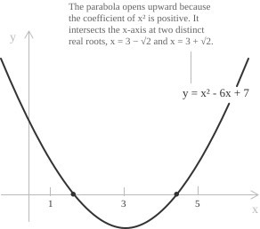
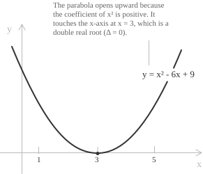
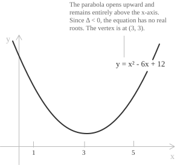

## From equation to curve

A quadratic equation](../quadratic-equations/) in standard form is given by:

$$ax^2 + bx + c = 0, \quad a \neq 0$$

This relation involves a single unknown $x$ and the values that satisfy it are isolated numbers. A geometric reading becomes possible once the left-hand side is regarded as the output of a function of $x$, that is, once we introduce a second variable:

$$y = ax^2 + bx + c$$

The pairs $(x, y)$ that satisfy this relation form a parabola in the Cartesian plane](../the-cartesian-coordinate-plane/). Solving the original equation then amounts to asking for which values of $x$ the output $y$ equals zero, so the algebraic problem of finding the roots is translated into the geometric problem of locating the points where the parabola meets the horizontal axis.

  

The shape and position of the parabola are governed by the three coefficients.

+ The coefficient $a$ controls the direction and the width of the curve. Its sign decides whether the parabola opens upward or downward, while larger values of $|a|$ make the graph narrower and smaller values make it wider.
+ The coefficient $b$, acting together with $a$, fixes the horizontal location of the axis of symmetry and therefore of the vertex, whose abscissa is $-b/2a$.
+ The constant term $c$ gives the height at which the curve crosses the vertical axis, since setting $x = 0$ yields $y = c$.

> A full account of the parabola as a curve, including its focus and directrix, belongs to the dedicated entry. The discussion here is limited to the geometric content carried by the equation and its solutions.

## Roots as intersections with the horizontal axis

The points of the plane lying on the $x$-axis are exactly those with $y = 0$. Imposing this condition on the parabola $y = ax^2 + bx + c$ returns the original equation $ax^2 + bx + c = 0$. The real solutions are therefore the abscissas of the points at which the parabola crosses or touches the horizontal axis.

This correspondence gives each root a concrete geometric counterpart. A root $x_1$ corresponds to the intersection point $(x_1, 0)$, and the number of real roots equals the number of such intersection points. The position of the parabola relative to the axis thus encodes the entire solution set of the equation.

## The discriminant as a geometric criterion

The number of intersections with the horizontal axis is governed by the discriminant:

$$\Delta = b^2 - 4ac$$

Three cases arise according to its sign.

**Case 1.** When $\Delta > 0$ the parabola crosses the axis at two distinct points, and the equation has two distinct real roots.

  

**Case 2.** When $\Delta = 0$ the parabola is tangent to the axis at a single point, which is the vertex, and the equation has one real root of multiplicity two.

  

**Case 3** When $\Delta < 0$ the parabola lies entirely above or entirely below the axis, with no intersection, and the equation has no real root.

  

In the last case the two solutions are a pair of complex conjugates](../quadratic-equations-with-complex-solutions/), which have no representation as points of the real axis. The discriminant therefore reads, at a glance, the qualitative relationship between the curve and the line $y = 0$.

## Axis of symmetry and vertex

Every parabola of the form $y = ax^2 + bx + c$ is symmetric with respect to the vertical line of equation:

$$x = -\frac{b}{2a}$$

This line is the axis of symmetry, and it passes through the vertex, whose coordinates are obtained by evaluating the function at the abscissa of the axis:

$$V = \left(-\frac{b}{2a},\ -\frac{\Delta}{4a}\right)$$

The vertex is a minimum when $a > 0$ and a maximum when $a < 0$, in accordance with the maximum or minimum](../maximum-minimum-and-inflection-points/) character of the curve. The ordinate $-\Delta/4a$ also confirms the criterion of the previous section: its sign, combined with the sign of $a$, determines whether the vertex lies above, on, or below the horizontal axis, which is precisely what fixes the number of real roots.

The two roots are placed symmetrically about the axis. Writing them through the quadratic formula](../quadratic-formula/) gives:

$$x_{1,2} = -\frac{b}{2a} \pm \frac{\sqrt{\Delta}}{2a}$$

The common term $-b/2a$ is the abscissa of the axis, so the midpoint of the two intersection points coincides with the foot of the axis of symmetry. The distance of each root from the axis is $\sqrt{\Delta}/2|a|$, which collapses to zero exactly when $\Delta = 0$, the case in which the two intersections merge into the point of tangency.

## Sign of the quadratic

The graph also displays the sign taken by the expression $ax^2 + bx + c$ as $x$ varies, since the value of $y$ is positive where the curve lies above the axis and negative where it lies below. This reading is the geometric basis for solving quadratic inequalities.

+ When $\Delta > 0$, with roots $x_1 < x_2$, the curve lies on one side of the axis between the roots and on the opposite side outside the interval $(x_1, x_2)$. If $a > 0$ the expression is negative on $(x_1, x_2)$ and positive elsewhere, while if $a < 0$ the signs are reversed.
+ When $\Delta = 0$, the curve touches the axis at the single root and stays on the same side everywhere else, so the expression keeps the sign of $a$ for every $x$ different from the root.
+ When $\Delta < 0$, the curve never meets the axis and the expression keeps the sign of $a$ for every real $x$.

## Orientation of the axis

The parabolas considered so far have their axis parallel to the $y$-axis, which is the configuration associated with the function $y = ax^2 + bx + c$. The roles of the two variables can be exchanged, producing a parabola with axis parallel to the $x$-axis.

For the form $f(x) = ax^2 + bx + c$, with axis parallel to the $y$-axis, the orientation is the following:

+ If $a > 0$, the parabola opens upward and the vertex is a minimum.
+ If $a < 0$, the parabola opens downward and the vertex is a maximum.

The vertex has coordinates:

$$V = \left(-\frac{b}{2a},\ f\left(-\frac{b}{2a}\right)\right)$$

For the form $f(y) = ay^2 + by + c$, with axis parallel to the $x$-axis, the orientation is instead the following:

+ If $a > 0$, the parabola opens to the right.
+ If $a < 0$, the parabola opens to the left.

The vertex has coordinates:

$$V = \left(f\left(-\frac{b}{2a}\right),\ -\frac{b}{2a}\right)$$

> Only the first form corresponds to a function $y$ of $x$, and only this form represents a quadratic equation in the unknown $x$. The second form describes a quadratic relation in $y$ and is included for completeness of the geometric picture.

## Vertex form and geometric transformations

Completing the square rewrites the trinomial in vertex form](../completing-the-square/):

$$y = a\left(x + \frac{b}{2a}\right)^2 - \frac{\Delta}{4a}$$

This expression exhibits the parabola as the curve $y = ax^2$ subjected to two rigid translations: a horizontal shift by $-b/2a$ and a vertical shift by $-\Delta/4a$. The first moves the axis of symmetry away from the $y$-axis, the second raises or lowers the vertex relative to the horizontal axis. All parabolas with the same leading coefficient $a$ are therefore congruent, differing only by their position in the plane.

This viewpoint makes the influence of the coefficients transparent. The number $a$ is the only intrinsic feature of the shape, while $b$ and $c$ act through the two translations that carry the standard parabola $y = ax^2$ into its final location, where its meeting with the horizontal axis records the solutions of the equation.

## Vertex and symmetry in special cases

Two configurations of the coefficients give parabolas with a particularly simple position.

When $b = 0$ and $c \neq 0$, the equation becomes $y = ax^2 + c$. The axis of symmetry is the $y$-axis itself, and the vertex sits on it at the point $V(0, c)$. The parabola is the standard curve $y = ax^2$ shifted vertically by $c$, so it meets the horizontal axis only when $a$ and $c$ have opposite signs.

When $c = 0$ and $b \neq 0$, the equation becomes $y = ax^2 + bx$. The constant term vanishes, so substituting $x = 0$ gives $y = 0$ and the parabola passes through the origin. The two roots are $x = 0$ and $x = -b/a$, and the vertex lies halfway between them at:

$$V\left(-\frac{b}{2a},\ -\frac{b^2}{4a}\right)$$
