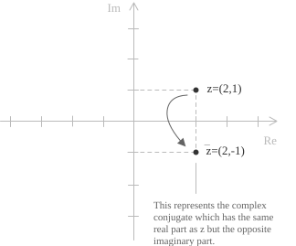

## Real and complex solutions

The nature of the solutions of a quadratic equation](../quadratic-equations/) is determined entirely by the sign of the discriminant $\Delta = b^2 - 4ac$, which appears under the radical in the quadratic formula](../quadratic-formula/):

$$x = \frac{-b \pm \sqrt{b^2 - 4ac}}{2a}$$

When $\Delta > 0$, the equation has two distinct real solutions. When $\Delta = 0$, the two solutions coincide and the equation has a single real root, counted with multiplicity two. When $\Delta < 0$, the square root of a negative number is involved and the equation has no real solution. It admits, however, exactly two solutions in the field of complex numbers](../complex-numbers-introduction/), which always appear as a conjugate pair.

- - -

By the Fundamental Theorem of Algebra](../roots-of-a-polynomial/), a polynomial equation of degree $n$ has exactly $n$ roots in $\mathbb{C}$, counted with multiplicity. Applied to the quadratic case, this guarantees that every equation of the form $ax^2 + bx + c = 0$ has exactly two roots in $\mathbb{C}$, regardless of the sign of the discriminant. The three cases above describe how those two roots are distributed: two real and distinct, one real and repeated, or two non-real conjugates.

## The complex conjugate

Given a complex number $z = a + ib$, its conjugate is obtained by reversing the sign of the imaginary part:

$$\overline{z} = a - ib$$

The number $\overline{z}$ is represented in the Gaussian plane by the point symmetric to $z$ with respect to the real axis. 

  

A number is real precisely when it coincides with its conjugate, since $z = \overline{z}$ forces the imaginary part to vanish.

> Conjugation preserves the algebraic operations. For any two complex numbers $w$ and $z$ one has $\overline{w + z} = \overline{w} + \overline{z}$ and $\overline{wz} = \overline{w}\overline{z}$. These two identities are the only facts about conjugation used in the argument that follows.

## Complex conjugate roots

When the coefficients $a$, $b$, and $c$ are real, the complex roots of $ax^2 + bx + c = 0$ always occur in conjugate pairs. If $z \in \mathbb{C}$ is a solution, then $\overline{z}$ is also a solution.

Suppose $az^2 + bz + c = 0$. Taking the conjugate of both sides, and using that conjugation distributes over sums and products, gives:

$$\overline{az^2 + bz + c} = \overline{a}(\overline{z})^2 + \overline{b}\overline{z} + \overline{c} = \overline{0}$$

Since every real number equals its own conjugate, we have $\overline{a} = a$, $\overline{b} = b$, $\overline{c} = c$, and $\overline{0} = 0$. The relation therefore reduces to:

$$a(\overline{z})^2 + b\overline{z} + c = 0$$

This is the original equation evaluated at $\overline{z}$, so $\overline{z}$ is a root of the same equation. When $\Delta < 0$ the two roots are distinct and non-real, hence they form a genuine conjugate pair.

> The hypothesis that the coefficients are real is essential. For an equation such as $x^2 + ix + 1 = 0$, whose coefficients are not all real, the roots need not be conjugate to one another.

## The general form of the complex roots

When $\Delta < 0$, the quantity $4ac - b^2$ is positive, and the square root of the discriminant can be written in terms of the imaginary unit as $\sqrt{b^2 - 4ac} = i\sqrt{4ac - b^2}$. Substituting this into the quadratic formula gives a closed expression for the two roots:

$$x_{1,2} = -\frac{b}{2a} \pm \frac{\sqrt{4ac - b^2}}{2a}i$$

The real part of both roots equals $-\dfrac{b}{2a}$, while the imaginary parts are opposite in sign. This makes the conjugate relationship explicit: the two roots share the same real part and differ only in the sign of the imaginary part.

## Sum and product of the roots

The relationship between the roots and the coefficients, expressed by the Vieta formulas](../vieta-formulas/), holds in $\mathbb{C}$ exactly as it does over the reals. For the roots $z$ and $\overline{z}$ of $ax^2 + bx + c = 0$ one has:

$$z + \overline{z} = -\frac{b}{a} \qquad z\overline{z} = \frac{c}{a}$$

Writing $z = p + iq$, the sum becomes $z + \overline{z} = 2p$ and the product becomes $z\overline{z} = p^2 + q^2$. Both quantities are real, as required by the fact that $a$, $b$, $c$ are real. The product equals the squared modulus $|z|^2$, which is strictly positive whenever the imaginary part does not vanish.

These two identities allow a quadratic with real coefficients to be reconstructed from a single one of its complex roots. Dividing $ax^2 + bx + c = 0$ by $a$ produces the monic equation:

$$x^2 - (z + \overline{z})x + z\overline{z} = 0$$

## Example 1

Solve the quadratic equation:

$$x^2 + 4x + 5 = 0$$

The equation is already in standard form $ax^2 + bx + c = 0$, with coefficients $a = 1$, $b = 4$, and $c = 5$. Substituting into the quadratic formula](../quadratic-formula/) gives:

$$x_{1,2} = \frac{-4 \pm \sqrt{4^2 - 4 \cdot 1 \cdot 5}}{2 \cdot 1}$$

The discriminant is negative:

$$\Delta = 16 - 20 = -4$$

Since $\Delta < 0$, the equation has no real solution. Writing $\sqrt{-4} = 2i$ and continuing with the quadratic formula gives:

$$x_{1,2} = \frac{-4 \pm 2i}{2}$$

Simplifying, the two complex conjugate solutions are:

$$x_1 = -2 + i \qquad x_2 = -2 - i$$

A direct check confirms the result. The sum of the roots is $x_1 + x_2 = -4$, in agreement with $-\dfrac{b}{a} = -4$, and the product is $x_1 x_2 = (-2)^2 - i^2 = 4 + 1 = 5$, in agreement with $\dfrac{c}{a} = 5$.

## Example 2

The next example illustrates the case in which the discriminant is negative and the coefficients are not all integers, requiring an additional simplification before the solutions can be written in standard complex form. Consider the equation:

$$3x^2 - 2x + 4 = 0$$

The equation is in standard form with coefficients $a = 3$, $b = -2$, and $c = 4$. Substituting into the quadratic formula](../quadratic-formula/) gives:

$$x_{1,2} = \frac{2 \pm \sqrt{(-2)^2 - 4 \cdot 3 \cdot 4}}{2 \cdot 3}$$

Computing the discriminant:

$$\Delta = 4 - 48 = -44$$

Since $\Delta < 0$, the equation has no real solution. Writing $\sqrt{-44} = 2\sqrt{11}i$ gives:

$$x_{1,2} = \frac{2 \pm 2\sqrt{11}i}{6} = \frac{1 \pm \sqrt{11}i}{3}$$

The two complex conjugate solutions are therefore:

$$x_1 = \frac{1 + \sqrt{11}i}{3} \qquad x_2 = \frac{1 - \sqrt{11}i}{3}$$

The real part $\dfrac{1}{3}$ agrees with the general expression $-\dfrac{b}{2a} = \dfrac{2}{6} = \dfrac{1}{3}$, which provides a quick consistency check on the computation.

## Example 3

The relations between roots and coefficients can also be used in reverse, to build a quadratic equation with real coefficients starting from one of its complex roots. Suppose one root is known to be:

$$z = 3 - 2i$$

Because the coefficients are required to be real, the second root is the conjugate $\overline{z} = 3 + 2i$. The sum and product of the two roots are:

$$z + \overline{z} = 6 \qquad z\overline{z} = 3^2 + 2^2 = 13$$

Substituting these values into the monic form $x^2 - (z + \overline{z})x + z\overline{z} = 0$ yields:

$$x^2 - 6x + 13 = 0$$

The discriminant of this equation is $\Delta = 36 - 52 = -16$, confirming that the roots are non-real, and solving it returns $3 \pm 2i$, as expected.
