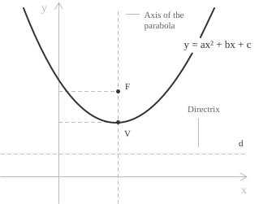

## Introduction

A quadratic equation is a polynomial equation](../polynomial-equations/) of degree two in one unknown. Its standard form is:

$$ax^2 + bx + c = 0 $$

In this expression $a,$ $b,$ and $c$ are real coefficients, with $a \neq 0,$ while $x$ is the unknown. The coefficient $a$ multiplies the quadratic term $x^2,$ the coefficient $b$ multiplies the linear term $x,$ and $c$ is the constant term. When $a = 0$ and $b \neq 0,$ equation $(1)$ reduces to a linear equation](../linear-equations/) of the form $bx + c = 0.$ If both $a$ and $b$ are zero, the equation contains only the constant term and has no solutions when $c \neq 0,$ but infinitely many when $c = 0.$

A quadratic equation is the simplest case of a trinomial equation](../trinomial-equations/), whose standard form is:

$$ax^{2n} + bx^{n} + c = 0 $$

Setting $n = 1$ in $(2)$ gives $(1).$ For $n \geq 2,$ the equation can be reduced to a quadratic equation in the auxiliary variable $y = x^n$ and solved using the same techniques discussed later in this section.

Replacing the equality sign in $(1)$ with one of the relations $<,$ $>,$ $\leq,$ or $\geq$ gives a quadratic inequality](../quadratic-inequalities/), which is solved by studying the sign of the same quadratic expression.

- - -

Geometrically, the graph of $y = ax^2 + bx + c$ is a parabola. This correspondence is discussed in greater detail in the entry on the geometrical meaning](../geometrical-meaning-quadratic-equations/) of quadratic equations.

  

We briefly recall a few of its features. When $a > 0,$ the parabola opens upward and its vertex is the point where the function attains its minimum. When $a < 0,$ the parabola opens downward and its vertex is the point where the function attains its maximum.

The real solutions of $(1)$ are the $x$-coordinates of the points where the parabola intersects the $x$-axis. The sign of the discriminant $\Delta = b^2 - 4ac$ gives three possible cases:

+ For $\Delta > 0,$ the parabola intersects the axis at two distinct points.
+ For $\Delta = 0,$ the parabola is tangent to the axis.
+ For $\Delta < 0,$ the parabola does not intersect the axis and the equation has no real solutions.

> When $a = 0,$ the expression $y = bx + c$ describes a straight line. The associated equation $bx + c = 0$ is linear only if $b \neq 0.$

## Solution methods

The procedure for solving quadratic equations is fairly routine and straightforward to apply. We begin with incomplete quadratic equations](../incomplete-quadratic-equations/), that is, equations of the form $(1)$ in which either $b$ or $c$ is zero. Such equations have a simpler form and can be solved directly, as described in the entry devoted to them, without using the general formula introduced below.

In the usual case where all three coefficients are nonzero, the first step is to rewrite the equation in standard form, as in $(1).$ Consider, for example, the equation $2x(x + 1) = x + 3.$ Expanding and collecting terms gives:

$$
\begin{aligned}
2x(x + 1) &= x + 3 \\
2x^2 + 2x &= x + 3 \\
2x^2 + x - 3 &= 0
\end{aligned}
$$

The equation is now in standard form, and its coefficients can be read off as $a = 2,$ $b = 1,$ and $c = -3.$ We can then determine the nature of its solutions by calculating the discriminant:

$$\Delta = b^2 - 4ac $$

The value of $(3)$ determines which of the following cases applies. These cases should be memorized to solve quadratic equations correctly.

+ When $\Delta > 0,$ the equation has two distinct real roots.
+ When $\Delta = 0,$ the equation has one real root of multiplicity two, or two equal real roots.
+ When $\Delta < 0,$ the equation has no real solutions, but it has a pair of complex conjugate roots](../quadratic-equations-with-complex-solutions/). The fundamental theorem of algebra](../roots-of-a-polynomial/) guarantees that a quadratic equation always has exactly two roots in $\mathbb{C},$ counted with multiplicity.

- - -

Once the discriminant has been calculated, we can use the quadratic formula](../quadratic-formula/) to find the roots:

$$x_{1,2} = \frac{-b \pm \sqrt{b^2 - 4ac}}{2a} $$

+ The coefficients $a,$ $b,$ and $c$ are the real coefficients in $(1).$
+ The symbol $\pm$ gives the two solutions of the equation, one for each sign.

In $(4),$ the discriminant appears under the square root. It satisfies the following identity, which shows directly that $\Delta \geq 0$ when the roots are real and that $\Delta = 0$ if and only if the two roots coincide:

$$\Delta = a^2(x_1 - x_2)^2$$

The roots of the equation satisfy the following relations, given by Vieta's formulas:

$$x_1 + x_2 = -\frac{b}{a}$$
$$x_1x_2 = \frac{c}{a}$$

- - -

We apply formula $(4)$ to three equations, one for each possible sign of the discriminant. Consider the first equation:

$$2x^2 - 5x + 2 = 0$$

The equation is already in standard form $(1),$ with coefficients $a = 2,$ $b = -5,$ and $c = 2.$ We first substitute these coefficients into $(3)$ to calculate the discriminant:

$$\Delta = (-5)^2 - 4(2)(2) = 25 - 16 = 9$$

The discriminant is positive, so we expect two distinct real solutions. Applying $(4)$ gives:

$$
\begin{aligned}
x_{1,2} &= \frac{-(-5) \pm \sqrt{9}}{2(2)} \\
&= \frac{5 \pm 3}{4}
\end{aligned}
$$

This gives the solutions of the equation:

$$x_1 = \frac{5 - 3}{4} = \frac{1}{2}$$
$$x_2 = \frac{5 + 3}{4} = 2$$

The equation therefore has two distinct real roots, $x_1 = 1/2$ and $x_2 = 2.$

- - -

Consider the second equation:

$$x^2 - 6x + 9 = 0$$

Here $a = 1,$ $b = -6,$ and $c = 9.$ Following the same steps as in the previous example, we calculate the discriminant:

$$\Delta = (-6)^2 - 4(1)(9) = 36 - 36 = 0$$

Since $\Delta$ is zero, we expect two equal real roots. Applying formula $(4)$ gives:

$$
\begin{aligned}
x_{1,2} &= \frac{-(-6) \pm \sqrt{0}}{2(1)} \\
&= \frac{6 \pm 0}{2} \\
&= 3
\end{aligned}
$$

The equation therefore has only one distinct solution, $x = 3,$ which is a root of multiplicity two.

- - -

Finally, consider the case with no real roots:

$$x^2 + 2x + 5 = 0$$

Calculating the discriminant shows that it is negative:

$$\Delta = 2^2 - 4(1)(5) = 4 - 20 = -16$$

The equation therefore has no real solutions, but it has solutions in the complex numbers](../complex-numbers/). Using the identity $i^2 = -1,$ formula $(4)$ gives:

$$
\begin{aligned}
x_{1,2} &= \frac{-2 \pm \sqrt{-16}}{2(1)} \\
&= \frac{-2 \pm 4i}{2} \\
&= -1 \pm 2i
\end{aligned}
$$

The equation therefore has two complex conjugate roots, $x_1 = -1 - 2i$ and $x_2 = -1 + 2i.$

## Factoring

In addition to the quadratic formula $(4)$ and the more direct methods for incomplete quadratic equations, a quadratic equation can also be solved by factoring. An equation in standard form $(1)$ can be written in the following factored form, where $x_1$ and $x_2$ are its roots:

$$a(x - x_1)(x - x_2) = 0 $$

The factoring method](../factoring-quadratic-equations/) is covered in detail in its dedicated entry and in the example below. For now, it is enough to know that this method is effective when the linear factors are easy to recognize; otherwise, the quadratic formula is generally preferred. When the discriminant is negative, the polynomial cannot be factored into real linear factors, and $(4)$ can be used to find its complex roots. Consider, for example, the following equation, which we could readily solve using $(4)$:

$$x^2 - 5x + 6 = 0 $$

With some practice, however, we can recognize that it has a simple factorization, using the following identity:

$$(x + r)(x + s) = x^2 + (r + s)x + rs$$

This identity tells us to look for two numbers whose sum is the coefficient of $x,$ namely $-5,$ and whose product is the constant term, namely $6.$ We can find these numbers using the following table:

$$
\begin{array}{c|c|c|c}
r & s & rs & r+s \\
\\\\\hline
1 & 6 & 6 & 7 \\
2 & 3 & 6 & 5 \\
-1 & -6 & 6 & -7 \\
-2 & -3 & 6 & -5
\end{array}
$$

The table is straightforward to construct. A product of $6$ can be obtained from $1 \cdot 6,$ $2 \cdot 3,$ and the other pairs shown. To satisfy the condition on the sum as well, we choose the row in which $r + s = -5,$ which is the last row. The numbers satisfying both conditions are therefore $-2$ and $-3.$ We can thus write $(6)$ in factored form as:

$$(x - 2)(x - 3) = 0$$

By the zero-product property, a product is zero if and only if at least one of its factors is zero. We therefore obtain:

$$x - 2 = 0 \quad \text{or} \quad x - 3 = 0$$

These equalities give the solutions $x_1 = 2$ and $x_2 = 3.$ This factorization corresponds to $(5)$ with $a = 1.$ If $a$ were different from $1,$ we would need to find two numbers whose sum is $b/a$ and whose product is $c/a.$

## Quadratic equations with parameters

The study of quadratic equations also extends to equations whose coefficients depend on a parameter. These are called quadratic equations with parameters](../quadratic-equations-with-parameters/) and have the following form:

$$a(k)x^2 + b(k)x + c(k) = 0 $$

For values of $k$ such that $a(k) \neq 0,$ the nature of the solutions is determined by calculating the discriminant:

$$\Delta(k) = b(k)^2 - 4a(k)c(k)$$

+ If $\Delta(k) > 0,$ the equation has two distinct real solutions.
+ If $\Delta(k) = 0,$ it has two equal real roots.
+ If $\Delta(k) < 0,$ it has two complex conjugate solutions.

The condition $a(k) \neq 0$ must always be checked before using the discriminant. For a value of $k$ such that $a(k) = 0,$ the equation is no longer quadratic and requires separate analysis. It becomes linear when $b(k) \neq 0.$ If $b(k) = 0$ as well, the equation has no solutions when $c(k) \neq 0,$ while every value of $x$ is a solution when $c(k) = 0.$
