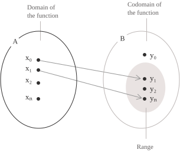
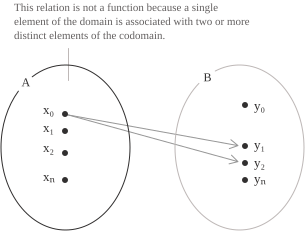
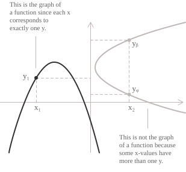

## Definition

Suppose $A$ and $B$ are non-empty subsets of the real numbers](../real-numbers/). The elements of $A$ are the inputs, while the elements of $B$ are the possible outputs. A function $f$ gives each $x \in A$ one and only one value $f(x) \in B.$ We write:

$$
f \colon A \to B
$$

+ The set $A$ is the domain of the function.
+ The set $B$ is the codomain.
+ For each $x \in A,$ the value $f(x) \in B$ is the image of $x$ under $f.$
+ $x$ is the independent variable, and $y=f(x)$ is the dependent variable.

The linear rule $2x - 1$ defines the function:

$$
f \colon \mathbb{R} \to \mathbb{R}, \quad f(x) = 2x - 1
$$

Writing $x \mapsto 2x - 1$ specifies the same assignment without naming the function. At the input $3,$ its value is:

$$
f(3) = 2 \cdot 3 - 1 = 5
$$

The symbol $f$ denotes the complete assignment, whereas $f(3)$ is the image of the particular input $3.$

  

> Uniqueness is required for each fixed input. Different inputs may have the same image.

- - -

A function $f \colon A \to B$ may have the following properties:

+ The function is injective if every element of $B$ is the image of at most one element of $A,$ that is, if for any $x_1, x_2 \in A$ with $x_1 \neq x_2$ we have $f(x_1) \neq f(x_2).$ Equivalently, for every $y \in B$ there is at most one $x \in A$ such that $f(x) = y.$
+ The function is surjective if every element of $B$ is the image of at least one element of $A,$ that is, if for every $y \in B$ there exists at least one $x \in A$ such that $f(x) = y.$ Equivalently, $f(A) = B.$
+ The function is bijective, or equivalently invertible, if it is both injective and surjective, that is, if for every $y \in B$ there exists a unique $x \in A$ such that $f(x) = y.$

These properties are treated in detail in the corresponding entry on injective, surjective and bijective functions](../injective-surjective-and-bijective-functions/).

- - -

Every set $A$ has an identity function. Its value at any $x \in A$ is simply $x$ itself:

$$
\mathrm{id}_A \colon A \to A, \quad \mathrm{id}_A(x) = x
$$

It is bijective, since distinct inputs give distinct outputs and every element of $A$ is attained. For a fixed value $c \in B,$ the constant function from $A$ to $B$ is defined by:

$$
f \colon A \to B, \quad f(x) = c
$$

A constant function is not injective when $A$ has more than one element, and it is surjective exactly when $B = \\{\ c \\}.$

- - -

Given $E \subseteq A,$ the restriction of $f \colon A \to B$ to $E$ is defined by:

$$
f|_E \colon E \to B, \quad f|_E(x) = f(x)
$$

Restricting the domain can make a non-injective function injective. If $f|_E$ is injective, the same assignment with codomain $f(E)$ defines a bijection from $E$ to $f(E)$ and hence has an inverse function](../inverse-function/).

- - -

The graph of $f$ is the set of ordered pairs $(x, f(x))$ obtained by pairing each input with its assigned output:

$$
G_f = \\{\ (x, f(x)) \mid x \in A \\}
$$

Thus $G_f \subseteq A \times B,$ and each $x \in A$ occurs as the first coordinate of exactly one pair.

## What is not a function

A relation $R \subseteq A \times B$ is a function from $A$ to $B$ only when every $x \in A$ is associated with exactly one value $y \in B.$

  

In the diagram, a single element $x_0$ corresponds to two distinct values in the codomain, so the relation is not a function. Formally, the required existence and uniqueness condition is:

$$
\forall \ x \in A,\\exists! \ y \in B\\vert \ (x, y) \in R
$$

In the relation shown, both $(x_0, y_1)$ and $(x_0, y_2)$ belong to $R,$ with $y_1 \neq y_2,$ which violates uniqueness. The same failure occurs in the table:

| X  | -3 |  1 | -3 |  5 |  2 |
|----|----|----|----|----|----|
| Y  |  7 |  4 | 10 | -2 |  8 |

The relation is not a function because $x = -3$ is associated with both $7$ and $10,$ rather than with exactly one value.

- - -

A criterion for deciding whether a curve in the plane is the graph of a function on its projection onto the $x$-axis is the vertical line test, which is passed exactly when every vertical line meets the curve in at most one point.

  

The curve on the left, a parabola, is the graph of a function, since each $x$ corresponds to exactly one $y.$ The curve on the right is not the graph of a function, since $x_2$ corresponds to more than one value of $y.$

## Difference between codomain and range

For a function $f \colon A \to B,$ the codomain is the declared target set $B.$

The range of $f,$ also called the image of the function, is the set $f(A)$ of attained values. It is always a subset of $B.$

Consider the function $f \colon \mathbb{R} \to \mathbb{R}$ defined by $f(x) = x^2.$ Its codomain is $\mathbb{R},$ while its range is $0, +\infty),$ so it is not surjective. The same assignment with codomain $[0, +\infty)$ defines a surjective function, but it is not injective because $f(-1) = f(1) = 1.$ With both domain and codomain equal to $[0, +\infty),$ the same rule defines a bijection.

For a subset $E \subseteq A,$ its image is defined by:

$$
f(E) = \\{\ f(x) \mid x \in E \\}
$$

Taking $E = A$ gives the range $f(A).$ For a subset $F \subseteq B,$ its preimage is defined by:

$$
f^{-1}(F) = \\{\ x \in A \mid f(x) \in F \\}
$$

The notation $f^{-1}(F)$ denotes a set and does not require $f$ to be invertible. The function $f \colon A \to f(A)$ is surjective because every element of $f(A)$ is attained by construction.

## Function equality and zeros

Under the convention used here, the domain and codomain are part of the data of a function. Two functions are equal when these sets agree and the functions have the same value at every point. For $f,g \colon D \to B,$ the pointwise condition is:

$$
f(x) = g(x) \quad \forall \ x \in D
$$

A point $a \in D$ is a zero of $f$ if the function vanishes at that point:

$$
f(a) = 0
$$

Finding the zeros amounts to solving the [equation $f(x)=0.$ Each solution $a$ identifies a point $(a,0)$ where the graph meets the $x$-axis. In sign analysis](../sign-analysis-in-inequalities/), every zero must be examined as a possible boundary between intervals on which $f$ is positive and those on which it is negative. The sign need not change at a zero, since the graph may touch the axis and remain on the same side.

## Symmetric and bounded functions

Even and odd functions](../even-and-odd-functions/) describe the behavior of a function under the change $x \mapsto -x.$ Let $A \subseteq \mathbb{R}$ be symmetric with respect to the origin, meaning $x \in A \Rightarrow -x \in A.$ For a function $f \colon A \to \mathbb{R},$ the two cases are:

+ The function is even if $f(-x) = f(x)$ for all $x \in A$ (symmetric with respect to the $y$-axis).
+ The function is odd if $f(-x) = -f(x)$ for all $x \in A$ (symmetric with respect to the origin)

- - -

A function $f \colon A \to \mathbb{R}$ with $A \subseteq \mathbb{R}$ is bounded if there exist $m, M \in \mathbb{R}$ such that:

$$
m \leq f(x) \leq M \quad \text{for every } x \in A
$$

The function is bounded above if there exists $M \in \mathbb{R}$ such that $f(x) \leq M$ for every $x \in A,$ and bounded below if there exists $m \in \mathbb{R}$ such that $m \leq f(x)$ for every $x \in A.$

Boundedness means that the range lies in some bounded interval](../intervals/) $m, M].$ It does not imply the existence of a global maximum or minimum](../maximum-minimum-and-inflection-points/). A global maximum is an upper bound](../supremum-and-infimum/) attained by the function, and a global minimum is a lower bound attained by the function (the arctangent is an example).

## Monotone and periodic functions

Increasing, decreasing, and monotone functions](../increasing-and-decreasing-functions/) compare function values at ordered points. For a function $f \colon A \to \mathbb{R},$ the inequality in each of the first four definitions below must hold for every pair $x_1, x_2 \in A$ with $x_1 < x_2:$

+ The function is increasing if $f(x_1) \leq f(x_2).$
+ The function is strictly increasing if $f(x_1) < f(x_2).$
+ The function is decreasing if $f(x_1) \geq f(x_2).$
+ The function is strictly decreasing if $f(x_1) > f(x_2).$
+ The function is monotone if it is increasing or decreasing throughout its domain.
+ The function is strictly monotone if it is strictly increasing or strictly decreasing throughout its domain.

- - -

A function $f \colon X \to \mathbb{R}$ is periodic if there exists $T > 0$ for which the translation $x \mapsto x + T$ maps $X$ onto itself and the following identity holds for every $x \in X:$

$$
f(x + T) = f(x)
$$

Every positive $T$ satisfying these conditions is a period of $f.$ If the set of positive periods has a least element, that element is the fundamental period. The sine and cosine functions](../sine-and-cosine/) both have fundamental period $2\pi.$

## Algebraic and transcendental functions

One way to classify continuous real functions is through polynomial relations. Let $f \colon D \to \mathbb{R},$ where $D \subseteq \mathbb{R}$ contains a non-degenerate interval. The function is algebraic if there is a nonzero polynomial $P$ in two variables, with real coefficients and positive degree in $y,$ such that $P(x, f(x)) = 0$ for every $x \in D.$ For example, $f(x) = \sqrt{x}$ is algebraic on $0, +\infty)$ because $f(x)^2 - x = 0.$

Every polynomial function is rational, since it can be written with denominator $1,$ and every rational function $f(x) = N(x)/Q(x)$ is algebraic because $Q(x)f(x) - N(x) = 0.$ Hence:

$$
\text{polynomial functions} \subseteq \text{rational functions} \subseteq \text{algebraic functions}
$$

The irrational functions](../irrational-functions/) considered here form a subclass of the non-rational algebraic functions. Their simplified expressions contain the variable in a radical and use finitely many root extractions. They do not exhaust the algebraic functions, since some algebraic functions cannot be expressed by radicals.

A continuous real function that satisfies no such polynomial relation is transcendental. Standard elementary examples include exponential and logarithmic functions, trigonometric and inverse trigonometric functions, and hyperbolic functions](../hyperbolic-sine-and-cosine/). In this context, transcendental means non-algebraic, not non-elementary.

## Domain of the main functions

The natural domain of a real expression is the largest subset of $\mathbb{R}$ on which every operation in the expression is defined and real-valued. When an expression imposes several restrictions, its natural domain is obtained by combining all domain conditions](../determining-the-domain-of-a-function/).

- - -

Polynomial functions](../polynomial-function/) have the form:

$$
y = \sum_{k=0}^{n} a_kx^k
$$

The coefficients $a_0, a_1, \dots, a_n$ are real, and $n$ is a non-negative integer. When the polynomial has degree $n,$ its leading coefficient is $a_n,$ with $a_n \neq 0.$ The zero polynomial has all coefficients equal to zero. The monomial $x^0$ is the constant monomial $1.$ The constant term and the positive integer powers are defined for every real $x,$ including $x = 0.$ Hence every polynomial has natural domain $\mathbb{R}.$ Consider the cubic polynomial:

$$
y = 2x^3 - 5x^2 + 3x - 1
$$

Every term is defined for every real $x,$ so this polynomial also has domain $\mathbb{R}.$

- - -

In a rational function](../rational-functions/), the numerator $N(x)$ and denominator $D(x)$ are polynomials, and $D$ is not the zero polynomial. Rational functions have the form:

$$
y = \frac{N(x)}{D(x)}
$$

The quotient is defined at exactly those real numbers $x$ for which $D(x) \neq 0.$ Consider the rational function:

$$
y = \frac{x^2 - 4}{x - 2}
$$

The denominator vanishes at $x = 2,$ so the domain is $\mathbb{R} \setminus \\{\ 2 \\}.$ Although the expression simplifies to $x + 2$ when $x \neq 2,$ this cancellation does not add $2$ to the original domain.

- - -

Let $f \colon D \to \mathbb{R}$ and let $n \geq 2$ be an integer. A radical expression](../radicals/) with index $n$ has the form:

$$
y = \sqrt[n]{f(x)}
$$

The domain depends on the parity of $n.$ If $n$ is even, the radicand must be non-negative, so the domain is:

$$
\\{\ x \in D \mid f(x) \geq 0 \\}
$$

For the even index $n = 2,$ consider:

$$
y = \sqrt{x - 2}
$$

The radicand must be non-negative, so the domain is $[2, +\infty).$ If $n$ is odd, the radical imposes no further restriction, and the domain is $D.$ For the odd index $n = 3,$ consider:

$$
y = \sqrt[3]{x - 2}
$$

The cube root is defined for negative and non-negative radicands, so its domain is $\mathbb{R}.$

- - -

For $f \colon D \to \mathbb{R},$ an expression involving a logarithm has the form:

$$
y = \log_a{f(x)} \quad \text{with} \quad a > 0, \quad a \neq 1
$$

The logarithmic argument must be strictly positive, so the domain is:

$$
\\{\ x \in D \mid f(x) > 0 \\}
$$

For base $2,$ consider:

$$
y = \log_2(x - 1)
$$

This function is defined only when $x - 1 > 0,$ so the domain is $(1, +\infty).$ For any $x \leq 1$ the expression is undefined, because the logarithm of a non-positive number does not exist in the reals. A second example uses the natural logarithm:

$$
y = \ln(3x + 6)
$$

The inequality $3x + 6 > 0$ gives $x > -2,$ so the domain is $(-2, +\infty).$

- - -

For $f \colon D \to \mathbb{R},$ an exponential expression](../exponential-function/) with constant base has the form:

$$
y = a^{f(x)} \quad \text{with} \quad a > 0, \quad a \neq 1
$$

Its domain is $D.$ Taking $a = 2$ and $f(x) = x$ gives:

$$
y = 2^x
$$

Since $2 > 0,$ this function has domain $\mathbb{R}$ and range $(0, +\infty).$

- - -

Expressions with a variable base and exponent have the form:

$$
y = [f(x)]^{g(x)}
$$

If real powers](../powers/) are defined by $[f(x)]^{g(x)} = \exp(g(x)\ln f(x)),$ then $f(x) > 0$ is required. Under this definition, if $f$ and $g$ have domains $D_f$ and $D_g,$ respectively, the domain is:

$$
\\{\ x \in D_f \cap D_g \mid f(x) > 0 \\}
$$

For non-positive bases, the real domain depends on the values of the exponent and must be determined case by case.

- - -

For $f \colon D \to \mathbb{R},$ a power with an irrational exponent $\alpha \in \mathbb{R} \setminus \mathbb{Q}$ has the form:

$$
f(x)^{\alpha}
$$

Its domain is given by the following two cases:

$$
\\{\ x \in D \mid f(x) \geq 0 \\}, \quad \text{if } \alpha > 0
$$
$$
\\{\ x \in D \mid f(x) > 0 \\}, \quad \text{if } \alpha < 0
$$

- - -

+ The sine function](../sine-function/) $y = \sin x$ and the cosine function](../cosine-function/) $y = \cos x$ have domain $\mathbb{R}.$
+ The tangent function](../tangent-function/) $y = \tan x$ has domain $\mathbb{R} \setminus \left\\{\\pi/2 + k\pi \mid k \in \mathbb{Z}\\right\}.$
+ The cotangent function](../cotangent-function/) $y = \cot x$ has domain $\mathbb{R} \setminus \left\\{\ k\pi \mid k \in \mathbb{Z}\\right\}.$
+ The arcsine function](../arcsine-function/) $y = \arcsin x$ and the arccosine function](../arccosine-function/) $y = \arccos x$ have domain $[-1, 1].$
+ The arctangent function](../arctangent-function/) $y = \arctan x$ and the arccotangent function](../arccotangent-function/) $y = \mathrm{arccot}\ x$ have domain $\mathbb{R}.$

## Operations between functions

Let $f \colon X_1 \to \mathbb{R}$ and $g \colon X_2 \to \mathbb{R},$ where $X_1 \subseteq \mathbb{R}$ and $X_2 \subseteq \mathbb{R},$ and set $X=X_1 \cap X_2.$

The sum, difference, and product are defined pointwise on $X:$

$$
\begin{aligned}
(f + g)(x) &= f(x) + g(x) \\
(f - g)(x) &= f(x) - g(x) \\
(f \cdot g)(x) &= f(x)g(x)
\end{aligned}
$$

The quotient of two functions $f(x)$ and $g(x)$ has domain $\\{\ x \in X \mid g(x) \neq 0 \\}$ and is defined by:

$$
\left(\frac{f}{g}\right)(x) = \frac{f(x)}{g(x)}
$$

Another operation between functions is composition. If $f \colon A \to B$ and $g \colon B \to C,$ then the composite $g \circ f$ applies $f$ first and then applies $g$ to the result:

$$
(g \circ f)(x)=g(f(x))
$$
