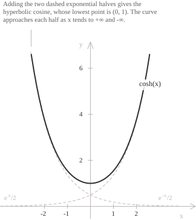

## Introduction

The geometric construction of the hyperbolic cosine, based on the area of a sector of the equilateral hyperbola, appears in hyperbolic sine and cosine](../hyperbolic-sine-and-cosine/). For real $x$, the hyperbolic cosine is the function defined by the exponential formula:

$$\cosh(x) = \frac{e^x + e^{-x}}{2}$$

The function $f(x) = \cosh(x)$ is half the sum of $e^x$ and $e^{-x}.$ It is defined for every real number and has range $1, +\infty).$ Its graph is symmetric about the vertical axis and has a horizontal tangent at the point $(0, 1).$ The function tends to $+\infty$ as $x \to +\infty$ and as $x \to -\infty,$ while the circular cosine oscillates. For large positive $x,$ the term $e^{-x}$ is close to zero and $\cosh(x)$ is close to $e^x/2.$ By evenness, $\cosh(x)$ is close to $e^{-x}/2$ for large negative $x.$

  

A uniform chain suspended from two points has the shape of a catenary. After a translation of the coordinate axes, the catenary has equation $y = a\cosh(x/a)$ for $a > 0,$ and its vertex is the lowest point of the chain. The parameter $a$ is the horizontal component of the tension divided by the weight per unit length. The curve is flatter for larger values of $a.$

## Properties

The function has the following properties.

+ Domain: $x \in \mathbb{R}$
+ Range: $y \geq 1$
+ Periodicity: not periodic
+ Parity: even, with $\cosh(-x) = \cosh(x)$
+ Monotonicity: strictly decreasing on $(-\infty, 0]$ and strictly increasing on $0, +\infty)$
+ Sign: positive on $\mathbb{R}$
+ Roots: none
+ Maximum and minimum points: the minimum value $1$ is attained at $x = 0,$ and the function is unbounded above.

The hyperbolic cosine and the hyperbolic sine](../hyperbolic-sine-function/) satisfy the fundamental hyperbolic identity:

$$\cosh^2(x) - \sinh^2(x) = 1$$

Since $\sinh(x)$ has the same sign as $x,$ solving the hyperbolic identity](../hyperbolic-identities/) for $\sinh(x)$ requires the plus sign for $x \geq 0$ and the minus sign for $x < 0:$

$$\sinh(x) = \pm\sqrt{\cosh^2(x) - 1}$$

Every value of $(1, +\infty)$ has exactly two preimages, so the hyperbolic cosine is not injective on $\mathbb{R}.$ 

## Limits, derivatives, and integrals of the hyperbolic cosine function

The remarkable limit](../remarkable-limits/) of the exponential function determines the behaviour near the origin. The relevant quotient is:

$$\frac{\cosh(x) - 1}{x} = \frac{1}{2}\left(\frac{e^x - 1}{x} + \frac{e^{-x} - 1}{x}\right)$$

As $x$ tends to zero, the first quotient in parentheses tends to $1$ and the second to $-1.$ Their half-sum tends to zero:

$$\lim_{x \to 0} \frac{\cosh(x) - 1}{x} = 0$$

Near the origin, both $\cosh(x) - 1$ and $\cos(x) - 1$ vanish faster than $x.$ From the identity $\cosh(x) - 1 = 2\sinh^2(x/2),$ we have:

$$\frac{\cosh(x) - 1}{x^2} = \frac{1}{2}\left(\frac{\sinh(x/2)}{x/2}\right)^2$$

Since the same exponential limit implies $\lim_{u \to 0} \sinh(u)/u = 1,$ the second-order limit is:

$$\lim_{x \to 0} \frac{\cosh(x) - 1}{x^2} = \frac{1}{2}$$

The limits at infinity and the comparison with $e^x/2$ at $+\infty$ are:

$$
\begin{aligned}
\lim_{x \to +\infty} \cosh(x) &= +\infty \\
\lim_{x \to -\infty} \cosh(x) &= +\infty \\
\lim_{x \to +\infty} \left(\cosh(x) - \frac{e^x}{2}\right) &= 0
\end{aligned}
$$

At $-\infty,$ the equality $\cosh(x) - e^{-x}/2 = e^x/2 \to 0$ shows that the curve approaches $e^{-x}/2$ from above. The graph has no vertical asymptotes because it is continuous on $\mathbb{R}.$ Since $\dfrac{\cosh(x)}{|x|} \to +\infty$ as $x \to \pm\infty,$ it has no horizontal or oblique asymptotes.

- - -

The function $\cosh(x)$ is continuous and differentiable on $\mathbb{R}.$ Termwise differentiation of the exponential expression gives its derivative:

$$\frac{d}{dx}\cosh(x) = \frac{e^x - e^{-x}}{2} = \sinh(x)$$

A second differentiation returns the original function, so the derivatives alternate with period two:

$$\frac{d^2}{dx^2}\cosh(x) = \cosh(x)$$

The parity of $n$ determines the $n$-th derivative:

$$
\frac{d^n}{dx^n}\cosh(x) =
\begin{cases}
\cosh(x) & \text{if } n \text{ is even} \\
\sinh(x) & \text{if } n \text{ is odd}
\end{cases}
$$

> The hyperbolic cosine is the unique solution of the differential equation](../differential-equations/) $y'' = y$ with $y(0) = 1$ and $y'(0) = 0.$ The circular cosine solves $y'' = -y$ with the same initial conditions.

- - -

Since the derivative of $\sinh(x)$ is $\cosh(x),$ the indefinite integral](../indefinite-integrals/) of the hyperbolic cosine is:

$$\int \cosh(x) \ dx = \sinh(x) + c$$

Because the function is even, its definite integral](../definite-integrals/) over an interval symmetric about the origin is twice the integral over the positive half:

$$\int_{-a}^{a} \cosh(x) \ dx = 2\sinh(a)$$

For integrals containing $\sqrt{x^2 - 1}$ on the branch $x \geq 1,$ the substitution $x = \cosh(t)$ with $t \geq 0$ gives $\sqrt{x^2 - 1} = \sinh(t)$ and $dx = \sinh(t) \ dt,$ so the radical disappears. The trigonometric substitution](../trigonometric-substitution-for-integrals/) on this branch is $x = \sec(t)$ with $0 \leq t < \pi/2.$

## Monotonicity and convexity

The derivative $\sinh(x)$ is negative for $x < 0$ and positive for $x > 0,$ so the hyperbolic cosine decreases on $(-\infty, 0]$ and increases on $0, +\infty).$ The only stationary point is $(0, 1),$ where the tangent is the horizontal line $y = 1$ and the function has its absolute minimum.

Since $\cosh''(x) = \cosh(x) > 0$ for every real $x,$ the graph is strictly [convex, has no inflection points](../maximum-minimum-and-inflection-points/), and lies above its tangent $y = 1$ at $(0, 1),$ with equality only at $x = 0:$

$$\cosh(x) \geq 1$$

## Inverse function

The hyperbolic cosine is even, so it has no inverse on $\mathbb{R}.$ On $0, +\infty),$ it is continuous and strictly increasing, with range $[1, +\infty).$ This restriction is a bijection, and its inverse function is denoted by $\mathrm{arcosh}:$

$$\mathrm{arcosh} : 1, +\infty) \to [0, +\infty)$$

With $t = e^y,$ the equation $x = \cosh(y)$ becomes $2x = t + t^{-1},$ which is equivalent to the quadratic equation:

$$t^2 - 2xt + 1 = 0$$

Its roots are $t = x \pm \sqrt{x^2 - 1}.$ Their product is $1,$ so they are reciprocal and correspond to the values $y$ and $-y,$ which have the same hyperbolic cosine. The plus sign is required because $y \geq 0$ implies $t \geq 1.$ Taking the natural logarithm](../logarithms/) gives:

$$\mathrm{arcosh}(x) = \ln\left(x + \sqrt{x^2 - 1}\right)$$

For $x > 1,$ the positivity of $\sinh$ and the fundamental hyperbolic identity give $\sinh(\mathrm{arcosh}(x)) = \sqrt{x^2 - 1},$ so the derivative of the inverse function](../derivative-of-the-inverse-function/) is:

$$\frac{d}{dx}\mathrm{arcosh}(x) = \frac{1}{\sqrt{x^2 - 1}}$$

As $x \to 1^+,$ the derivative tends to $+\infty,$ so the graph of $\mathrm{arcosh}$ has a vertical tangent at $(1, 0).$ This tangent is the reflection across the line $y = x$ of the horizontal tangent to the graph of $\cosh$ at $(0, 1).$ On $(1, +\infty),$ the antiderivatives of $\dfrac{1}{\sqrt{x^2 - 1}}$ are:

$$\int \frac{1}{\sqrt{x^2 - 1}} \ dx = \ln\left(x + \sqrt{x^2 - 1}\right) + c$$

## Maclaurin series

The Maclaurin series of the hyperbolic cosine follows from the series of the exponential function. Adding the expansion of $e^{-x}$ to that of $e^x$ cancels the odd powers and doubles the even powers. Dividing by $2$ gives a power series](../power-series/) that converges for every real number](../real-numbers/):

$$\cosh(x) = \sum_{n=0}^{\infty} \frac{x^{2n}}{(2n)!} = 1 + \frac{x^2}{2!} + \frac{x^4}{4!} + \frac{x^6}{6!} + \cdots$$

The coefficients of the even powers are positive. For $x \neq 0$ every partial sum is strictly less than the value of the function. In particular, the first two terms give:

$$\cosh(x) > 1 + \frac{x^2}{2}$$

Near the vertex, the first two terms give the parabolic approximation $y = 1 + x^2/2.$

The alternating signs in the Taylor series](../taylor-series/) of the circular cosine appear when $x$ is replaced by $ix.$ For complex $x,$ each term of degree $2n$ is multiplied by $i^{2n} = (-1)^n,$ so $\cosh(ix) = \cos(x).$ Replacing $x$ by $ix$ in this identity and using evenness gives $\cos(ix) = \cosh(x).$