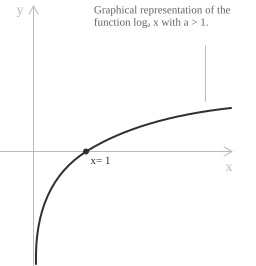
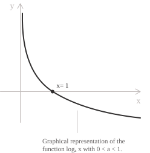

## Introduction

The logarithmic function has the form $y = \log_a x,$ with $a > 0,$ $a \neq 1,$ for every $x \in \mathbb{R}^+.$ It is the inverse of the exponential function](../exponential-function/), so its domain and range are swapped.

If the base $a > 1,$ the function is increasing.

  

If $0 < a < 1,$ the function is decreasing.

  

The only point where the function equals $0$ is $x = 1,$ since $\log_a(1) = 0.$ This holds because $a^0 = 1$ by the properties of powers](../powers/). The line $x = 0$ is a vertical asymptote, since the function diverges as $x$ approaches zero from the right.

Defining the logarithm as the inverse of the exponential is the elementary approach and assumes that $a^x$ has already been constructed for every real exponent. The section on the natural logarithm below gives a definition in terms of an integral, with the exponential defined as the inverse of the logarithm.

> The value of the base determines whether the function is increasing or decreasing. For logarithmic inequalities](../logarithmic-inequalities/), a base between $0$ and $1$ requires reversing the direction of the inequality, because the function is decreasing.

## Properties

These all follow from the definition of the logarithm as the inverse of the exponential function.

+ Domain: $(0, +\infty)$
+ Range: $\mathbb{R}$
+ Root: $x = 1$
+ The function is strictly increasing on $(0,+\infty)$ when $a > 1,$ and strictly decreasing when $0 < a < 1.$
+ The function is neither even nor odd, since it is not defined for negative $x.$
+ The function is continuous on $(0, +\infty).$
+ As the inverse of the differentiable exponential function, the logarithm is differentiable on its whole domain, with derivative:

$$f'(x) = \frac{1}{x\ln(a)}$$

+ The function has no maximum or minimum](../maximum-minimum-and-inflection-points/) on its domain, since it is unbounded both near zero and at infinity.

## Limits, derivatives, and integrals

The limits near zero and at infinity depend on the base. For a base $a > 1,$ the logarithm decreases without bound as $x$ approaches zero from the right, and grows without bound as $x$ tends to infinity:

$$\lim_{x \to 0^+} \log_a x = -\infty$$

$$\lim_{x \to +\infty} \log_a x = +\infty$$

When $0 < a < 1,$ the limits are reversed:

$$\lim_{x \to 0^+} \log_a x = +\infty$$

$$\lim_{x \to +\infty} \log_a x = -\infty$$

- - -

The derivative of the logarithmic function with base $a$ follows from the standard differentiation rules. For $x > 0$ and $a > 0$ with $a \neq 1,$ the derivative of $\log_a(x)$ with respect to $x$ is:

$$\frac{d}{dx}\log_a(x) = \frac{1}{x\ln(a)}$$

- - -

The indefinite integral](../indefinite-integrals/) of the logarithmic function with base $a$ follows from the relation between logarithms with different bases:

$$\log_a(x) = \frac{\ln(x)}{\ln(a)}$$

This reduces the problem to the integral of the natural logarithm. Using integration by parts](../integration-by-parts/), we obtain:

$$\int \frac{\ln(x)}{\ln(a)} \ dx = \frac{x(\ln(x)-1)}{\ln(a)} + c$$

## Natural logarithm

The natural logarithm admits a direct definition as an integral. For $x > 0$ it is given by:

$$\ln(x) = \int_{1}^{x} \frac{1}{t} \ dt$$

The sign of the result follows from the definition. When $x > 1$ the integral runs over an interval of positive length with a positive integrand, so $\ln(x) > 0.$ When $0 < x < 1$ the orientation of the interval reverses the sign, so $\ln(x) < 0.$ At $x = 1$ the two limits coincide and $\ln(1) = 0.$

The fundamental theorem of calculus](../fundamental-theorem-of-calculus/) gives the derivative directly from this definition:

$$\frac{d}{dx}\ln(x) = \frac{1}{x}$$

The additive property of the logarithm also follows from the integral form, by comparing derivatives and using the chain rule. Fix $y > 0$ and set $g(x) = \ln(xy).$ The chain rule](../chain-rule/) gives:

$$g'(x) = \frac{1}{xy}\cdot y = \frac{1}{x}$$

so $g$ and $\ln$ share the same derivative and differ by a constant. Evaluating at $x = 1$ identifies the constant as $\ln(y),$ which yields:

$$\ln(xy) = \ln(x) + \ln(y)$$

The base of the natural logarithm is the Euler number](../euler-number-limit-sequence/) $e,$ defined as the unique value whose logarithm equals $1$:

$$\ln(e) = \int_{1}^{e} \frac{1}{t} \ dt = 1$$

This condition places $e$ between $2$ and $4,$ because bounding the value $1$ above and below by integrals of $1/t$ is the same as comparing $1$ to $\ln(2)$ and $\ln(4).$ On $[1,2]$ the constant $1$ bounds $1/t$ from above, so the corresponding integral stays below $1$:

$$\ln(2) = \int_{1}^{2} \frac{1}{t} \ dt < 1$$

On $[1,4]$ the step function equal to $\frac{1}{2}$ on $[1,2]$ and $\frac{1}{4}$ on $[2,4]$ bounds $1/t$ from below, and its integral equals $\frac{1}{2}(2-1) + \frac{1}{4}(4-2) = 1,$ so the corresponding integral exceeds $1$:

$$\ln(4) = \int_{1}^{4} \frac{1}{t} \ dt > 1$$

These two inequalities place the value $1$ between the logarithms of $2$ and $4$:

$$\ln(2) < 1 = \ln(e) < \ln(4)$$

Since $\ln$ is increasing, the same order holds for the arguments, so $2 < e < 4.$ Once $e$ is available, the natural logarithm coincides with the logarithm to base $e$:

$$\ln(x) = \log_e(x)$$

The change of base formula rewrites it in terms of any other base $a$:

$$\ln(x) = \frac{\log_a(x)}{\log_a(e)}$$

The natural logarithm is the inverse of the exponential function](../exponential-function/) $e^x.$ The exponential grows faster than every power of $x,$ since for each natural number $n$:

$$\lim_{x \to +\infty} \frac{e^x}{x^n} = +\infty$$

The logarithm therefore grows more slowly than every positive power of $x,$ which is the precise sense in which it increases slowly.

- - -

An integral representation of the natural logarithm uses the definite integral](../definite-integrals/) of $\ln(t)$ on an interval starting at the origin:

$$\int_{0}^{x} \ln(t) \ dt$$

This integral is defined for $x > 0.$ The integrand $\ln(t)$ is not defined at $t = 0,$ so the integral is interpreted as an improper integral](../improper-integrals/). Its value follows from integration by parts:

$$\int \ln(t) \ dt = t\ln(t) - t + c$$

Applying this antiderivative and taking the limit as the lower bound approaches zero, we obtain:

$$\int_{0}^{x} \ln(t) \ dt = \bigl[t\ln(t) - t\bigr]_{0}^{x} = x\ln(x) - x + 1$$

- - -

A definite integral of the natural logarithm is:

$$\int_{0}^{1} \ln(x) \ dx = -1$$

This is again an improper integral, since $\ln(x)$ is not defined at $x = 0.$ Its value follows from the antiderivative $x\ln(x) - x$ evaluated with the limit at the lower bound. On the interval $(0,1)$ the negative values of $\ln(x)$ give a net negative area equal to $-1.$

## Binary search and the logarithmic function

One use of logarithms is the analysis of algorithmic complexity. Each step of a binary search answers one yes/no question, which corresponds to one binary bit, so the logarithm counts the binary decisions needed to locate an item.

Suppose we want to find an item in a sorted list of $N$ elements. Checking the elements one by one, with the target in the $n$-th position, may require up to $n$ steps. This approach is linear search, and its worst-case time complexity](../big-o-notation/) is:

$$\mathcal{O}(n)$$

Linear search is inefficient for large lists. Binary search reduces the search space at each step. It finds a target element in a sorted list by dividing the list in half and keeping only the half that may contain the target. This continues until the element is found or the list can no longer be divided.

At each step the search space is divided by $2.$ If the initial list has $n$ elements, the number of steps is proportional to the number of times $n$ can be divided by $2$ before reaching $1,$ which is the base-$2$ logarithm:

$$\text{Number of steps} \approx \log_2 n$$

The time complexity of binary search is therefore:

$$\mathcal{O}(\log n)$$

The same pattern of repeated halving appears in other divide-and-conquer algorithms and in decision trees. If a list contains $1{,}000{,}000$ elements, binary search finds any element in at most:

$$\log_2(1{,}000{,}000) \approx 19.9$$

Fewer than $20$ steps are needed, compared with up to $1{,}000{,}000$ steps for linear search.

> Binary search requires the elements to be sorted, typically in ascending order. Without a defined ordering, the algorithm cannot decide which half of the list to discard at each step.
