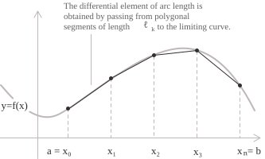

## Dai segmenti agli archi di curva

Quando vogliamo determinare la lunghezza di un segmento determinato da due punti distinti nel piano, $A$ e $B$, utilizziamo la formula della distanza euclidea:

$$
d(A,B)=\sqrt{(x_2-x_1)^2+(y_2-y_1)^2} 
$$

È una formula semplice e piuttosto intuitiva che considera le distanze calcolate rispetto agli assi delle componenti in $x$ e in $y$ dei punti ed è immediatamente applicabile a un segmento che non è nient'altro che una linea dritta. Le cose si complicano quando al posto di un segmento dobbiamo misurare la lunghezza di una curva che tipicamente non segue un andamento lineare e può assumere un profilo più variegato.

In questi casi si ricorre ad una costruzione che si fonda sullo stesso meccanismo con cui abbiamo costruito l'integrale definito](../definite-integrals/), approssimando la curva con segmenti facilmente misurabili e ricorrendo al limite. Consideriamo per esempio una funzione $f(x)$ continua e derivabile con derivata continua su un intervallo chiuso $a, b].$ Il nostro obiettivo è quello di misurare l'arco di curva compreso fra i punti di ascissa $a$ e $b$ associandogli un numero reale che ne misuri la lunghezza. Per prima cosa inscriviamo una spezzata nella curva, poi ne calcoliamo la lunghezza e miglioriamo progressivamente l'approssimazione aggiungendo dei punti la cui distanza sull'asse delle $x$ tende a zero.

In termini formali definiamo $P = \\{\ x_0, x_1, \dots, x_n \\}$ una partizione dell'intervallo $a, b]$ tale che:

$$a = x_0 < x_1 < \cdots < x_n = b$$

Costruiamo la spezzata associando ad ogni punto della partizione il punto $(x_k, f(x_k))$ che giace sul grafico della funzione. Congiungendo i punti ottenuti tramite dei segmenti otteniamo la spezzata inscritta nella curva, la cui lunghezza totale è la somma delle distanze euclidee tra punti consecutivi. La lunghezza del singolo segmento di indice $k$ è pertanto ricavabile dalla seguente formula della distanza euclidea che corrisponde alla $(1)$:

$$\ell_k = \sqrt{(x_k - x_{k-1})^2 + (f(x_k) - f(x_{k-1}))^2} $$

  

Poiché $f$ è derivabile su $[x_{k-1}, x_k],$ per il teorema di Lagrange](../lagrange-theorem/) esiste un punto $\xi_k$ nell'intervallo aperto $(x_{k-1}, x_k)$ tale che:

$$f(x_k) - f(x_{k-1}) = f'(\xi_k)(x_k - x_{k-1})$$

Sostituendo questa identità nella $(2)$ e raccogliendo $(x_k - x_{k-1})^2$ otteniamo:

$$\ell_k = \sqrt{1 + [f'(\xi_k)]^2}(x_k - x_{k-1})$$

La lunghezza totale della spezzata inscritta nella curva è quindi una somma di Riemann della funzione $\sqrt{1 + [f'(x)]^2}$ relativa alla partizione $P$ e quando l'ampiezza degli intervalli tende a zero, questa somma converge a un integrale definito.

## Lunghezza di un arco in forma cartesiana

La costruzione appena illustrata conduce alla definizione di lunghezza per le curve espresse come grafici di funzioni sul piano cartesiano. Consideriamo una funzione $f$ con derivata continua sull'intervallo chiuso $a, b].$ La lunghezza dell'arco del grafico di $f$ da $x = a$ a $x = b$ è definita dal seguente integrale definito:

$$L = \int_a^b \sqrt{1 + [f'(x)]^2} \ dx $$

La continuità di $f'$ su $a, b]$ garantisce la continuità della funzione integranda e quindi la sua integrabilità secondo Riemann. Una funzione la cui derivata sia limitata, ma non continua, può comunque avere un grafico di lunghezza ben definita. In questo caso la dimostrazione elementare appena presentata non si applica direttamente, e la discussione richiede il quadro più generale delle cosiddette curve rettificabili.

L'espressione $\sqrt{1 + [f'(x)]^2} \ dx$ è detta elemento di lunghezza d'arco e si indica  con $ds.$ Tale espressione esprime la lunghezza infinitesima della curva associata a un incremento infinitesimo $dx$ della variabile indipendente e soddisfa la seguente identità:
$$ds^2 = dx^2 + dy^2 $$ 
Se osserviamo attentamente la $(4)$ possiamo riconoscere il teorema di Pitagora applicato al triangolo di cateti $dx$ e $dy = f'(x) \ dx.$

- - -

Facciamo un esempio pratico andando a calcolare la lunghezza dell'arco di una parabola descritto dalla funzione $f(x) = x^2$ sull'intervallo $[0, 1].$ Per farlo dobbiamo applicare la $(3)$ e per prima cosa calcoliamo la derivata di $f$ ottenendo:

$$f'(x) = 2x$$

Sostituendo nella formula $(3),$ possiamo esprimere la lunghezza dell'arco come:

$$L = \int_0^1 \sqrt{1 + 4x^2} \ dx$$

Questo è un integrale di una funzione razionale della forma $\sqrt{1 + (2x)^2},$ che si risolve tipicamente per sostituzione imponendo $2x = \sinh t$ e il differenziale pari a $2 \ dx = \cosh t \ dt$ ottenendo

$$dx = \frac{1}{2}\cosh t \ dt$$

L'identità iperbolica $1 + \sinh^2 t = \cosh^2 t$ permette di semplificare il radicale in $\cosh t$ ottenendo::

$$L = \int_0^{\mathrm{arsinh} 2} \cosh t \cdot \frac{1}{2}\cosh t \ dt = \frac{1}{2}\int_0^{\mathrm{arsinh} 2} \cosh^2 t \ dt$$

Applicando l'identità $\cosh^2 t = \tfrac{1}{2}(1 + \cosh 2t),$ otteniamo la primitiva:

$$\int \cosh^2 t \ dt = \frac{1}{2}t + \frac{1}{4}\sinh 2t + c$$

Valutando l'integrale agli estremi e usando $\sinh 2t = 2\sinh t \cosh t,$ insieme alle relazioni $\sinh(\mathrm{arsinh} 2) = 2$ e $\cosh(\mathrm{arsinh} 2) = \sqrt{5},$ ricaviamo quindi la lunghezza dell'arco di parabola tra l'origine e il punto 1,1:

$$L = \frac{1}{4}\mathrm{arsinh} 2 + \frac{\sqrt{5}}{2}$$

## Lunghezza di un arco in forma parametrica

Consideriamo adesso un caso molto frequente che riguarda alcune curve come le circonferenze, ellissi e spirali, che non possono essere descritte come grafici di un'unica funzione in quanto per un valore della $x$ possono corrispondere più valori della $y$. Per queste curve si introduce tipicamente una variabile ausiliaria e si esprimono le due coordinate del punto mobile come funzioni di tale parametro. Questa è la cosiddetta descrizione parametrica di una curva che coincide, come vedremo più avanti, con la descrizione cartesiana quando il parametro corrisponde all'ascissa. Consideriamo ad esempio una curva piana descritta dal parametro $t$ in un intervallo chiuso:

$$\begin{cases} x = x(t) \\ y = y(t) \end{cases} \quad t \in [\alpha, \beta]$$

Supponiamo che le funzioni $x(t)$ e $y(t)$ siano continuamente derivabili sull'intervallo $[\alpha, \beta].$ Applichiamo la costruzione vista sopra mediante le spezzate rispetto a una partizione dell'intervallo del parametro. In questo modo otteniamo una corda che congiunge i punti associati a due valori consecutivi $t_{k-1}$ e $t_k$ la cui lunghezza per la $(1)$ è data da:

$$\ell_k = \sqrt{[x(t_k) - x(t_{k-1})]^2 + [y(t_k) - y(t_{k-1})]^2}$$

Applichiamo il teorema di Lagrange a $x$ e a $y$ e passiamo al limite quando l'ampiezza degli intervalli tende a zero. In questo modo otteniamo la formula della lunghezza d'arco in forma parametrica:

$$L = \int_\alpha^\beta \sqrt{[x'(t)]^2 + [y'(t)]^2} \ dt $$

> Ricordiamo che una curva ammette in generale molte parametrizzazioni distinte, ma la lunghezza dell'arco dipende esclusivamente dall'immagine geometrica della curva sul tratto percorso, purché la parametrizzazione sia regolare e iniettiva.

- - -

Abbiamo detto che la formula cartesiana è un caso particolare di quella parametrica quando scegliamo il parametro $t = x.$ In questo caso, infatti, la parametrizzazione si riduce a:

$$\begin{cases} x(t) = t \\ y(t) = f(t) \end{cases}$$

Si ha quindi che $x'(t) = 1$ e $y'(t) = f'(t).$ Sostituendo queste espressioni nella formula $(5)$ si ottiene la formula $(3).$ La rappresentazione parametrica è dunque più generale e quindi utile in situazioni in cui la formulazione cartesiana non è direttamente applicabile.

- - -

Facciamo un ulteriore esempio, andando a calcolare la lunghezza di una circonferenza di raggio $r$ e centro nell'origine, usando stavolta la rappresentazione parametrica:

$$\begin{cases} x(t) = r\cos t \\ y(t) = r\sin t \end{cases} \quad t \in [0, 2\pi]$$

Iniziamo a calcolare le derivate delle funzioni parametriche che sono:

$$x'(t) = -r\sin t \qquad y'(t) = r\cos t$$

Sostituendo nella formula parametrica della lunghezza d'arco e usando l'identità trigonometrica fondamentale $\sin^2 t + \cos^2 t = 1,$ la funzione integranda diventa:

$$\sqrt{[x'(t)]^2 + [y'(t)]^2} = \sqrt{r^2\sin^2 t + r^2\cos^2 t} = r$$

Quindi nell'intervallo $[0, 2\pi],$ otteniamo il seguente integrale:

$$L = \int_0^{2\pi} r \ dt = 2\pi r$$

In questo modo abbiamo dimostrato che la circonferenza ha dunque lunghezza proprio pari a $2\pi r.$

- - -

Consideriamo invece una cicloide generata da un punto su una circonferenza di raggio $r$ che rotola senza strisciare lungo una retta. La tipica parametrizzazione di un arco della cicloide è data da:

$$\begin{cases} x(t) = r(t - \sin t) \\ y(t) = r(1 - \cos t) \end{cases} \quad t \in [0, 2\pi]$$

Calcoliamo le derivate delle componenti parametriche che sono pari a:

$$x'(t) = r(1 - \cos t) \qquad y'(t) = r\sin t$$

Sommando i quadrati di queste due componenti e usando le identità $1 - \cos t = 2\sin^2(t/2)$ e $\sin t = 2\sin(t/2)\cos(t/2),$ otteniamo:

$$
\begin{aligned}
[x'(t)]^2 + [y'(t)]^2 &= r^2(1 - \cos t)^2 + r^2\sin^2 t \\
                      &= 2r^2(1 - \cos t)
\end{aligned}
$$

Applicando le formule di bisezione, l'espressione diventa $4r^2\sin^2(t/2),$ la cui radice quadrata è $2r |\sin(t/2)|.$ Poiché $t/2 \in [0, \pi]$ sull'intervallo di integrazione, il seno è non negativo e possiamo eliminare il valore assoluto. L'integrale della lunghezza d'arco si riduce quindi a:

$$L = \int_0^{2\pi} 2r\sin(t/2) \ dt$$

Una primitiva di $\sin(t/2)$ è $-2\cos(t/2),$ e la valutazione agli estremi dà la lunghezza di una arco della cicloide che è pari a $8r$:

$$
\begin{aligned}
L &= 2r\bigl[-2\cos(t/2)\bigr]_0^{2\pi} \\
  &= 2r(-2\cos\pi + 2\cos 0) \\
  &= 2r(2 + 2) \\
  &= 8r
\end{aligned}
$$

## Un breve riepilogo e limiti di applicabilità

Abbiamo quindi descritto come calcolare la lunghezza di un arco di curva mediante la formulazione cartesiana e quella parametrica. Le formule da tenere a mente sono:

[class="table-1"]

|                                             |                                                             |
| ------------------------------------------- | ----------------------------------------------------------- |
| $y = f(x),$ con $x \in a, b]$              | $$L = \int_a^b \sqrt{1 + [f'(x)]^2} \ dx$$                  |
| $(x(t), y(t)),$ con $t \in [\alpha, \beta]$ | $$L = \int_\alpha^\beta \sqrt{[x'(t)]^2 + [y'(t)]^2} \ dt$$ |

[/class]

Le formule fin qui illustrate si basano sull'ipotesi che le derivate coinvolte esistano e siano continue su tutto l'intervallo di integrazione. Quando questa regolarità viene meno in punti isolati, l'integrale può spesso essere interpretato come un integrale improprio](../improper-integrals/), e la lunghezza dell'arco può ancora risultare finita. Esistono tuttavia curve continue di lunghezza infinita per le quali le formule elementari non sono applicabili e si ricorre alla teoria generale delle curve rettificabili (che va oltre la nostra trattazione), nella quale la lunghezza è definita direttamente come l'estremo superiore](../supremum-and-infimum/) delle lunghezze di tutte le spezzate inscritte.

Solo per fornire un breve accenno, una curva si dice rettificabile quando l'estremo superiore è finito. In genere, le curve continuamente derivabili su un intervallo chiuso e limitato sono rettificabili, e in questi casi l'estremo superiore coincide con il valore calcolato dalle formule integrali. 

La classe delle curve rettificabili è più ampia di quella delle curve di classe $C^1$, ovvero con derivata prima continua, e fornisce la base per la formulazione generale della nozione di lunghezza. 

Ricordiamo infine che quando l'integrale della lunghezza d'arco non può essere calcolato in forma chiusa, il suo valore può comunque essere approssimato mediante l'integrazione numerica](../numerical-integration/).
