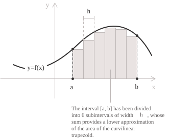
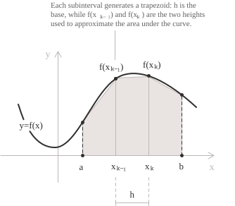

## Integrali senza primitive elementari

Ho più volte osservato che gli integrali, quantomeno quelli che si incontrano nella scuola superiore o nei primi anni universitari, sono, tutto sommato, meno problematici di quanto possano sembrare a un primo approccio e che il loro calcolo, più che il ricorso all'intuizione, richiede l'applicazione di procedimenti piuttosto strutturati e in buona parte meccanici. 

Sappiamo come il teorema fondamentale del calcolo integrale](../fundamental-theorem-of-calculus/) fornisca un metodo per calcolare un integrale definito](../definite-integrals/) a partire da una primitiva della funzione integranda. Trovare la primitiva è il grosso del lavoro, che può essere più o meno complicato a seconda di com'è fatto l'integrale di partenza, ma a quel punto il valore dell'integrale si ottiene facilmente come differenza tra i valori della primitiva agli estremi dell'intervallo. Molte funzioni integrande, tuttavia, non ammettono una primitiva esprimibile mediante funzioni elementari, e metodi come l'integrazione per sostituzione](../integration-by-substitution/), l'integrazione per parti](../integration-by-parts/) e la sostituzione di Weierstrass](../the-weierstrass-substitution/) spesso non consentono di ottenere un'espressione in forma chiusa.

Un esempio tipico è il seguente integrale, che ritroviamo nella distribuzione normale](../normal-distribution/) e la cui funzione integranda non ammette primitive elementari:

$$\int_0^1 e^{-x^2} \ dx$$

La stessa difficoltà si presenta con gli integrali contenenti $\sin(x)/x,$ con gli integrali ellittici e con un'ampia classe di espressioni che combinano termini algebrici e trascendenti.

Il calcolo numerico di questi integrali segue quindi un percorso diverso da quello delle tecniche illustrate nei precedenti capitoli. Quello che si cerca di fare è di costruire un'approssimazione la cui accuratezza può essere migliorata secondo le necessità di studio. Il ramo dell'analisi che studia questi procedimenti è detto integrazione numerica, o quadratura numerica e richiama l'origine geometrica dell'integrale come area di una regione piana.

In questa pagina ci addentreremo quindi nei principali metodi numerici che diventano indispensabili quando il calcolo analitico non è possibile o richiede un lavoro eccessivo. Anticipo che è una trattazione più avanzata rispetto agli argomenti dei canonici corsi universitari di Analisi 1, ma è interessante affrontare il tema anche per anticipare come la teoria degli integrali sia molto complessa e vada oltre le elementari tecniche di integrazione viste fin qui. 

Come regola generale, ricordate che quando si può determinare agevolmente la primitiva, è sempre preferibile calcolare il valore esatto dell'integrale mediante il teorema fondamentale del calcolo integrale e lasciare i metodi numerici, per nulla banali, a problemi di altra natura.

## Principio generale

In termini generali, l'integrazione numerica si basa sulla stessa costruzione che definisce l'integrale di Riemann](../riemann-integrability-criteria/). Si suddivide cioè l'intervallo di integrazione in un numero finito di sottointervalli, si sostituisce la funzione integranda su ciascuno di essi con una funzione più semplice di cui si conosce esattamente l'integrale e si approssima l'area totale sommando i singoli contributi. La qualità dell'approssimazione dipende dall'ampiezza dei sottointervalli e dall'ordine di accuratezza della formula locale.

  

Consideriamo, ad esempio, una partizione uniforme dell'intervallo $[a,b],$ i cui sottointervalli sono definiti dai seguenti punti o nodi della partizione:

$$
a = x_0 < x_1 < \cdots < x_n = b \quad x_k = a + kh
$$

Il passo, ovvero la base dei singoli rettangoli, è costante ed è dato da:

$$
h = \frac{b-a}{n}
$$

Per approssimare l'integrale, valutiamo la funzione integranda nei nodi $x_0, x_1, \dots, x_n,$ moltiplichiamo ciascun valore $f(x_k)$ per un coefficiente $w_k$ e sommiamo i risultati. Otteniamo così una formula di quadratura del tipo:

$$  
\int_a^b f(x) \ dx \approx \sum_{k=0}^{n} w_k f(x_k)   
$$

I coefficienti $w_k$ sono detti pesi e stabiliscono il contributo di ciascun valore della funzione all'approssimazione dell'integrale. Inoltre, la loro scelta determina il metodo specifico di quadratura, in quanto stabilisce come combinare i valori della funzione nei nodi per approssimare l'integrale. 

Le formule più semplici si ottengono interpolando la funzione integranda su ciascun sottointervallo, o su ciascun gruppo di sottointervalli consecutivi, mediante un polinomio di grado relativamente basso, per poi integrarlo. Il grado del polinomio interpolante determina la forma della formula risultante e contribuisce a determinarne l'ordine di accuratezza.

Per questo si dice che una formula di quadratura ha grado di esattezza $m$ se integra esattamente ogni polinomio di grado non superiore a $m,$ ma non tutti i polinomi di grado $m+1.$ Questa nozione fornisce una misura teorica della precisione di un metodo ed è il punto di partenza per costruire formule più accurate.

## Le formule dei rettangoli e del punto medio

La formula di quadratura più elementare che si può trovare è quella che approssima la funzione integranda su ciascun sottointervallo mediante una costante. Scegliendo il valore della funzione nell'estremo sinistro, nell'estremo destro oppure nel punto medio, si ottengono tre varianti della formula dei rettangoli. Le prime due riproducono le somme di Riemann già incontrate nella costruzione dell'integrale definito mentre la formula del punto medio ha un'accuratezza maggiore grazie alla simmetria della costruzione. Riferiamoci a quest'ultima e indichiamo i punti medi dei sottointervalli con la seguente uguaglianza:

$$
\bar{x}_k = \frac{x_{k-1} + x_k}{2}
$$

La formula di quadratura del punto medio su un singolo sottointervallo è:

$$
\int_{x_{k-1}}^{x_k} f(x) \ dx \approx hf(\bar{x}_k)
$$

Su ciascun sottointervallo approssimiamo l'integrale con il prodotto $hf(\bar{x}_k),$ dove $h$ è l'ampiezza del sottointervallo (base del rettangolo) e $f(\bar{x}_k)$ è il valore della funzione nel suo punto medio (altezza). Poiché l'integrale su $[a,b]$ è la somma degli integrali sui singoli sottointervalli, sommiamo queste approssimazioni e raccogliamo il fattore comune $h.$ Otteniamo così la formula del punto medio:

$$  
\int_a^b f(x) \ dx \approx \sum_{k=1}^{n} hf(\bar{x}_k) = h \sum_{k=1}^{n} f(\bar{x}_k)   
$$

Se la funzione integranda è di classe $C^2,$ ovvero ammette derivata prima e seconda entrambe continue su $[a,b],$ l'errore della formula $(2)$ soddisfa la stima:

$$
\left| \int_a^b f(x) \ dx - h\sum_{k=1}^{n} f(\bar{x}_k) \right| \le \frac{(b-a)h^2}{24} \max_{x \in [a,b]} |f''(x)|
$$

L'errore è quindi dell'ordine di $h^2$ e se, per esempio, dimezziamo il passo $h,$ il limite superiore fornito dalla stima si riduce a un quarto del valore iniziale. Si ottiene così un miglioramento significativo rispetto alle formule dei rettangoli con valutazione nell'estremo sinistro o destro, il cui errore è dell'ordine di $h$ e che convergono quindi più lentamente al valore esatto dell'integrale.

> La stima dell'errore, come tutte le stime analoghe delle formule successive, dipende dal massimo del valore assoluto di una derivata di ordine superiore di $f$ su $[a,b].$ La finitezza di questo massimo è garantita dal teorema di Weierstrass](../weierstrass-theorem/), secondo il quale una funzione continua su un intervallo chiuso e limitato assume il proprio massimo e il proprio minimo.

## La formula dei trapezi

Vediamo ora un altro caso che considera dei trapezi anziché dei rettangoli. Su ciascun sottointervallo sostituiamo il grafico della funzione integranda con il segmento che congiunge i punti $(x_{k-1}, f(x_{k-1}))$ e $(x_k, f(x_k)).$ Otteniamo così un'approssimazione più accurata rispetto alle formule dei rettangoli che usano gli estremi.

Quando le due ordinate sono positive, il segmento delimita con l'asse delle ascisse e le rette verticali agli estremi un trapezio. La sua area si calcola moltiplicando la media delle due ordinate per l'ampiezza del sottointervallo. La stessa formula resta valida per ordinate di segno qualsiasi, purché le aree sotto l'asse delle ascisse siano considerate negative.

  

La formula locale in questo caso è:

$$
\int_{x_{k-1}}^{x_k} f(x) \ dx \approx \frac{h}{2}\bigl[f(x_{k-1}) + f(x_k)\bigr]
$$

A questo punto, per approssimare l'integrale su $[a,b],$ sommiamo i contributi dei singoli trapezi. Ogni valore interno $f(x_k)$ compare in due contributi, perché il nodo $x_k$ è l'estremo destro di un sottointervallo e l'estremo sinistro del successivo. I valori $f(a)$ e $f(b)$ compaiono invece una sola volta. Raccogliendo il fattore comune $h/2,$ otteniamo quindi la formula composta dei trapezi:

$$  
\int_a^b f(x) \ dx \approx \frac{h}{2}\Bigl[f(a) + f(b) + 2 \sum_{k=1}^{n-1} f(x_k)\Bigr]   
$$

Se la funzione integranda è di classe $C^2$ su $[a,b],$ l'errore della formula $(3)$ soddisfa la seguente stima:

$$
\left| \int_a^b f(x) \ dx - \frac{h}{2}\Bigl[f(a) + f(b) + 2 \sum_{k=1}^{n-1} f(x_k)\Bigr] \right| \le \frac{(b-a)h^2}{12} \max_{x \in [a,b]} |f''(x)|
$$

L'errore è ancora dell'ordine di $h^2,$ come per la formula del punto medio, ma la costante nella stima dei trapezi è però doppia rispetto a quella della formula del punto medio. I due metodi hanno dunque lo stesso ordine di convergenza, ma la formula del punto medio ha una costante d'errore più piccola.

## La formula di Simpson

La formula di Simpson è un metodo per ottenere un aumento dell'accuratezza approssimando la funzione integranda su una coppia di sottointervalli consecutivi mediante un polinomio di secondo grado. Consideriamo tre nodi consecutivi equidistanti $x_{k-1}, x_k, x_{k+1}$ e indichiamo con $P(x)$ l'unico polinomio di grado non superiore a due che passa per i tre punti $(x_{k-1}, f(x_{k-1})),$ $(x_k, f(x_k)),$ $(x_{k+1}, f(x_{k+1})).$ L'integrale di questo polinomio sulla coppia di sottointervalli si può calcolare in forma chiusa e il risultato è:

$$
\int_{x_{k-1}}^{x_{k+1}} P(x) \ dx = \frac{h}{3}\bigl[f(x_{k-1}) + 4 f(x_k) + f(x_{k+1})\bigr]
$$

Sostituendo questa espressione all'integrale della funzione integranda si ottiene la formula di Simpson su una singola coppia di sottointervalli. Per applicare la formula di Simpson all'intero intervallo, raggruppiamo i sottointervalli a due a due, il primo con il secondo, il terzo con il quarto, e così via, tale che il numero di suddivisioni $n$ deve essere pari.

Sommando le formule relative alle singole coppie, i valori nei punti medi conservano un coefficiente pari a $4,$ mentre quelli negli estremi interni hanno coefficiente pari a $2,$ perché compaiono in due coppie adiacenti. I valori in $a$ e $b$ compaiono invece una sola volta e hanno quindi coefficiente pari a $1.$ Otteniamo così la formula di Simpson:

$$  
\int_a^b f(x) \ dx \approx \frac{h}{3}\Bigl[f(a) + f(b) + 4 \sum_{j=1}^{n/2} f(x_{2j-1}) + 2 \sum_{j=1}^{n/2-1} f(x_{2j})\Bigr]   
$$

La prima somma comprende i valori nei nodi $x_1, x_3, \dots, x_{n-1},$ mentre la seconda comprende quelli nei nodi interni $x_2, x_4, \dots, x_{n-2}.$

La somma sugli indici dispari comprende $k = 1, 3, \dots, n-1,$ mentre quella sugli indici pari comprende soltanto i nodi interni $k = 2, 4, \dots, n-2.$ Se la funzione integranda è di classe $C^4$ su $[a,b],$ l'errore della formula composta di Simpson soddisfa la stima:

$$
\left| \int_a^b f(x) \ dx - S_n \right| \le \frac{(b-a)h^4}{180} \max_{x \in [a,b]} |f^{(4)}(x)|
$$

Qui $S_n$ indica l'espressione approssimante al secondo membro della formula $4.$ L'errore è ora dell'ordine della quarta potenza del passo, e dimezzare $h$ riduce di un fattore sedici il limite superiore fornito dalla stima! La stima dell'errore di Simpson decresce quindi più rapidamente al diminuire del passo rispetto alle stime del secondo ordine delle formule dei trapezi e del punto medio, ma questo non garantisce un errore effettivo minore per ogni funzione e ogni passo.

## Confronto e ordine di convergenza

Le tre formule appena discusse appartengono alla famiglia delle cosiddette formule di Newton-Cotes di basso ordine, caratterizzate dall'uso di nodi equidistanti e dall'integrazione di un polinomio interpolante di grado fissato. L'ordine di convergenza esprime la rapidità con cui l'errore diminuisce all'aumentare del numero di suddivisioni. Possiamo sintetizzarle in questa tabella:

| Formula     | Grado di esattezza | Errore globale |
| ----------- | ------------------ | -------------- |
| Punto medio | 1                  | $O(h^2)$       |
| Trapezi     | 1                  | $O(h^2)$       |
| Simpson     | 3                  | $O(h^4)$       |

La notazione $O(h^p),$ detta O grande, indica che, per $h$ sufficientemente piccolo, il valore assoluto dell'errore è limitato superiormente da $Ch^p,$ dove $C$ è una costante indipendente da $h.$

In base a questi ordini di convergenza, per ridurre il limite superiore fornito dalla stima dell'errore di un fattore cento occorre moltiplicare il numero di suddivisioni per circa $\sqrt[4]{100} \approx 3.16$ con il metodo di Simpson e per dieci con la formula dei trapezi, perciò Simpson può richiedere meno valutazioni della funzione integranda per raggiungere una precisione assegnata.

## Esempio 1

Facciamo un esempio pratico e applichiamo le formule dei trapezi e di Simpson all'integrale:

$$
\int_0^1 e^{-x^2} \ dx
$$

Sappiamo che la funzione integranda non ammette primitive esprimibili in forma elementare e il teorema fondamentale del calcolo integrale non consente quindi di calcolare direttamente l'integrale mediante una primitiva elementare. Applichiamo allora l'integrazione numerica e scegliamo $n = 4$ sottointervalli di uguale ampiezza $h = 1/4.$ I nodi della partizione e i corrispondenti valori della funzione integranda sono riportati nella tabella seguente.

| $k$ | $x_k$ | $f(x_k) = e^{-x_k^2}$ |
| --- | --- | --- |
| 0 | 0.00 | 1.000000 |
| 1 | 0.25 | 0.939413 |
| 2 | 0.50 | 0.778801 |
| 3 | 0.75 | 0.569783 |
| 4 | 1.00 | 0.367879 |

Applicando la formula $(3)$ dei trapezi otteniamo:

$$  
\begin{aligned}  
\int_0^1 e^{-x^2} \ dx  
&\approx \frac{0.25}{2}\Bigl[1.000000 + 0.367879 + 2(0.939413 + 0.778801 + 0.569783)\Bigr] \\  
&= 0.125(1.367879 + 4.575994) \\  
&\approx 0.742984  
\end{aligned}  
$$

Per confrontare i risultati, usiamo il valore approssimato dell'integrale $0.7468241328,$ ottenuto con un calcolo numerico più preciso di quelli che svolgeremo nell'esempio. Lo scarto dal valore di riferimento è circa $3.84 \times 10^{-3},$ coerentemente con la stima dell'errore del secondo ordine della formula dei trapezi.

Nella formula $(4)$ di Simpson i nodi di indice dispari $x_1$ e $x_3$ hanno peso quattro, mentre il nodo interno di indice pari $x_2$ ha peso due. Sostituendo i valori si ottiene:

$$
\begin{aligned}
S_4
&= \frac{0.25}{3}\Bigl[1.000000 + 0.367879 + 4(0.939413 + 0.569783) + 2(0.778801)\Bigr] \\
&= \frac{1}{12}(1.367879 + 6.036784 + 1.557602) \\
&\approx 0.746855
\end{aligned}
$$

Lo scarto dal valore di riferimento è ora circa $3.1 \times 10^{-5},$ oltre due ordini di grandezza più piccolo dell'errore ottenuto con la formula dei trapezi usando lo stesso numero di nodi a dimostrazione che la formula di Simpson fornisce quindi un'approssimazione più accurata a parità di valutazioni.

## Oltre le formule di Newton-Cotes

Per confortarvi, i metodi presentati in questa pagina sono i più semplici tra le numerose tecniche di quadratura che esistono. La famiglia di Newton-Cotes può essere estesa a polinomi interpolanti di grado superiore, ma aumentando il grado possono comparire pesi di segno alterno e problemi di stabilità e per questo le formule di grado elevato sono poco usate nella pratica. 

Un'altra possibilità consiste nel rinunciare a nodi equidistanti e scegliere sia i nodi sia i pesi in modo da massimizzare il grado di esattezza a parità di valutazioni, ma naturalmente questo complica ulteriormente il quadro. Questa scelta è alla base della famiglia delle formule di quadratura di Gauss, nelle quali $n$ nodi sono sufficienti per integrare esattamente ogni polinomio di grado non superiore a $2n - 1.$ 

Esistono inoltre ulteriori tecniche come il metodo di Romberg ma che richiedono strumenti più complessi, fuori dal nostro ambito.

Infine voglio citare il fatto che la quadratura numerica richiede una certa attenzione quando viene applicata a integrali impropri](../improper-integrals/), a funzioni integrande che oscillano rapidamente o a funzioni che presentano una singolarità all'interno o agli estremi dell'intervallo. In questi casi, le formule elementari introdotte possono perdere accuratezza e devono essere adattate, mediante una trasformazione analitica preliminare che elimini la singolarità oppure con metodi specifici per il problema considerato.
