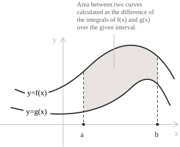
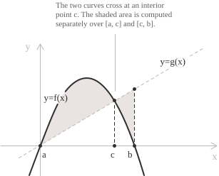
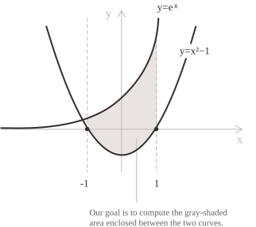

## Finding areas using definite integrals

We know that finding areas is one application of definite integrals](../definite-integrals/), and that when a function is nonnegative on an interval, its definite integral equals the area between its graph and the horizontal axis. The same idea extends fairly readily to finding the area between two curves, with a few details to keep in mind.

Consider two continuous functions](../continuous-functions/) $f$ and $g$ on an interval $[a,b],$ with $a < b,$ and suppose that $f(x) \geq g(x)$ throughout the interval. The region whose area we want to measure is bounded above by the graph of $f$ and below by the graph of $g,$ while the lines $x = a$ and $x = b$ form its left and right boundaries when the curves do not meet at the endpoints. Using a definite integral, we can calculate its area with the simple formula:

$$A = \int_a^b [f(x) - g(x)] \ dx $$

Remember that the order of subtraction in the integrand depends on the relative positions of the curves. Since the height of the region must be nonnegative at every point of the interval, we subtract the lower function from the upper one. The functions need not both be positive, and formula $(1)$ remains valid when one or both lie below the horizontal axis.

A simple first example is the region between the lines $y = 2$ and $y = -1$ for $x \in [0,3].$ The vertical distance between the lines is constant and equals $2 - (-1) = 3.$ Applying $(1)$ gives:

$$A = \int_0^3 [2 - (-1)] \ dx = [3x]_0^3 = 9$$

The result is therefore the area of a rectangle with base $3$ and height $3.$ In practice, however, problems are usually less accommodating. The height between two curves generally varies with $x,$ so the integral must account for this variation over the entire interval on which we are finding the area.

## Geometric interpretation

To get a better sense of where formula $(1)$ comes from, consider the shaded region between the graphs of $f$ and $g$ shown below.

  

We cannot simply multiply base by height as we would for a rectangle, since, as the figure shows, the height of the region varies as $x$ runs from $a$ to $b.$ We therefore divide $[a,b]$ into small subintervals of width $\Delta x_i$ and choose a point $\xi_i$ in each one. On each subinterval, we can then approximate the corresponding part of the region by a rectangle with base $\Delta x_i$ and height $f(\xi_i) - g(\xi_i).$ Adding the areas of these rectangles gives:

$$A \approx \sum_{i=1}^{n} [f(\xi_i) - g(\xi_i)]\Delta x_i$$

Since $f$ and $g$ are continuous, their difference $f - g$ is also continuous and Riemann integrable](../riemann-integrability-criteria/). As the maximum width of the subintervals tends to zero, these sums converge to the definite integral of $f - g.$ This gives formula $(1),$ which we can also rewrite using the linearity of the integral](../definite-integrals/):

$$A = \int_a^b f(x) \ dx - \int_a^b g(x) \ dx $$

This equality expresses the required area as the difference of two integrals over the same interval. Be careful, though. If a function takes negative values, its integral gives a signed area, which need not equal the geometric area between its graph and the horizontal axis. The difference is still correct because $f(x) - g(x)$ measures the vertical distance between the graphs at each point. A form that does not require us to determine which curve lies above the other is:

$$A = \int_{a}^{b} |f(x) - g(x)| \ dx $$

## Areas between intersecting curves

So far, we have assumed that one curve stays above the other throughout the interval. When this is no longer the case, we need to work out where $f(x) - g(x)$ changes sign before starting the calculations. If the interval is not given, its endpoints are determined by the intersections of the curves, which we find by setting $f(x) = g(x).$

We need to take care here, since two consecutive intersections may enclose one region, while several intersections may produce several regions to be considered separately or together.

Suppose, for example, that the curves switch positions (upper and lower) at a point $c \in (a,b).$ More precisely, suppose that $f(x) \geq g(x)$ on $[a,c]$ and $g(x) \geq f(x)$ on $[c,b].$ This situation is shown in the following figure:

  

In this case, the integral of $f - g$ over all of $[a,b]$ would count the first region positively and the second negatively. To obtain the geometric area, we must add two nonnegative contributions, reversing the order of subtraction after $c.$ We therefore write:

$$A = \int_a^c [f(x) - g(x)] \ dx + \int_c^b [g(x) - f(x)] \ dx $$

The same construction applies when there is more than one change of sign. This explains the use of the absolute value](../absolute-value/) in $(3),$ which gives the vertical distance between the curves regardless of their order. To evaluate the integral using antiderivatives, we generally still need to determine the sign of $f - g$ and rewrite the absolute value on the different subintervals.

> An intersection does not necessarily mean that the curves switch positions. The graphs of $f(x) = x^2$ and $g(x) = 0$ meet at the origin, but $f(x) \geq g(x)$ on both sides. We only need to split the integral when the difference changes sign or when the expression defining a boundary of the region changes.

## Example 1

Let us apply the method we have described to the curves $y = e^x$ and $y = x^2 - 1$ on the interval $[-1,1].$ Here the endpoints are already given, so we need to determine which curve is above the other. The region is shown below.

  

The function $e^x$ is positive for every $x,$ whereas $x^2 - 1 \leq 0$ on $[-1,1],$ so the graph of the exponential lies above the parabola throughout the interval. Formula $(1)$ gives:

$$A = \int_{-1}^{1} [e^x - (x^2 - 1)] \ dx$$

Fortunately, this integral is simpler than it may first appear. We can evaluate it in just a few straightforward steps:

$$
\begin{aligned}
A &= \int_{-1}^{1} (e^x - x^2 + 1) \ dx \\
  &= \left[e^x - \frac{x^3}{3} + x\right]_{-1}^{1} \\
  &= \left(e - \frac{1}{3} + 1\right) - \left(e^{-1} + \frac{1}{3} - 1\right) \\
  &= e - \frac{1}{e} + \frac{4}{3}
\end{aligned}
$$

We have therefore found the area between the two curves on the given interval, which is $e - 1/e + 4/3.$

## Example 2

Now consider the curves $f(x) = x^3 - 3x$ and $g(x) = x,$ and again find the area of the regions enclosed by their graphs. This time the interval is not given, so we must find the intersections by setting $f(x) = g(x):$

$$
\begin{aligned}
x^3 - 3x &= x \\
x^3 - 4x &= 0 \\
x(x - 2)(x + 2) &= 0
\end{aligned}
$$

The factorization gives the solutions immediately, namely $x = -2,$ $x = 0$ and $x = 2.$ The curves therefore enclose two regions, one over $[-2,0]$ and the other over $[0,2].$ To set up their integrals, we now examine the sign of the difference](../polynomial-inequalities/):

$$f(x) - g(x) = x(x - 2)(x + 2)$$

For $-2 < x < 0,$ the first two factors are negative and the third is positive, so the product is positive. On this interval, $f$ is the upper function. For $0 < x < 2,$ only the factor $x - 2$ is negative, so the product is negative and $g$ is the upper function. Applying $(4),$ we write:

$$A = \int_{-2}^{0} (x^3 - 4x) \ dx + \int_0^2 (4x - x^3) \ dx$$

We calculate the two contributions separately. For the region to the left of the origin, we obtain:

$$
\begin{aligned}
A_1 &= \left[\frac{x^4}{4} - 2x^2\right]_{-2}^{0} \\
    &= 0 - (4 - 8) \\
    &= 4
\end{aligned}
$$

For the region to the right of the origin, the difference has the opposite sign, and the calculation gives:

$$
\begin{aligned}
A_2 &= \left[2x^2 - \frac{x^4}{4}\right]_0^2 \\
    &= (8 - 4) - 0 \\
    &= 4
\end{aligned}
$$

The total area of the two regions is therefore $A = A_1 + A_2 = 8.$

Notice that the two areas are equal because $f$ and $g$ are both odd functions](../even-and-odd-functions/). We could therefore have calculated just the area over $[0,2]$ and doubled it. You can see why reversing the sign matters here. If we had integrated $f - g$ over all of $[-2,2]$ without changing the sign, we would have obtained zero, since the two contributions would have canceled.

## Integration with respect to $y$

Describing a region using vertical strips is not always the most convenient approach. Some regions have left and right boundaries expressed directly as functions of $y.$ In these cases, it is convenient to use horizontal rather than vertical sections and integrate with respect to $y.$

For example, suppose that $p$ and $q$ are continuous functions on $[c,d],$ with $c < d$ and $p(y) \geq q(y)$ throughout the interval. Consider the region bounded on the right by $x = p(y),$ on the left by $x = q(y),$ and by the lines $y = c$ and $y = d.$ Each horizontal section has length $p(y) - q(y),$ so the area is:

$$A = \int_c^d [p(y) - q(y)] \ dy $$

The reasoning is the same as for $(1),$ but with the coordinates interchanged. Before, we subtracted the lower boundary from the upper one; now we subtract the left boundary from the right one. The choice of variable therefore depends on the shape of the region and the functions to be integrated. If one description requires a change in the expression for a boundary, while the other uses the same two boundaries throughout the interval, the second may reduce the number of integrals needed.

> A brief but relevant aside. To rewrite a curve $y = f(x)$ in the form $x = f^{-1}(y),$ the function $f$ must be invertible on the part under consideration. If it is not, we may need to distinguish several branches, as with the parabola $x = y^2,$ which gives $y = \sqrt{x}$ and $y = -\sqrt{x}.$

## Example 3

Let us find the area enclosed by the parabola $x = y^2$ and the line $x = y + 2.$ Both curves are expressed as functions of $y,$ so we try formula $(5).$ As in Example 2, the limits of integration are not given. To find them, we equate the two expressions for $x:$

$$
\begin{aligned}
y^2 &= y + 2 \\
y^2 - y - 2 &= 0 \\
(y - 2)(y + 1) &= 0
\end{aligned}
$$

The intersections have $y$-coordinates $y = -1$ and $y = 2.$ On this interval, the difference between the $x$-coordinate on the line and the $x$-coordinate on the parabola is:

$$y + 2 - y^2 = (2 - y)(y + 1)$$

Both factors are nonnegative for $-1 \leq y \leq 2.$ The line is therefore the right boundary and the parabola is the left boundary. Subtracting in this order and integrating gives:

$$
\begin{aligned}
A &= \int_{-1}^{2} (y + 2 - y^2) \ dy \\
  &= \left[\frac{y^2}{2} + 2y - \frac{y^3}{3}\right]_{-1}^{2} \\
  &= \left(2 + 4 - \frac{8}{3}\right) - \left(\frac{1}{2} - 2 + \frac{1}{3}\right) \\
  &= \frac{10}{3} + \frac{7}{6} = \frac{9}{2}
\end{aligned}
$$

The area of the region enclosed by the two curves is therefore $9/2.$

- - -

Let us now see how the calculation changes if we use vertical strips. The parabola gives the two branches $y = \pm\sqrt{x},$ while the line becomes $y = x - 2.$ The region extends from $x = 0$ to $x = 4.$ On $[0,1],$ the lower boundary is $y = -\sqrt{x};$ on $[1,4],$ it is $y = x - 2.$ The upper boundary is $y = \sqrt{x}$ on both intervals. The area is therefore given by:

$$A = \int_0^1 2\sqrt{x} \ dx + \int_1^4 (\sqrt{x} - x + 2) \ dx$$

This calculation is also relatively simple, and we find the antiderivatives using the power rule](../indefinite-integrals/):

$$
\begin{aligned}
A &= \left[\frac{4}{3}x^{3/2}\right]_0^1 + \left[\frac{2}{3}x^{3/2} - \frac{x^2}{2} + 2x\right]_1^4 \\
  &= \frac{4}{3} + \frac{16}{3} - \left(\frac{2}{3} - \frac{1}{2} + 2\right) \\
  &= \frac{4}{3} + \frac{19}{6} = \frac{9}{2}
\end{aligned}
$$

As you can see, the result is identical to the one obtained using horizontal strips.

## A few final practical considerations

As we have seen, finding the area between two curves by integration is not difficult. Apart from the calculations, the part that requires the most care is understanding the shape of the region. It is therefore best to start by identifying its boundaries and deciding whether to integrate with respect to $x$ or $y.$

If the interval is not given, we find the intersections and select those that bound the required region. When there are more than two intersections, we must distinguish the area of a single region from the sum of the areas of all the enclosed regions. Between two consecutive intersections, the difference of two continuous functions has no zeros and keeps the same sign. In this case, evaluating it at one interior point is enough to determine its sign throughout the subinterval.

Once we understand the shape of the region, we set up each integral by subtracting the lower boundary from the upper one, or the left boundary from the right one. If the order of the boundaries or their defining expressions change, we split the calculation into the corresponding intervals. Remember, though, that an intersection alone does not necessarily mean we must reverse the subtraction. Two graphs may touch at one or more points without crossing.

All that remains is to evaluate the integral](../fundamental-theorem-of-calculus/) and obtain the area.
