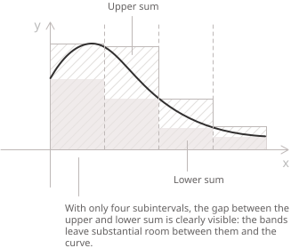
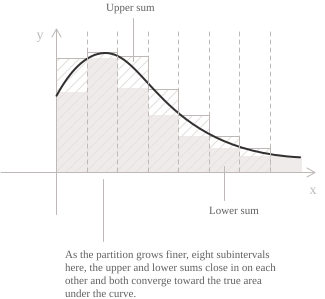

## Partitions, upper sums, and lower sums

We know that the Riemann integral](../definite-integrals/) of a bounded function on a closed interval](../intervals/) measures the area (with its sign taken into account) under its graph. This is done through rectangular approximations that progressively converge to the same value. The main difficulty is usually to determine whether this limiting process is well defined. Below, we will present a series of criteria that answer this question even when the function is not obviously continuous.

The criteria we will present determine whether a bounded function $f$ on $[a,b]$ is integrable in the following cases. The last two conditions use Lebesgue measure, which we will introduce later.

+ If $f$ is continuous on $a, b],$ then it is integrable.
+ If $f$ is monotone on $a, b],$ then it is integrable.
+ If $f$ has only finitely many discontinuities, then it is integrable.
+ If the discontinuities of $f$ form a set of measure zero, then it is integrable.
+ If the set of discontinuities of $f$ has positive Lebesgue measure, then $f$ is not Riemann integrable.

- - -

We begin with two points $a < b$ and a bounded function $f:[a,b]\to\mathbb{R}.$ We define a partition $P$ of $[a,b]$ as a finite set of points $P = \\{\ x_0, x_1, \dots, x_n \\}$ ordered so that:

$$a = x_0 < x_1 < \cdots < x_n = b$$

On each subinterval $[x_{i-1}, x_i],$ we define the supremum and infimum](../supremum-and-infimum/) of $f.$ Since $f$ is bounded, we can define its supremum and infimum as follows:

$$M_i = \sup_{x \in [x_{i-1}, x_i]} f(x)$$

$$m_i = \inf_{x \in [x_{i-1}, x_i]} f(x)$$

$M_i$ is the smallest number greater than or equal to every value that $f$ takes on the subinterval $[x_{i-1},x_i],$ while $m_i$ is the largest number less than or equal to every value that $f$ takes on the same subinterval. The figure shows a nonnegative function together with its lower sums. On each subinterval, the top edge of the rectangle is at height $m_i$ and lies at or below the graph.

  

The next figure shows the upper sum. The top edge of each rectangle is at height $M_i$ and lies at or above the graph.

  

We know that when $f$ is Riemann integrable, its integral lies between the lower and upper sums.

When $f$ is continuous, $M_i$ and $m_i$ coincide with the maximum and minimum actually attained on the subinterval, but for a general bounded function we use the supremum and infimum because a maximum or minimum may never be attained on that interval.

Using $M_i$ and $m_i,$ we define what we call the Darboux upper and lower sums, given respectively by:

$$U(f, P) = \sum_{i=1}^n M_i(x_i - x_{i-1})$$

$$L(f, P) = \sum_{i=1}^n m_i(x_i - x_{i-1})$$

These sums satisfy the following order properties:

+ As we refine the partition into progressively smaller subintervals, the upper sum can only decrease or remain unchanged, while the lower sum can only increase or remain unchanged.
+ Moreover, every lower sum is less than or equal to every upper sum, even when they are associated with different partitions, because both can be compared through a common refinement.

In particular, the following inequality holds:

$$L(f, P) \leq U(f, P)$$

A refinement therefore reduces the gap between the upper and lower sums or leaves it unchanged, but this gap does not necessarily tend to zero.

## The Darboux criterion

The Darboux criterion states that a bounded function on a closed bounded interval is Riemann integrable if and only if there are partitions that make the difference between the upper and lower sums arbitrarily small. To see this, we begin by defining the upper and lower integrals of $f$ as the infimum of all upper sums and the supremum of all lower sums:

$$U(f) = \inf_{P} U(f, P)$$

$$L(f) = \sup_{P} L(f, P)$$

In both definitions, $P$ ranges over all partitions of $a, b].$ The quantity $U(f)$ is the greatest lower bound of the upper sums, while $L(f)$ is the least upper bound of the lower sums. The order properties above give $L(f) \leq U(f)$ for every bounded function $f.$ A bounded function $f$ is Riemann integrable on $a, b]$ if and only if these two numbers coincide:

$$U(f) = L(f)$$

In that case, their common value is given by the following integral:

$$\int_a^b f(x) \ dx = U(f) = L(f)$$

This equality therefore gives the definition of Riemann integrability. The Darboux criterion, which is equivalent to this definition, states that a bounded function $f$ is Riemann integrable on $a, b]$ if and only if, for every $\varepsilon > 0,$ there is a partition $P$ such that:

$$U(f, P) - L(f, P) < \varepsilon$$

  

The diagrams illustrate the criterion for an arbitrary continuous function. A coarse partition leaves a visible gap between the upper and lower rectangles, while refining it reduces the gap because the oscillation of this function is small on sufficiently short subintervals.

  

For an integrable function, we can find a partition that makes the upper and lower sums as close as we wish, and to prove integrability it is enough to construct such a partition for every $\varepsilon > 0.$ In particular, on each subinterval $[x_{i-1}, x_i],$ the difference $M_i - m_i$ is the oscillation of $f$ on that subinterval. A direct calculation gives:

$$U(f, P) - L(f, P) = \sum_{i=1}^n (M_i - m_i)(x_i - x_{i-1})$$

This identity therefore expresses the gap between the Darboux sums. A bounded function is integrable exactly when, for every $\varepsilon > 0,$ there is a partition that makes this sum less than $\varepsilon.$

The function is not Riemann integrable, however, if the gap has a positive lower bound that holds for all partitions, that is, if there is a constant $\eta > 0$ such that the following inequality holds for every partition:

$$
U(f,P)-L(f,P)=\sum_{i=1}^{n}(M_i-m_i)(x_i-x_{i-1})\geq\eta
$$

Indeed, if we choose $\varepsilon=\eta,$ no partition satisfies the inequality required by the Darboux criterion.

## Common sufficient conditions

The following three conditions imply Riemann integrability and often allow us to avoid estimating the Darboux sums directly, since finding the supremum and infimum on each subinterval and identifying a partition that makes the gap less than $\varepsilon$ can be no easy task. A bounded function $f$ on $a, b]$ is Riemann integrable if it satisfies at least one of them.

+ If $f$ is continuous on $a, b],$ then it is uniformly continuous](../uniform-continuity/). Its oscillation $M_i - m_i$ is therefore uniformly small on all sufficiently short subintervals, and the Darboux criterion gives integrability.
+ If $f$ is monotone on $a, b],$ let $\lVert P\rVert$ denote the largest subinterval length. Bounding the length of each subinterval by $\lVert P\rVert,$ we obtain $U(f, P) - L(f, P) \leq \lVert P\rVert|f(b) - f(a)|,$ because the absolute differences between the function values at the endpoints form a telescoping sum. The gap can therefore be made arbitrarily small.
+ If $f$ is bounded and has only finitely many discontinuities, we can cover those points with intervals of arbitrarily small total length. Boundedness controls the contribution from these intervals. On the remaining compact pieces, $f$ is uniformly continuous, which allows us to control the rest of the gap between the Darboux sums. This condition includes piecewise continuous functions](../piecewise-functions/) on closed bounded intervals.

Keep in mind that a function can be integrable even if it satisfies none of the three conditions above. Moreover, the discontinuities can be dense in the interval](../topology-of-the-real-line/) even for a monotone function. To characterise Riemann integrability, we therefore need to consider the measure of the set of discontinuities, as we will see in the next criterion.

## The criterion based on the set of discontinuities

We now turn to a more advanced case, considering a bounded function $f:[a,b]\to\mathbb{R}.$ This function is Riemann integrable if and only if its set of discontinuities has Lebesgue measure zero. In simple terms, this means that all the points of discontinuity can be covered by a finite or countable family of intervals whose total length is arbitrarily small.

Formally, a set $D \subset a, b]$ has measure zero if, for every $\varepsilon > 0,$ it can be covered by a countable family of intervals whose total length is less than $\varepsilon.$ The set of discontinuities can therefore be infinite or dense, provided it has measure zero. The following two examples compare a set of discontinuities of positive measure with one of measure zero.

- - -

As an example, take the Dirichlet function](../dirichlet-function/), defined by:

$$
f(x) =
\begin{cases}
1 & x \in \mathbb{Q} \\
0 & x \notin \mathbb{Q}
\end{cases}
$$

This function is discontinuous at every point of $a, b],$ so its set of discontinuities is the entire interval and has positive measure. The Dirichlet function is therefore not Riemann integrable. Every subinterval contains both rational and irrational numbers, so $M_i = 1$ and $m_i = 0$ for every $i.$ It follows that $U(f, P) - L(f, P) = b - a$ for every partition $P,$ regardless of how fine it is.

- - -

Every finite or countable set](../cardinality-and-countable-sets/) has Lebesgue measure zero. Now consider Thomae's function, defined by:

$$
t(x) =
\begin{cases}
0 & x \notin \mathbb{Q} \\
\dfrac{1}{q} & x = \dfrac{p}{q}
\end{cases}
$$

In the second line, $p\in\mathbb{Z},$ $q\in\mathbb{N},$ $q>0$ and the fraction $p/q$ is in lowest terms.

This function is discontinuous exactly at the rational numbers](../rational-numbers/) and continuous at every irrational number](../irrational-numbers/). The rationals in $a, b]$ form a countable set, so Thomae's function is Riemann integrable. Since $t \geq 0$ and every subinterval contains an irrational number, every lower Darboux sum is zero. The common value of the upper and lower integrals is therefore zero.
