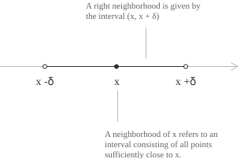
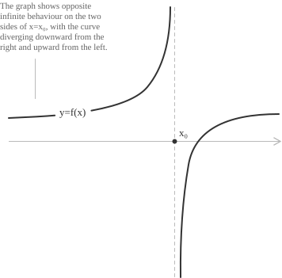
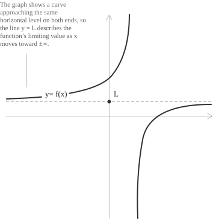

## Introduzione e definizione

Il concetto di limite è fondamentale nell'analisi matematica, poiché consente di studiare il comportamento di una funzione quando essa si avvicina arbitrariamente a un certo valore. Prima di passare alla sua definizione, consideriamo una generica funzione $f(x)$ e un intervallo costituito da tutti i punti vicini a $x,$ definito intorno di $x.$ Più nello specifico, se consideriamo un punto $x$ generico e due punti $x - \delta$ e $x + \delta$ sulla retta reale, possiamo definire l'intorno circolare di $x$ come l'intervallo aperto $(x - \delta, x + \delta)$ con $\delta > 0.$

  

Gli intorni consentono di definire i limiti, in quanto permettono di descrivere il comportamento locale della $f(x)$ vicino a un dato punto. Come si può vedere dalla figura, più piccolo è l'intorno, più l'intervallo $(x - \delta, x + \delta)$ si restringe, tanto più i suoi punti sono vicini a $x.$

Procediamo adesso a una formalizzazione della definizione di limite considerando sempre una funzione $f(x)$ di cui vogliamo studiare il comportamento quando la $x$ si avvicina al punto $x_0.$ Diciamo allora che, per $x$ che tende a $x_0,$ la funzione $f(x)$ ha limite $\ell,$ e scriviamo:

$$\lim_{x \to x_0} f(x) = \ell $$

La formula (1) afferma che possiamo rendere i valori di $f(x)$ arbitrariamente vicini a $\ell,$ purché scegliamo $x$ sufficientemente vicino a $x_0$ e diverso da $x_0.$ Per farlo fissiamo una tolleranza $\varepsilon > 0$ che rappresenta una distanza da $\ell$ entro la quale vogliamo che si trovino i valori di $f(x).$ La formula (1) richiede che, per ogni scelta di $\varepsilon > 0,$ esista un numero $\delta > 0$ in grado di garantire questa vicinanza per tutti i punti $x$ del dominio che soddisfano la seguente condizione:

$$0 < |x - x_0| < \delta$$

La disuguaglianza $|x - x_0| < \delta$ nella (3) impone che $x$ si trovi a una distanza minore di $\delta$ da $x_0,$ mentre $0 < |x - x_0|$ esclude il punto $x = x_0.$ La scelta di $\delta$ deve assicurare che la distanza tra $f(x)$ e $\ell$ sia minore della tolleranza, ovvero deve valere la seguente disuguaglianza:

$$|f(x) - \ell| < \varepsilon$$

Per chiarire come si sceglie $\delta$ a partire da $\varepsilon,$ consideriamo questo esempio. Prendiamo la funzione $f(x) = 2x$ e calcoliamo il suo limite quando $x$ tende a $3,$ che è pari a $6$. Possiamo quindi scrivere:

$$|f(x) - 6| = |2x - 6| = 2|x - 3| $$

Se vogliamo che $f(x)$ disti da $6$ meno di $0.01,$ basta richiedere che $x$ disti da $3$ meno di $0.005,$ in quanto per la $(5)$ la distanza $|f(x) - 6|$ è il doppio della distanza $|x - 3|.$ Infatti, se $|x - 3| < 0.005,$ si ottiene:

$$|f(x) - 6| = 2|x - 3| < 2 \cdot 0.005 = 0.01$$

Abbiamo quindi scelto $\varepsilon = 0.01$ e trovato $\delta = 0.005.$ In questo esempio, chiedere che $f(x)$ disti da $6$ meno di $0.01$ equivale a chiedere che il suo valore appartenga a un intorno di $6,$ che può essere indicato da un intervallo piccolo a piacere come $(5.99, 6.01).$ Abbiamo visto che ciò è verificato per tutti gli $x$ nell'intervallo $(2.995, 3.005),$ che è un intorno di $3,$ ad esclusione del $x = 3,$ come richiesto dalla $(3).$ Per ogni $\varepsilon > 0,$ la scelta $\delta = \varepsilon/2$ garantisce la (4), confermando che il limite è $6.$

- - -

Abbiamo visto che la $(1)$ si applica per un certo $x$ che tende a $x_0,$ ma la stessa definizione si può applicare quando ci avviciniamo a $x$ da destra o da sinistra. In questo caso si parla rispettivamente di limite destro e di limite sinistro indicati come segue:

$$ 
\begin{aligned}
&\lim_{x \to x_0^+} f(x) \\
&\lim_{x \to x_0^-} f(x)
\end{aligned}
$$

Nel primo caso il limite si avvicina a $x$ con valori prossimi a $x$ e maggiori di $x$, mentre nel secondo caso con valori minori. Quando tali limiti esistono e sono finiti, ma assumono valori diversi $\ell_1 \neq \ell_2,$ si ha che:

$$ 
\begin{cases}
\lim\limits_{x \to x_0^-} f(x) = \ell_1 \in \mathbb{R} \\
\lim\limits_{x \to x_0^+} f(x) = \ell_2 \in \mathbb{R}
\end{cases} \implies \nexists \lim\limits_{x \to x_0} f(x)
$$

In tale situazione esistono due limiti laterali distinti, ma non esiste il limite per $x$ che tende a $x_0$ senza restrizioni sul lato da cui si avvicina.

## Teorema di unicità del limite

La (7) segue dal teorema di unicità del limite, secondo il quale il limite di una funzione, se esiste, è unico. Se ad esempio il limite per $x \to x_0$ è pari a $\ell,$ anche i limiti destro e sinistro devono necessariamente coincidere con esso. La dimostrazione del teorema procede per assurdo, con i seguenti assunti:

+ $x_0$ è un punto di accumulazione per cui ogni suo intorno deve contenere almeno un punto del dominio diverso da $x_0.$ 
+ Esistono due limiti $\ell_1$ e $\ell_2$ con $\ell_1 \lt \ell_2.$ 

Scegliamo quindi la seguente tolleranza:

$$\varepsilon = \frac{\ell_2 - \ell_1}{2} > 0$$

Poiché per ipotesi la funzione tende sia a $\ell_1$ che a $\ell_2,$ per la $(3)$ esiste $\delta_1 > 0$ tale che, per tutti gli $x$ del dominio con $0 < |x - x_0| < \delta_1,$ si ha $|f(x) - \ell_1| < \varepsilon,$ ovvero la $(4).$ Questo impone a $f(x)$ di essere minore di $\ell_1 + \varepsilon,$ cioè del punto medio tra i due valori. 

Lo stesso ragionamento può essere fatto quando la funzione tende a $\ell_2.$ In questo caso abbiamo una distanza $\delta_2 > 0$ per la quale $0 < |x - x_0| < \delta_2$ che implica $|f(x) - \ell_2| < \varepsilon.$ In questo caso $f(x)$ deve essere maggiore di $\ell_2 - \varepsilon,$ che è lo stesso punto medio.

Scegliamo ora un punto $x$ del dominio la cui distanza da $x_0$ sia positiva e valga la seguente relazione:

$$0 < |x - x_0| < \min\{\delta_1, \delta_2\}$$

Tenendo conto della $(4),$ per $x$ devono necessariamente valere entrambe le seguenti disuguaglianze:

$$
\begin{aligned}
f(x) &< \ell_1 + \varepsilon = \frac{\ell_1 + \ell_2}{2} \\
f(x) &> \ell_2 - \varepsilon = \frac{\ell_1 + \ell_2}{2}
\end{aligned}
$$

Questo porta a un assurdo. Per esempio, se $\ell_1 = 2$ e $\ell_2 = 4,$ la tolleranza scelta è $\varepsilon = (4 - 2)/2 = 1.$ Le due condizioni diventano:

$$
\begin{aligned}
f(x) &< 2 + 1 = 3 \\
f(x) &> 4 - 1 = 3
\end{aligned}
$$

Lo stesso valore $f(x)$ dovrebbe quindi essere contemporaneamente minore di $3$ e maggiore di $3,$ il che è impossibile. Quindi l'ipotesi che i due limiti $\ell_1$ e $\ell_2$ siano distinti è impossibile, il che dimostra il teorema.

Vediamo ora un altro caso in cui esiste contemporaneamente un limite finito $\ell$ e un limite infinito. Se $f(x)$ tende a $\ell,$ scegliendo $\varepsilon = 1,$ otteniamo per qualunque $x$ che si avvicina a $x_0,$ la seguente disuguaglianza:

$$\ell - 1 < f(x) < \ell + 1 $$

Se la funzione tende anche a $\pm\infty,$ dovremmo avere $f(x) > \ell + 1$ o $f(x) < \ell - 1,$ in contraddizione con la $(8)$.

Infine, vediamo il caso in cui i limiti esistono e sono rispettivamente $\pm \infty$. Quando il limite vale $+ \infty,$ avremmo $f(x) > 1$ per $x$ che tende a $x_0,$ mentre per $- \infty$ $f(x) < -1,$ il che porta a una contraddizione.

Pertanto, dall'analisi dei casi precedenti possiamo concludere che, se il limite di una funzione per $x \to x_0$ esiste, finito o infinito, il suo valore è unico, come richiesto dal teorema.

## Asintoti

In generale, in un limite la variabile $x$ può tendere a un numero reale $x_0$ oppure a $\pm \infty,$ mentre il valore del limite può essere finito oppure infinito. Per $x$ che tende a un punto finito, i casi possibili sono:

$$
\begin{aligned}
\lim_{x \to x_0} f(x) &= \ell \\
\lim_{x \to x_0} f(x) &= \pm \infty
\end{aligned}
$$

Per $x$ che tende a $\pm \infty,$ si hanno invece i casi:

$$
\begin{aligned}
\lim_{x \to \pm \infty} f(x) &= \ell \\
\lim_{x \to \pm \infty} f(x) &= \pm \infty
\end{aligned}
$$

Quando $f(x)$ tende a $\pm \infty$ per $x$ che si avvicina a $x_0,$ il comportamento della funzione vicino a quel punto determina un asintoto verticale di equazione $x = x_0.$ Un asintoto è una retta alla quale il grafico di una funzione si avvicina quando il valore di $x$ oppure quello di $f(x)$ cresce o decresce senza limite. La distanza tra la curva e l'asintoto tende a zero quando il grafico si estende verso infinito sul piano cartesiano.

  

Talvolta, come nell'esempio in figura, i limiti destro e sinistro divergono con segni opposti:

$$
\begin{aligned}
\lim_{x \to x_0^+} f(x) &= -\infty \\
\lim_{x \to x_0^-} f(x) &= +\infty
\end{aligned}
$$

Quando $f(x)$ tende a un valore finito $L$ per $x$ che tende a $+\infty$ oppure a $-\infty,$ la retta $y = L$ è un asintoto orizzontale della funzione nella direzione corrispondente.

  

La stessa retta è un asintoto orizzontale in entrambe le direzioni quando i due limiti all'infinito sono uguali a $L$:

$$
\begin{aligned}
\lim_{x \to +\infty} f(x) &= L \\
\lim_{x \to -\infty} f(x) &= L
\end{aligned}
$$

Esistono anche gli asintoti obliqui, cioè rette di equazione $y = mx + q,$ con $m \neq 0,$ alle quali il grafico si avvicina con distanza che tende a zero per $x \to +\infty$ oppure $x \to -\infty.$ Una trattazione sistematica degli asintoti orizzontali, verticali e obliqui è sviluppata nella pagina dedicata.

## Proprietà

I limiti rispettano una serie di proprietà algebriche che sono trattate nel dettaglio, con esempi svolti, nella pagina dedicata. Qui riepiloghiamo le proprietà delle operazioni fondamentali che consentono di semplificare i calcoli nella risoluzione dei problemi.

Il limite del prodotto di una costante per una funzione è uguale al prodotto della costante per il limite della funzione:

$$\lim_{x \to x_0} c f(x)  = c \lim_{x \to x_0} f(x) = c \cdot \ell $$

Il limite della somma di due funzioni è uguale alla somma dei rispettivi limiti:

$$\lim_{x \to x_0} \big( f(x) + g(x) \big) = \lim_{x \to x_0} f(x) + \lim_{x \to x_0} g(x) = \ell_1 + \ell_2$$

La $(10)$ è particolarmente utile quando si ha a che fare con i polinomi, con le funzioni trigonometriche come seno e coseno e con altre espressioni elementari comuni che si possono ridurre alla somma di due limiti.

Un'ulteriore proprietà riguarda il limite del prodotto di due funzioni che è uguale al prodotto dei rispettivi limiti:

$$\lim\limits_{x \to x_0} \big( f(x) g(x) \big) = \lim\limits_{x \to x_0} f(x) \cdot \lim\limits_{x \to x_0} g(x) = \ell_1 \cdot \ell_2 $$

Infine, il limite del quoziente di due funzioni è uguale al quoziente dei rispettivi limiti:

$$\lim\limits_{x \to x_0} \left( \frac{f(x)}{g(x)} \right) = \frac{\lim\limits_{x \to x_0} f(x)}{\lim\limits_{x \to x_0} g(x)} = \frac{\ell_1}{\ell_2} $$

Tutte le proprietà descritte sopra sono valide solo quando i limiti coinvolti esistono e sono finiti e, nel caso del quoziente, il limite del denominatore è diverso da zero. Nei problemi pratici, però, sostituire alle funzioni i rispettivi limiti può condurre a delle espressioni che non consentono di determinare il valore del limite, come ad esempio nei seguenti casi:

$$\frac{0}{0} \qquad \frac{\infty}{\infty} \qquad \infty - \infty$$

Queste espressioni sono note come forme indeterminate e per risolverle occorrono tecniche specifiche, come la scomposizione in fattori, il confronto asintotico, la regola di de l'Hôpital, l'uso degli sviluppi di Taylor e il ricorso alla notazione di o piccolo. Uno degli esempi più noti è il limite della seguente funzione:

$$\lim_{x \to 0} \frac{\sin x}{x} $$

Se procediamo a sostituire direttamente $x = 0$ nella $(13),$ otteniamo la forma indeterminata $0/0,$ che non è definita, e la proprietà del quoziente non si può applicare perché il limite del denominatore è zero. La $(13)$ è un limite notevole il cui valore è $1$. La risoluzione delle forme indeterminate e i limiti notevoli hanno una trattazione dedicata in due apposite voci.

## Limiti delle funzioni elementari

Nella sezione del sito sulle funzioni, ciascuna tipologia di funzione presenta una sezione dedicata ai relativi limiti elementari e notevoli. Di seguito vengono riepilogati i limiti più noti:

Per una funzione costante $f(x) = k$ con $k \in \mathbb{R},$ si ha:

$$
\begin{aligned}
\lim_{x \to -\infty} k &= k \\
\lim_{x \to +\infty} k &= k
\end{aligned}
$$

Per la funzione identità $f(x) = x,$ si ha:

$$
\begin{aligned}
\lim_{x \to -\infty} x &= -\infty \\
\lim_{x \to +\infty} x &= +\infty
\end{aligned}
$$

Per la funzione esponenziale con base $a > 1,$ si ha:

$$
\begin{aligned}
\lim_{x \to -\infty} a^x &= 0 \\
\lim_{x \to +\infty} a^x &= +\infty
\end{aligned}
$$

Per la funzione esponenziale con base $0 < a < 1,$ si ha:

$$
\begin{aligned}
\lim_{x \to -\infty} a^x &= +\infty \\
\lim_{x \to +\infty} a^x &= 0
\end{aligned}
$$

Per la funzione potenza $f(x) = x^n$ abbiamo due casi. Il primo è quello con esponente $n \in \mathbb{N}$ pari e positivo, per cui si ha:

$$
\begin{aligned}
\lim_{x \to -\infty} x^n &= +\infty \\
\lim_{x \to +\infty} x^n &= +\infty
\end{aligned}
$$

Quando invece l'esponente è dispari, si ha:

$$
\begin{aligned}
\lim_{x \to -\infty} x^n &= -\infty \\
\lim_{x \to +\infty} x^n &= +\infty
\end{aligned}
$$

Anche per la funzione che coinvolge la radice $f(x) = \sqrt[n]{x}$ abbiamo due casi. Il primo è quello con indice pari, per cui si ha:

$$\lim_{x \to +\infty} \sqrt[n]{x} = +\infty$$

Per la funzione con indice dispari, invece, si ha:

$$
\begin{aligned}
\lim_{x \to -\infty} \sqrt[n]{x} &= -\infty \\
\lim_{x \to +\infty} \sqrt[n]{x} &= +\infty
\end{aligned}
$$

Per la funzione logaritmo con base $a > 1,$ si ha:

$$
\begin{aligned}
\lim_{x \to 0^+} \log_a x &= -\infty \\
\lim_{x \to +\infty} \log_a x &= +\infty
\end{aligned}
$$

Quando la base è invece compresa nell'intervallo $0 < a < 1,$ si ha:

$$
\begin{aligned}
\lim_{x \to 0^+} \log_a x &= +\infty \\
\lim_{x \to +\infty} \log_a x &= -\infty
\end{aligned}
$$

Per la funzione valore assoluto $f(x) = |x|,$ si ha:

$$
\begin{aligned}
\lim_{x \to -\infty} |x| &= +\infty \\
\lim_{x \to +\infty} |x| &= +\infty
\end{aligned}
$$

Infine, per la funzione segno $\mathrm{sgn}(x),$ si ha:

$$
\begin{aligned}
\lim_{x \to -\infty} \mathrm{sgn}(x) &= -1 \\
\lim_{x \to +\infty} \mathrm{sgn}(x) &= 1
\end{aligned}
$$
