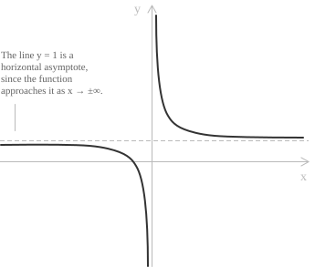
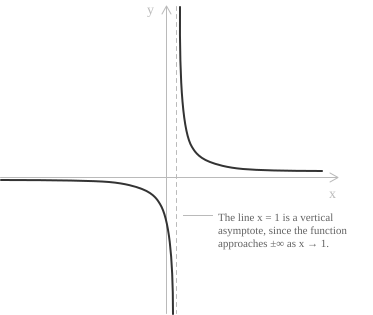
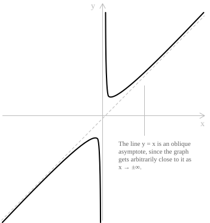

## Horizontal asymptotes

An asymptote of a function is a line that its graph approaches arbitrarily closely, either as the variable tends to infinity or near a point of discontinuity. The definition relies entirely on the notion of limit.

Let $y = f(x)$ be a real-valued function defined on an interval of the form $a, +\infty)$, $(-\infty, b]$, or on $\mathbb{R}$. The line with equation $y = L$ is a horizontal asymptote of $f$ if:

$$\lim_{x \to +\infty} f(x) = L \quad \text{or} \quad \lim_{x \to -\infty} f(x) = L$$

Consider the function:

$$y = \frac{x + 1}{x}$$

  

By computing the limit as $x \to \pm\infty$, we obtain:

$$\lim_{x \to \pm\infty} \frac{x + 1}{x} = \lim_{x \to \pm\infty} \left( 1 + \frac{1}{x} \right) = 1$$

The function therefore admits the horizontal asymptote $y = 1$, which both branches of the graph approach as $x \to +\infty$ and $x \to -\infty$.

## Vertical asymptotes

Let $y = f(x)$ be a real-valued function defined on $a, b] \setminus \\ 
{ x_0 \\}$, where $x_0 \in a, b]$. The line with equation $x = x_0$ is a vertical asymptote of $f$ if:

$$\lim_{x \to x_0^-} f(x) = \pm \infty \quad \text{or} \quad \lim_{x \to x_0^+} f(x) = \pm \infty$$

A standard example is the function:

$$y = \frac{1}{x - 1}$$

  

This rational expression is undefined at $x = 1$, since the denominator becomes zero. To analyse the behaviour of $f(x)$ near $x = 1$, we compute the one-sided limits:

$$\lim_{x \to 1^-} \frac{1}{x - 1} = -\infty \qquad \lim_{x \to 1^+} \frac{1}{x - 1} = +\infty$$

The function diverges to $-\infty$ when approaching $1$ from the left, and to $+\infty$ when approaching from the right. The line $x = 1$ is therefore a vertical asymptote of $f$.

> A rational function](../rational-functions/) often has vertical asymptotes where its denominator vanishes and the function is undefined. Such points are non-removable discontinuities, where the function fails to be continuous.

## Oblique asymptotes

Let $y = f(x)$ be a real-valued function defined on a half-line of the form $(-\infty, a]$ or $a, +\infty)$. The line with equation $y = p x + q$ is an oblique asymptote of $f$ if:

$$
\begin{aligned}
\lim_{x \to -\infty} \big[ f(x) - (p x + q) \big] &= 0 \\
\lim_{x \to +\infty} \big[ f(x) - (p x + q) \big] &= 0
\end{aligned}
$$

The graph of $f$ therefore approaches the line $y = p x + q$ for large values of $|x|$.

- - -

The equation of the oblique asymptote $y = p x + q$ associated with a function $f(x)$ is determined by computing two specific limits. The slope $p$ is found by evaluating:

$$p = \lim_{x \to \pm\infty} \frac{f(x)}{x}$$

Once the slope is known, the vertical offset $q$ is obtained from:

$$q = \lim_{x \to \pm\infty} \big[ f(x) - p x \big]$$

If both limits exist and are finite, then the line $y = p x + q$ is the oblique asymptote of the function.

- - -

Consider the function:

$$f(x) = \frac{x^2 + 1}{x}$$

  

To determine whether this function admits an oblique asymptote as $x \to \pm\infty$, we begin with the limit of $f(x)/x$:

$$\frac{f(x)}{x} = \frac{x^2 + 1}{x^2} = 1 + \frac{1}{x^2}$$

As $x \to \pm\infty$, the term $\dfrac{1}{x^2}$ tends to zero, so:

$$\lim_{x \to \pm\infty} \frac{f(x)}{x} = 1$$

The slope of the asymptote is therefore $p = 1$. Next, we compute the limit of the difference $f(x) - p x$:

$$f(x) - x = \frac{x^2 + 1}{x} - x = \frac{x^2 + 1 - x^2}{x} = \frac{1}{x}$$

Since $\frac{1}{x} \to 0$ as $x \to \pm\infty$, we obtain:

$$\lim_{x \to \pm\infty} [f(x) - x] = 0$$

The function therefore admits an oblique asymptote with equation:

$$y = x$$

> In this case the oblique asymptote passes through the origin, which gives $q = 0$, a degenerate configuration. In general, the vertical offset $q$ need not be zero.

## Example 1

Here the vertical offset $q$ is nonzero, unlike the previous case. Take the function:

$$f(x) = \frac{2 x^2 - x + 3}{2 x}$$

To determine the oblique asymptote, we first compute the slope $p$:

$$
\begin{aligned}
p &= \lim_{x \to \pm\infty} \frac{f(x)}{x} \\
  &= \lim_{x \to \pm\infty} \frac{2 x^2 - x + 3}{2 x^2} \\
  &= 1
\end{aligned}
$$

Next, we evaluate the vertical offset $q$:

$$
\begin{aligned}
q &= \lim_{x \to \pm\infty} \big( f(x) - x \big) \\
  &= \lim_{x \to \pm\infty} \frac{2 x^2 - x + 3 - 2 x^2}{2 x} \\
  &= \lim_{x \to \pm\infty} \frac{- x + 3}{2 x} \\
  &= -\frac{1}{2}
\end{aligned}
$$

The equation of the oblique asymptote is therefore:

$$y = x - \frac{1}{2}$$

## Properties of asymptotes

Several properties follow from these definitions:

+ Not every function admits asymptotes.
+ For horizontal asymptotes, several configurations are possible: a function may have none, it may approach the same horizontal line as $x \to +\infty$ and $x \to -\infty$, or it may approach two distinct horizontal lines in the two directions.
+ Different types of asymptotes can coexist. A single function may simultaneously exhibit horizontal, vertical, and oblique asymptotes, depending on its behaviour near discontinuities and at infinity.
+ Vertical asymptotes are not confined to rational functions: the logarithm $\ln x$ has one at $x = 0$, and $\tan x$ has infinitely many.
+ A graph may cross its horizontal asymptote rather than only approach it, as $\frac{\sin x}{x}$ does infinitely often near $y = 0$.
+ For a rational function](../rational-functions/), an oblique asymptote occurs when the degree of the numerator exceeds that of the denominator by exactly one.

The asymptote condition $f(x) - (p x + q) \to 0$ can be written $f(x) = p x + q + o(1)$ in little-o notation. Landau symbols](../big-o-notation/) more generally compare the growth rates of functions.
