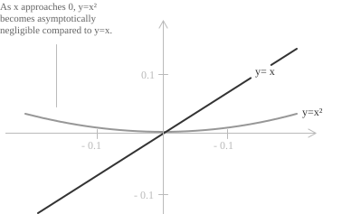

## What is little-o notation

The symbol $o(x)$, read as "little-o of $x$", belongs to the family of Landau symbols, which characterise asymptotic relationships between functions. Writing $f(x) = o(x)$ states that $f(x)$ is negligible compared to $x$ as the input approaches a given value, its growth rate insignificant relative to $x$ in the limit.

Let $f, g : A \to \mathbb{R}$ (or $\mathbb{C}$) be two functions, and let $x_0$ be a limit point of $A$. We say that $f(x)$ is little-o of $g(x)$ as $x \to x_0$ if $g(x) \neq 0$ on a neighbourhood of $x_0$ (except possibly at $x_0$ itself) and:

$$\lim_{x \to x_0} \frac{f(x)}{g(x)} = 0$$

Equivalently, for every $\varepsilon > 0$ there exists $\delta > 0$ such that, whenever $0 < |x - x_0| < \delta$, the inequality $|f(x)| \leq \varepsilon \cdot |g(x)|$ holds.

> The same notation applies to limits at infinity by replacing $x \to x_0$ with $x \to \infty$. It also applies to sequences, where the continuous variable $x$ is replaced by the integer index $n$ and the limit is taken as $n \to \infty$.

## Example 1

Take $f(x) = x^2$ and $g(x) = x$ as $x \to 0$. Their ratio has limit:

$$\lim_{x \to 0} \frac{x^2}{x} = \lim_{x \to 0} x = 0$$

Since the limit is zero, we write:

$$x^2 = o(x) \quad \text{as} \quad x \to 0$$

A direct comparison clarifies the reason. As $x \to 0$, both $x$ and $x^2$ tend to zero, but at different rates. Near the origin, $x^2$ is much smaller than $x$:

  

Numerically, at $x = 0.1$ the square is $0.01$, at $x = 0.01$ it is $0.0001$, and at $x = 0.001$ it is $0.000001$. Each tenfold decrease in $x$ shrinks $x^2$ a hundredfold, so the ratio $x^2/x = x$ falls to zero.

## Example 2

Little-o notation applies equally when the input increases without bound. For $x$ and $x^2$ as $x \to \infty$:

$$\lim_{x \to \infty} \frac{x}{x^2} = \lim_{x \to \infty} \frac{1}{x} = 0$$

Because the ratio approaches zero:

$$x = o(x^2) \quad \text{as} \quad x \to \infty$$

The same relation holds for any two power functions](../power-function/) $x^a$ and $x^b$ with $a < b$:

$$x^a = o(x^b) \quad \text{as} \quad x \to \infty$$

A further example compares a logarithmic function](../logarithms/) with a power function. Since:

$$\lim_{x \to \infty} \frac{\log x}{x} = 0$$

it follows that $\log x = o(x)$ as $x \to \infty$. Logarithmic growth is strictly dominated by linear growth, a fact used throughout the analysis of algorithms.

## The meaning of $o(1)$

The symbol $o(1)$ is the class of functions that tend to zero as $x \to x_0$. A function $f(x)$ belongs to $o(1)$ when it becomes infinitesimally small compared to the constant $1$ in that limit. We write $f(x) = o(1)$ as $x \to x_0$ if and only if:

$$\lim_{x \to x_0} \frac{f(x)}{1} = \lim_{x \to x_0} f(x) = 0$$

The set of all functions belonging to $o(1)$ can be described as:

$$o_{x_0}(1) = \\\{\ f : B(x_0, \delta) \setminus \\ 
{x_0\\} \to \mathbb{R} \mid \lim_{x \to x_0} f(x) = 0 \\\}$$

Here $B(x_0, \delta)$ is an open neighbourhood of $x_0$ of radius $\delta$, and the functions are defined on it except at $x_0$ itself. Membership in $o(1)$ requires only that $f(x) \to 0$ as $x \to x_0$, so $o_{x_0}(1)$ collects exactly the functions that are infinitesimal compared to the constant $1$.

## Example 3

The limit of $\dfrac{\sin x}{x}$ as $x \to 0$ follows from the Taylor expansion of $\sin x$ near zero:

$$\sin x = x - \frac{x^3}{6} + o(x^3) \quad \text{as} \quad x \to 0$$

Dividing both sides by $x$:

$$\frac{\sin x}{x} = 1 - \frac{x^2}{6} + o(x^2) \quad \text{as} \quad x \to 0$$

Both $\dfrac{x^2}{6}$ and the remainder $o(x^2)$ vanish as $x \to 0$, so:

$$\frac{\sin x}{x} = 1 + o(1)$$

> Since $o(1) \to 0$, this recovers $\lim_{x \to 0} \dfrac{\sin x}{x} = 1$, one of the remarkable limits](../remarkable-limits/).

## Properties

One property follows at once from the definition. If $g(x) = o(f(x))$ as $x \to x_0$, the ratio of the two functions tends to zero:

$$\lim_{x \to x_0} \frac{o(f(x))}{f(x)} = 0$$

- - -

Multiplying a function by a nonzero constant does not affect its asymptotic behaviour in little-o notation. For any constant $c \in \mathbb{R}$ and any function $g(x)$, as $x \to x_0$:

$$o(c \cdot g(x)) = o(g(x))$$

$$c \cdot o(g(x)) = o(g(x))$$

> A nonzero constant only rescales the ratio that defines little-o, so its zero limit is unchanged.

- - -

Little-o terms behave predictably under addition. The sum of two little-o terms of the same function remains a little-o term of that function. Formally, as $x \to x_0$:

$$o(f(x)) + o(f(x)) = o(f(x))$$

> By the algebra of limits](../algebra-of-limits/), the limit of a sum is the sum of the limits, so two ratios that each tend to zero add to one that also tends to zero.

- - -

When multiplying a little-o term by a function, the result is a new little-o term whose asymptotic order scales accordingly. For functions $f(x)$ and $g(x)$, as $x \to x_0$:

$$f(x) \cdot o(g(x)) = o(f(x) g(x))$$

For example, if $g(x) = x$ and we have $o(g(x)) = o(x)$, then multiplying by $f(x) = x^2$ gives:

$$x^2 \cdot o(x) = o(x^3)$$

- - -

Powers behave the same way. If $f(x) = o(g(x))$ as $x \to x_0$, then for any $a > 0$ raising both functions to the power $a$ preserves the relation, so that $[f(x)]^a = o([g(x)]^a)$ as $x \to x_0$. For example, with $f(x) = o(x)$ as $x \to 0$ and $a = 2$:

$$[f(x)]^2 = o(x^2)$$

- - -

Little-o notation exhibits transitivity. If $f(x) = o(g(x))$ and $g(x) = o(h(x))$ as $x \to x_0$, then:

$$f(x) = o(h(x)) \quad \text{as} \quad x \to x_0$$

This follows directly from the definition: since both ratios approach zero, their product also approaches zero, and therefore $f(x)/h(x) \to 0$. For example, since $x^3 = o(x^2)$ and $x^2 = o(x)$ as $x \to 0$, it follows that $x^3 = o(x)$ as $x \to 0$.

> Chaining extends to any finite sequence of functions, each little-o of the next, so that the first is little-o of the last.

- - -

The composition of two little-o terms reduces to a single term. If $h(x) = o(g(x))$ and $g(x) = o(f(x))$ as $x \to x_0$, then any function that is little-o of $g$ is also little-o of $f$. In compact notation:

$$o(o(f(x))) = o(f(x)) \quad \text{as} \quad x \to x_0$$

This result follows directly from transitivity: if $h = o(g)$ and $g = o(f)$, then $h = o(f)$. For example, since $x^2 = o(x)$ as $x \to 0$, any function that is $o(x^2)$ is also $o(x)$.

## Distinction between little-o and big-O notation

Little-o and Big-O notation are both members of the family of Landau symbols, but they describe distinct asymptotic behaviours. Big-O notation bounds a function by a constant multiple of another, whereas little-o imposes the stricter requirement that the ratio of the two functions approach zero in the limit.

Formally, $f(x) = O(g(x))$ as $x \to x_0$ if there exist constants $M > 0$ and $\delta > 0$ such that $|f(x)| \leq M |g(x)|$ whenever $0 < |x - x_0| < \delta$.

As $x \to 0$, $x^2 = o(x)$, which also implies $x^2 = O(x)$. However, $x = O(x)$ does not imply $x = o(x)$, since:

$$\lim_{x \to 0} \frac{x}{x} = 1 \neq 0$$

The limit fails to vanish, so the little-o condition is not satisfied even though the Big-O condition holds. Little-o requires the ratio to reach zero, while Big-O asks only that it stay bounded.

In terms of set inclusion, the class of functions satisfying $f = o(g)$ lies strictly within the class satisfying $f = O(g)$. Every little-o relationship is also a Big-O relationship, but the converse fails.

## Little-o notation in Taylor expansions

In an asymptotic expansion](../asymptotic-expansion/), little-o notation describes the error after truncation at a finite order. Rather than writing each omitted term, a single symbol records the remainder's asymptotic order. Given a function $f(x)$ that is $n$ times differentiable at $x_0$, its Taylor expansion to order $n$ takes the form:

$$f(x) = f(x_0) + f'(x_0)(x - x_0) + \frac{f''(x_0)}{2!}(x - x_0)^2 + \cdots + \frac{f^{(n)}(x_0)}{n!}(x - x_0)^n + o\big( (x - x_0)^n \big)$$

The remainder $o((x - x_0)^n)$ conveys precise asymptotic information: the error decreases more rapidly than $(x - x_0)^n$ as $x \to x_0$, and is therefore negligible compared to the last explicit term in the expansion.

- - -

Several common Taylor expansions near $x = 0$ carry an explicit little-o remainder:

[class="table-1"]

|                  |                                                                       |
| ---------------- | --------------------------------------------------------------------- |
| $e^x$            | $1 + x + \dfrac{x^2}{2!} + \dfrac{x^3}{3!} + o(x^3)$                  |
| $\sin x$         | $x - \dfrac{x^3}{6} + o(x^3)$                                         |
| $\cos x$         | $1 - \dfrac{x^2}{2} + \dfrac{x^4}{24} + o(x^4)$                       |
| $\ln(1+x)$       | $x - \dfrac{x^2}{2} + \dfrac{x^3}{3} + o(x^3)$                        |
| $(1+x)^\alpha$   | $1 + \alpha x + \dfrac{\alpha(\alpha-1)}{2} x^2 + o(x^2)$              |

[/class]

These expansions are effective for evaluating limits involving indeterminate forms](../indeterminate-forms/). Replacing a function by its Taylor expansion turns the problem into algebraic manipulation in which the little-o remainder vanishes in the limit:

$$\lim_{x \to 0} \frac{e^x - 1 - x}{x^2} = \lim_{x \to 0} \frac{\dfrac{x^2}{2} + o(x^2)}{x^2} = \frac{1}{2}$$

As $x \to 0$, the little-o term becomes negligible and the limit is determined by the leading coefficient.

> The little-o remainder records more than the presence of omitted terms. It fixes the order of the error, the rate at which the truncated expansion approaches $f(x)$ as $x \to x_0$.
