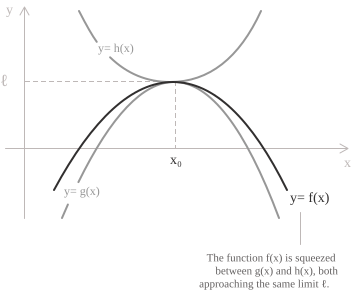
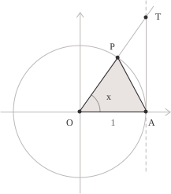
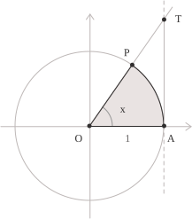

## Statement

When calculating limits, we may encounter problems for which direct substitution is not an effective method. Certain techniques, as we will see in the relevant articles in the section on limits, allow us to handle particular forms, such as indeterminate forms](../indeterminate-forms/). Some functions, such as sine and cosine](../sine-and-cosine/), have an oscillatory behaviour and warrant a separate discussion. In these cases, we use the squeeze theorem, which allows us to evaluate limits of expressions such as the following with ease:

$$x\sin\left( \frac{1}{x} \right) \qquad \frac{\sin x}{x} \qquad x^2\cos\left( \frac{1}{x} \right)$$

In practical terms, the theorem allows us to bound the original function between two functions with the same limit, thereby determining its limit. Consider a limit point](../topology-of-the-real-line/) $x_0 \in \mathbb{R} \cup \{ \pm\infty \}.$ By definition, every neighbourhood of this point contains at least one point of the domain distinct from $x_0.$ We then consider three real-valued functions $f,$ $g$ and $h$ defined at the points of the domain that lie in a neighbourhood $I$ of $x_0.$ Suppose also that the following inequality holds, expressing the fact that the graph of $f$ always lies between the graphs of $g$ and $h$:

$$g(x) \leq f(x) \leq h(x) $$

At this point, suppose that we know the following limit $\ell$:

$$\lim_{x \to x_0} g(x) = \lim_{x \to x_0} h(x) = \ell$$

Then, under these hypotheses, the function $f(x)$ also has a limit, and its value is precisely the limit in $(2)$:

$$\lim_{x \to x_0} f(x) = \ell$$

Graphically, the curve representing $f(x)$ always lies between the lower bounding function $g(x)$ and the upper bounding function $h(x),$ and since both tend to $\ell,$ the function $f(x)$ must also converge to the same limit.

  

To prove this result, we fix an arbitrary number $\varepsilon > 0$ and show that the function $f(x),$ which lies between $g(x)$ and $h(x),$ tends to the same limit $\ell$ as $x \to x_0.$ By the hypothesis stated in $(1),$ we know that $\lim_{x \to x_0} g(x) = \ell.$ By the definition of a limit, a positive number $\delta_1$ therefore exists such that, for every $x$ in the domain satisfying $0 < |x - x_0| < \delta_1,$ we have:

$$\ell - \varepsilon < g(x) < \ell + \varepsilon $$

Again by $(1),$ since we know that $\lim_{x \to x_0} h(x) = \ell,$ an argument analogous to the one just given yields a positive number $\delta_2$ such that, for every $x$ in the domain satisfying $0 < |x - x_0| < \delta_2,$ we have:

$$\ell - \varepsilon < h(x) < \ell + \varepsilon $$

Setting $\delta = \min(\delta_1, \delta_2),$ we find that both $(4)$ and $(5)$ hold for every $x$ in the domain such that $0 < |x - x_0| < \delta.$ Since $(1)$ also holds, we obtain:

$$\ell - \varepsilon < f(x) < \ell + \varepsilon $$

Since this condition holds for every $\varepsilon > 0,$ we conclude that:

$$\lim_{x \to x_0} f(x) = \ell$$

When $x_0 = +\infty,$ the conditions $0 < |x - x_0| < \delta_1$ and $0 < |x - x_0| < \delta_2$ are replaced by $x > M_1$ and $x > M_2.$ Choosing $M = \max(M_1, M_2)$ sufficiently large ensures that both bounds hold for $x > M,$ and the squeeze theorem gives the same conclusion as in the case just proved. For $x_0 = -\infty,$ we instead use the conditions $x < M_1$ and $x < M_2,$ choosing $M = \min(M_1, M_2).$

## Examples

We give a few examples below to show how the theorem is applied in practice. Let us try to calculate the limit of the following function:

$$\lim_{x \to 0} x \cdot \sin\left( \frac{1}{x} \right) $$

Direct substitution of $x = 0$ is not possible because $1/x$ is not defined at zero. The factor $x$ tends to zero, whereas $\sin(1/x)$ has no limit as $x \to 0,$ because it oscillates indefinitely between $-1$ and $1.$ However, we know that the following inequality holds for $x \neq 0,$ since the sine function](../sine-function/) lies between these values:

$$-1 \leq \sin\left( \frac{1}{x} \right) \leq 1 $$

To calculate the limit in $(7),$ we observe that $(8)$ guarantees that the absolute value](../absolute-value/) of the sine is at most $1,$ and from this, multiplying by $x,$ we obtain:

$$-|x| \leq x \cdot \sin\left( \frac{1}{x} \right) \leq |x| $$

From $(9),$ we can see that the functions $-|x|$ and $|x|$ tend to zero as $x \to 0,$ and therefore, since $x \sin(1/x)$ lies between them, the squeeze theorem gives zero as the value of the limit in $(7)$:

$$\lim_{x \to 0} x \cdot \sin\left( \frac{1}{x} \right) = 0$$

In general, remember the following rule, which is very useful for solving problems similar to the one just presented: when a bounded oscillating function is multiplied by a power $x^n$ with $n$ a positive integer, the product tends to zero as $x$ tends to zero.

- - -

Now consider the following limit:

$$\lim_{x \to +\infty} \frac{\ln(3 + \sin x)}{x^3} $$

The numerator oscillates but remains bounded, while the denominator tends to $+\infty.$ To apply the squeeze theorem, we examine the argument of the logarithm. First, we know that:

$$-1 \leq \sin x \leq 1 $$

If we add $3$ to each member of $(11)$ to match the structure of the argument of the logarithm, we obtain:

$$2 \leq 3 + \sin x \leq 4$$

We now apply the logarithmic function](../logarithmic-function/) to the inequality and obtain:

$$\ln 2 \leq \ln(3 + \sin x) \leq \ln 4$$

We then divide by the denominator in $(10),$ obtaining:

$$\frac{\ln 2}{x^3} \leq \frac{\ln(3 + \sin x)}{x^3} \leq \frac{\ln 4}{x^3}$$

With the inequality written in this form, both the lower and upper bounding functions tend to zero as $x \to +\infty,$ so the limit in $(10)$ is also zero. We can therefore write:

$$\lim_{x \to +\infty} \frac{\ln(3 + \sin x)}{x^3} = 0$$

- - -

We now calculate the limit:

$$\lim_{x \to 0} \left( x^4 \cdot \cos\left( \frac{2}{x} \right) + 2 \right) $$

Like sine, the cosine function](../cosine-function/) lies between $-1$ and $1,$ so the following inequality holds for every $x \neq 0$:

$$-1 \leq \cos\left( \frac{2}{x} \right) \leq 1$$

Multiplying all three members by $x^4,$ as in $(12),$ we obtain:

$$-x^4 \leq x^4 \cdot \cos\left( \frac{2}{x} \right) \leq x^4$$

As $x$ tends to $0,$ the limits of the lower and upper bounding functions are both zero, so the squeeze theorem gives:
$$\lim_{x \to 0} x^4 \cdot \cos\left( \frac{2}{x} \right) = 0$$

As you can see, we still need to account for the constant 2 in $(12),$ so, using the rules of the algebra of limits](../algebra-of-limits/), in particular the rule for the limit of a sum, we obtain:

$$\lim_{x \to 0} \left( x^4 \cdot \cos\left( \frac{2}{x} \right) + 2 \right) = 0 + 2 = 2$$

The limit in $(12)$ is therefore $2.$

## A fundamental limit

It is worth examining the squeeze theorem further through its application to a fundamental trigonometric limit](../remarkable-limits/):

$$\lim_{x \to 0} \frac{\sin x}{x} = 1 $$

Consider an angle $x \in (0, \pi/2)$ on the unit circle](../unit-circle/), and let $O$ denote the centre, $A$ the point $(1, 0)$ on the positive horizontal axis, and $P$ the point on the circle determined by the angle $x,$ measured counterclockwise from $OA.$ We now identify the point $T$ where the ray $OP$ intersects the vertical tangent line through $A.$ This gives us three regions:

+ the triangle $OAP$
+ the circular sector bounded by $OA,$ $OP$ and the arc $AP$
+ the triangle $OAT.$

We can now compare these regions, starting with the first one, namely the triangle $OAP,$ whose area is given by

$$\mathrm{Area}(OAP) = \frac{1}{2} \sin x$$

  

The area of the circular sector in the second item is given by

$$\mathrm{Area}(\text{sector}) = \frac{1}{2} x$$

  

Finally, the triangle $OAT$ has area:

$$\mathrm{Area}(OAT) = \frac{1}{2} \tan x$$

  

From this construction, we can deduce that the triangle $OAP$ is contained in the circular sector, which is in turn contained in the triangle $OAT,$ so their areas satisfy the following inequality:

$$\frac{1}{2} \sin x < \frac{1}{2} x < \frac{1}{2} \tan x $$

We eliminate the denominator in $(14)$ by multiplying by $2,$ obtaining:

$$\sin x < x < \tan x $$

Since $\sin x$ is strictly positive for $x \in (0, \pi/2),$ dividing $(15)$ by $\sin x$ gives:

$$1 < \frac{x}{\sin x} < \frac{1}{\cos x}$$

The middle expression is the reciprocal of the function appearing in the limit in $(13),$ so we can rewrite $(15)$ by taking reciprocals to obtain:

$$\cos x < \frac{\sin x}{x} < 1$$

The inequality just obtained holds for $0 < x < \pi/2,$ so it allows us to study the ratio $\sin x/x$ as $x$ approaches zero from the right. The lower bounding function $\cos x$ and the constant upper bounding function $1$ both have limit $1$:

$$
\begin{aligned}
& \lim_{x \to 0^+} \cos x = 1 \\
&\lim_{x \to 0^+} 1 = 1
\end{aligned}
$$

As $x$ approaches zero from the right, $\cos x$ approaches $1,$ while the upper bound is already $1.$ The ratio $\sin x/x,$ which lies between these two values, must therefore also approach $1,$ and the squeeze theorem gives:

$$\lim_{x \to 0^+} \frac{\sin x}{x} = 1$$

The same result holds when $x$ approaches zero from the left. Indeed, changing the sign of $x$ changes the signs of both the sine and the denominator, leaving the ratio unchanged:

$$\frac{\sin(-x)}{-x} = \frac{-\sin x}{-x} = \frac{\sin x}{x}$$

The ratio therefore tends to $1$ from both sides, so we can conclude that the limit in $(13)$ has been established.
