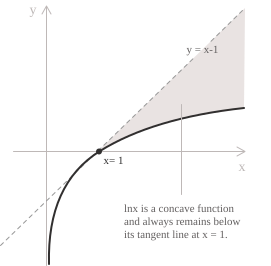

## Definition

If $a$ and $b$ are positive real numbers](../properties-of-real-numbers/), with $a \neq 1,$ the logarithm of $b$ to the base $a,$ denoted by $\log_a b,$ is the real number $c$ such that $a^c = b.$

$$\log_a b = c \iff a^c = b$$

The following conditions must be satisfied:

$$a>0 \qquad a \neq 1 \qquad b>0$$

For example, $\log_2 8 = 3$ because $2^3 = 8.$ The logarithm of a number is the exponent to which a given base must be raised to obtain that number. Therefore, the logarithm is the inverse operation of exponentiation.

+ $a$ is the base of the logarithm.
+ $b$ is the argument of the logarithm.

For $a>0,$ the value $a^x$ is a positive real number for every $x \in \mathbb{R}.$ Negative and zero bases do not define real powers for every real exponent. When $a = 1,$ the expression $a^x$ becomes $1^x = 1$ for every $x \in \mathbb{R}.$ The exponential function is then constant and is not invertible, so it has no logarithmic inverse. Thus, the base must satisfy $a>0$ and $a \neq 1.$

## Basic identities

The laws of powers and the definition of the logarithm give the following identities:

$$a^0 = 1 \Rightarrow \log_a 1 = 0$$

$$a^1 = a \Rightarrow \log_a a = 1$$

Since $a^c>0$ for every $c \in \mathbb{R},$ no real logarithm has a nonpositive argument. Equivalently, if $b \le 0,$ no real number $c$ satisfies $a^c=b.$

+ Logarithms with base $e$ are natural logarithms and are denoted by $\ln x,$ where the constant $e$](../euler-number-limit-sequence/) is approximately $2.71828$ and is the base of the natural exponential function $e^x.$

+ Logarithms with base $10$ are common logarithms and are denoted unambiguously by $\log_{10}x.$ When the context fixes the base as $10,$ the shorter notation $\log x$ is also common.

> The base-10 logarithm measures orders of magnitude, since multiplying a positive number by $10^k$ adds $k$ to its logarithm.

## Logarithmic function

The logarithmic function](../logarithmic-function/) is the inverse of the exponential function. Its domain and range are therefore interchanged relative to those of the exponential function](../exponential-function/). For a fixed base $a,$ the function has the following form:

$$
\log_a : (0,+\infty) \to \mathbb{R}, \quad a > 0 \quad a \neq 1
$$

The domain is $(0,+\infty),$ and the range is $\mathbb{R}.$ The function is continuous and differentiable on $(0,+\infty).$

  

The graph above shows the monotonic behaviour and asymptotic properties of the logarithmic function. For $a > 1,$ the function $f(x) = \log_a x$ is strictly increasing on $(0,+\infty).$ It has a vertical asymptote at $x = 0,$ and its limits are:

$$
\begin{aligned}
\lim_{x \to 0^+} \log_a x &= -\infty \\
\lim_{x \to +\infty} \log_a x &= +\infty
\end{aligned}
$$

For $0 < a < 1,$ the function is strictly decreasing on $(0,+\infty).$

  

The line $x = 0$ is again a vertical asymptote, but the limiting behaviour is reversed:

$$
\begin{aligned}
\lim_{x \to 0^+} \log_a x &= +\infty \\
\lim_{x \to +\infty} \log_a x &= -\infty
\end{aligned}
$$

> In binary search, each comparison halves the remaining search interval. Starting with $n$ entries, after $k$ comparisons the interval contains at most $n/2^k$ entries, so the number of comparisons grows proportionally to $\log_2 n.$

## Properties

The following identities describe how to manipulate logarithmic expressions. Each property is stated together with the conditions on the base and the arguments that ensure the expressions are well-defined in the real numbers](../properties-of-real-numbers/). In every case, the base must satisfy $a > 0$ and $a \neq 1,$ and every quantity appearing as an argument of a logarithm must be strictly positive.

Since the logarithm is defined as the inverse of the exponential function, the following identities hold:

$$
\begin{aligned}
a^{\log_a x} &= x \qquad \forall x \in (0,+\infty) \\
\log_a(a^x) &= x \qquad \forall x \in \mathbb{R}
\end{aligned}
$$

These two identities express the fact that exponentiation with base $a$ and the logarithm to base $a$ are inverse functions on their respective domains.

- - -

For $x, y > 0,$ the logarithm of a product is the sum of the logarithms of the factors:

$$
\log_a(xy) = \log_a x + \log_a y
$$

This is the product rule. It transforms a multiplicative relationship into an additive one and follows directly from the corresponding law of exponents.

- - -

For $x, y > 0,$ the logarithm of a quotient is the difference between the logarithm of the numerator and the logarithm of the denominator:

$$
\log_a{\frac{x}{y}} = \log_a x - \log_a y
$$

This is the quotient rule. As a particular case, setting $x = 1$ yields:

$$
\log_a{\frac{1}{y}} = -\log_a y
$$

Thus, the logarithm of the reciprocal of $y$ is the opposite of the logarithm of $y.$

- - -

For $x > 0$ and $n \in \mathbb{R},$ the logarithm of a power equals the exponent times the logarithm of $x:$

$$
\log_a x^n = n\log_a x
$$

This is the power rule. If $u=\log_a x,$ then $x=a^u$ and $x^n=a^{nu}.$ Applying $\log_a$ gives $\log_a x^n=nu=n\log_a x$ for every real exponent $n.$

- - -

For $b > 0$ and $n \in \mathbb{N}$ with $n \ge 1,$ the logarithm of a radical is equal to the logarithm of the radicand divided by the index of the root:

$$
\log_a\sqrt[n]{b} = \frac{1}{n}\log_a b
$$

This identity is a direct consequence of the power rule, since $\sqrt[n]{b} = b^{1/n}.$

- - -

For $a, p > 0$ with $a, p \neq 1$ and $b > 0,$ a logarithm in base $a$ can be written as the ratio of two logarithms taken in a common base $p:$

$$
\log_a b = \frac{\log_p b}{\log_p a}
$$

This is the change of base formula. It expresses every logarithm in a base for which values are available, such as base $e$ or base $10.$

## Fundamental inequality for the natural logarithm

The natural logarithm satisfies the inequality:

$$
\ln x \le x - 1 \qquad \forall x > 0
$$

Equality holds if and only if $x = 1.$ This result follows directly from the fact that the function $\ln x$ is concave on the interval $(0,+\infty).$

  

Its second derivative is negative, so $\ln x$ is strictly concave on $(0,+\infty):$

$$
(\ln x)^{\prime\prime} = -\frac{1}{x^2} < 0 \qquad \forall x > 0
$$

For any differentiable concave function, the graph lies below each of its tangent lines. In particular, consider the tangent at $x = 1,$ where:

$$
\ln 1 = 0 \quad \text{and} \quad (\ln x)' \big|_{x=1} = 1
$$

The equation of this tangent line is:

$$
y = x - 1
$$

Thus, the inequality $\ln x \le x - 1$ expresses the geometric fact that the curve $y = \ln x$ never rises above its tangent line at $x = 1,$ and it touches it only at $x = 1.$

## Logarithms in algebraic structure

The set of positive real numbers $(0,+\infty)$ is a group under multiplication, while $\mathbb{R}$ is a group under addition. The logarithm maps products to sums. For example, for $x,y>0,$ consider the product:

$$
x^3 y^2
$$

Taking logarithms gives:

$$
\log_a(x^3 y^2) = 3\log_a x + 2\log_a y
$$

The logarithm is therefore a homomorphism from the multiplicative group $(0,+\infty)$ to the additive group $\mathbb{R}.$ It is bijective, so it is a group isomorphism. The product and power rules describe this correspondence explicitly.

> A homomorphism is a function between two algebraic structures that preserves the operation, meaning $\varphi(x \star y) = \varphi(x) \circ \varphi(y).$ Here $\star$ and $\circ$ denote the operations of the two algebraic structures, such as addition or multiplication.

## Example 1

Assume that $a>0,$ $a\neq1,$ and $x,y,z>0.$ We simplify the following expression using the logarithmic properties:

$$
\log_a \left( \frac{x^3 \cdot y}{z^2} \right)
$$

The quotient rule expresses the logarithm as the difference between the logarithms of the numerator and denominator:

$$
\log_a \left( \frac{x^3 \cdot y}{z^2} \right) = \log_a(x^3 \cdot y) - \log_a(z^2)
$$

The product rule then separates the factors in the numerator:

$$
\log_a(x^3 \cdot y) = \log_a(x^3) + \log_a(y)
$$

Thus, the expression becomes:

$$
\log_a \left( \frac{x^3 \cdot y}{z^2} \right) = \log_a(x^3) + \log_a(y) - \log_a(z^2)
$$

The power rule moves each exponent in front of its logarithm:

$$
\log_a(x^3) = 3 \log_a(x) \quad \text{and} \quad \log_a(z^2) = 2 \log_a(z)
$$

Substitution gives the simplified expression:

$$
\log_a \left( \frac{x^3 \cdot y}{z^2} \right) = 3 \log_a(x) + \log_a(y) - 2 \log_a(z)
$$

The exponents of the numerator factors become positive coefficients, while the exponent of the denominator factor becomes the negative coefficient $-2.$

## Changing the base of a logarithm

The change of base formula can be derived directly from the definition. Assume that $a,b>0,$ $a,b\neq1,$ and $x>0.$ Then:

$$\log_a x = \frac{\log_b x}{\log_b a}$$

> The formula converts a logarithm to any base in which values are known, including base $10$ or base $e.$

- - -

Set $y=\log_a x.$ By the definition of the logarithm, $a^y=x.$ Taking logarithms to base $b$ on both sides gives:

$$\log_b(a^y) = \log_b(x)$$

The power rule gives:

$$y\log_b(a) = \log_b(x)$$

Since $a\neq1,$ the denominator $\log_b a$ is nonzero. Dividing both sides by it gives:

$$y = \frac{\log_b(x)}{\log_b(a)}$$

Since $y=\log_a x,$ we have proved the change of base formula:

$$\log_a(x) = \frac{\log_b(x)}{\log_b(a)}$$

## Logarithmic equations

Logarithmic equations](../logarithmic-equations/) are equations in which the variable appears inside a logarithm. Their solutions must satisfy the domain conditions of every logarithmic argument. A typical logarithmic equation has the form:

$$\log_a f(x) = g(x)$$

+ $a,$ the base of the logarithm, must satisfy $a > 0$ and $a \neq 1.$

+ $f(x)$ is the argument of the logarithm and must be strictly positive, so $f(x) > 0.$

## The natural logarithm

The natural logarithm can be defined independently of exponentiation using a definite integral](../definite-integrals/). For every real number $x > 0,$ set:

$$
\ln x = \int_1^x \frac{1}{t} \ dt
$$

The function $1/t$ is continuous on the interval between $1$ and any fixed $x>0,$ so the integral is well-defined. By the Fundamental Theorem of Calculus](../fundamental-theorem-of-calculus/), the natural logarithm is differentiable and satisfies:

$$
(\ln x)' = \frac{1}{x} \qquad x>0
$$

The natural logarithm is strictly increasing](../increasing-and-decreasing-functions/) because its derivative is positive on $(0,+\infty).$ It is also strictly concave, since:

$$
(\ln x)^{\prime\prime}= -\frac{1}{x^2} < 0
$$

- - -

The exponential function $e^x$ is the inverse of the natural logarithm $\ln x.$ Once $\ln x$ has been established, logarithms with any base $a>0,$ $a\neq 1,$ are defined by:

$$
\log_a x = \frac{\ln x}{\ln a}
$$

Since $\ln a\neq0$ for every admissible base $a,$ this quotient is well-defined. As a function of $x,$ it is continuous and differentiable on $(0,+\infty).$

## Series expansion of the natural logarithm

For $x>-1,$ the integral definition gives the identity:

$$
\ln(1+x) = \int_0^x \frac{1}{1+t} \ dt
$$

The integrand can be expanded as a geometric series](../geometric-series/). For $|t| < 1,$ we have:

$$
\frac{1}{1+t} = \sum_{n=0}^{\infty} (-1)^nt^n = 1-t+t^2-t^3+\cdots
$$

This series converges uniformly on every closed subinterval of $(-1,1),$ which justifies term-by-term integration for $|x|<1.$ Integrating from $0$ to $x$ yields:

$$
\ln(1+x) = \sum_{n=0}^{\infty} \frac{(-1)^nx^{n+1}}{n+1} = x-\frac{x^2}{2}+\frac{x^3}{3}-\frac{x^4}{4}+\cdots
$$

The resulting series converges for $-1 < x \le 1.$ The endpoint $x = -1$ is excluded because the series then reduces, up to sign, to the harmonic series](../harmonic-series/), which diverges. At $x = 1,$ the alternating series test gives convergence, and Abel's theorem extends the identity to the endpoint:

$$
\ln 2 = 1-\frac{1}{2}+\frac{1}{3}-\frac{1}{4}+\cdots
$$

For $|x|<1,$ the partial sums approximate $\ln(1+x).$ Truncating the expansion after the first term gives the linear approximation:

$$
\ln(1+x) \approx x \qquad \text{for } x \to 0
$$

The error has order $x^2.$ In particular, the approximation implies:

$$
\lim_{x \to 0} \frac{\ln(1+x)}{x} = 1
$$

This limit appears in calculations involving limits and derivatives, and it gives the local linearisation of the logarithm near $1.$

The series for $\ln(1+x)$ converges slowly when $x$ is close to $1.$ For $|y|<1,$ subtracting the series for $\ln(1-y)$ from the series for $\ln(1+y)$ gives:

$$\ln\frac{1+y}{1-y} = 2\left(y+\frac{y^3}{3}+\frac{y^5}{5}+\cdots\right)$$

For example, setting $y=1/3$ gives a series for $\ln 2$ whose terms decrease much faster than those of the alternating harmonic series.

## Logarithmic differentiation

Assume that $f$ and $g$ are differentiable on an interval and that $f(x)>0$ throughout that interval. A function of the form $y = f(x)^{g(x)},$ in which both the base and the exponent depend on the variable, cannot in general be differentiated by directly applying either the power rule or the exponential rule. Logarithmic differentiation handles such expressions by taking the natural logarithm of both sides and then differentiating implicitly.

Applying the natural logarithm to $y = f(x)^{g(x)}$ and using the power rule for logarithms, we obtain:

$$
\ln y = g(x)\ln f(x)
$$

Differentiating both sides with respect to $x,$ and applying the chain rule to the left-hand side and the product rule to the right-hand side, gives:

$$
\frac{y'}{y} = g'(x)\ln f(x)+g(x)\frac{f'(x)}{f(x)}
$$

Solving for $y'$ and substituting the original expression for $y$ yields the explicit derivative:

$$
y' = f(x)^{g(x)}\left[g'(x)\ln f(x)+g(x)\frac{f'(x)}{f(x)}\right]
$$

The condition $f(x) > 0$ ensures that the logarithm is well-defined on the interval of interest. For example, consider the derivative of $y = x^x$ for $x > 0.$ Taking the natural logarithm of both sides gives:

$$
\ln y = x \ln x
$$

Differentiating both sides with respect to $x,$ the left-hand side becomes $y'/y$ by the chain rule](../the-derivative-of-a-composite-function/), while the right-hand side is computed using the product rule:

$$
\frac{y'}{y} = \ln x+x \cdot \frac{1}{x} = \ln x+1
$$

Multiplying both sides by $y = x^x$ yields the result:

$$
\frac{d}{dx}x^x = x^x(\ln x+1)
$$

The same method applies when the variable appears in both the base and the exponent. It also applies to products of several positive factors because the logarithm converts the product into a sum before differentiation.

## The AM-GM inequality via logarithms

The arithmetic mean](../arithmetic-mean/) and the geometric mean](../geometric-mean/) of positive real numbers satisfy the AM-GM inequality. For $n\in\mathbb{N}$ with $n\ge1$ and $x_1, x_2, \ldots, x_n>0,$ it is:

$$
\frac{x_1 + x_2 + \cdots + x_n}{n} \geq \left( x_1 x_2 \cdots x_n \right)^{\frac{1}{n}}
$$

Equality holds if and only if $x_1 = x_2 = \cdots = x_n.$ The function $\ln$ is strictly concave on $(0,+\infty)$ because $(\ln x)'' = -1/x^2 < 0$ for every $x > 0.$ Jensen's inequality therefore gives:

$$
\frac{1}{n} \sum_{i=1}^{n} \ln x_i \leq \ln \left( \frac{1}{n} \sum_{i=1}^{n} x_i \right)
$$

The left-hand side is the arithmetic mean of $\ln x_1, \ldots, \ln x_n,$ which by the logarithmic form of the geometric mean](../geometric-mean/) equals $\ln M_g.$ The right-hand side is $\ln M_a,$ where $M_a$ denotes the arithmetic mean](../arithmetic-mean/). The inequality therefore becomes:

$$
\ln M_g \leq \ln M_a
$$

Since $\ln$ is strictly increasing, this is equivalent to $M_g \leq M_a,$ which is the AM-GM inequality. Strict concavity gives equality if and only if $x_1 = x_2 = \cdots = x_n.$
