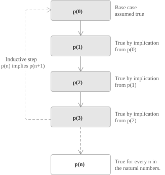

## Inductive set

Mathematical induction is the principle that allows us to establish statements that depend on a natural-number parameter. Its validity rests on a structural feature of $\mathbb{N}$, namely that the natural numbers form the smallest set that contains $0$ and is closed under the operation of taking the successor. To make this precise, we begin by isolating the notion of an inductive subset of the real line.

Definition 1. A subset $A \subseteq \mathbb{R}$ is said to be inductive if it satisfies the following two conditions:

+ $0 \in A$.
+ $\forall\, x \in A$ it follows that $x + 1 \in A$.

In other words, an inductive set contains the element $0$ and is closed under the operation of adding $1$.

- - -
Theorem 1. Let $A, B \subseteq \mathbb{R}$ be inductive sets. Then their intersection $A \cap B$ is also an inductive set. Since $A$ and $B$ are inductive, we have:

+ $0 \in A$ and $0 \in B$, thus $0 \in A \cap B$.
+ If $x \in A \cap B$, then $x \in A$ and $x \in B$. By the inductive property, $x + 1 \in A$ and $x + 1 \in B$, and therefore $x + 1 \in A \cap B$.

Thus $A \cap B$ satisfies the defining conditions of an inductive set. The same reasoning applies, without change, to the intersection of any non-empty family of inductive sets, since both defining properties are preserved under arbitrary intersections.

The real line $\mathbb{R}$ is itself trivially inductive, so the family of inductive subsets of $\mathbb{R}$ is non-empty. We may therefore define the set of natural numbers](../natural-numbers/) $\mathbb{N}$ as the intersection of all inductive subsets of $\mathbb{R}$. By construction $\mathbb{N}$ is inductive, and it is contained in every other inductive subset of $\mathbb{R}$. For this reason $\mathbb{N}$ is called the smallest inductive subset of $\mathbb{R}$, and this minimal character is the structural fact on which every proof by induction ultimately rests.

## Mathematical induction

Starting from the formal definition of an inductive set, consider a property $p(n)$ defined for every natural number $n$ and the corresponding set of natural numbers for which the property holds:

$$A = \{\, n \in \mathbb{N} \mid p(n) \,\}$$

By definition, the set $A$ is a subset of $\mathbb{N}$. We now ask under which conditions these two sets coincide. Suppose that the following conditions are satisfied:

+ $p(0)$ is true, that is, $0 \in A$.
+ $p(n) \to p(n+1)$ for every $n \in \mathbb{N}$, that is, if $n \in A$ then $n+1 \in A$.

Under these two conditions, the set $A$ is itself inductive. Since $A \subseteq \mathbb{N}$ and $\mathbb{N}$ is the smallest inductive subset of $\mathbb{R}$, it follows that $\mathbb{N} \subseteq A$ as well, and hence $A = \mathbb{N}$. Therefore, the property $p(n)$ holds for every $n \in \mathbb{N}$.

These two conditions correspond to the standard structure of a proof by mathematical induction:

+ The base case consists of verifying that $p(0)$ holds, meaning that $0$ belongs to $A$.
+ The inductive step consists of proving that, whenever $p(n)$ is true for some $n \in \mathbb{N}$, it follows that $p(n+1)$ is also true, thereby ensuring that $n+1 \in A$.

The hypothesis $p(n)$ used in the inductive step is called the inductive hypothesis. It is important to keep in mind that the inductive step does not prove $p(n+1)$ in isolation, but only the conditional implication $p(n) \to p(n+1)$. The actual truth of $p(n+1)$ for every natural number is then secured by the chain of implications starting from the base case.

  

> If the property is to be proved not for every $n \in \mathbb{N}$, but only for $n \geq n_0$ for some fixed natural number $n_0$, the same scheme applies with $n_0$ in place of $0$ as the base case. The conclusion is then that $p(n)$ holds for every integer $n \geq n_0$.

## Example: sum of the first natural numbers

Let us consider a first application of the principle by proving the following identity, which provides a closed form for the sum of the integers from $1$ to $n$:

$$\sum_{i=1}^{n} i = \frac{n(n+1)}{2} \qquad \forall\, n \in \mathbb{N}$$

We first consider the base case. For $n = 0$ the left-hand side is an empty sum, whose value is $0$ by the standard convention that a sum indexed over an empty range vanishes. The right-hand side gives:

$$\frac{0 \cdot (0+1)}{2} = 0$$

The formula holds for $n = 0$.

- - -
We now proceed to the inductive step. Assume that the formula holds for some $k \in \mathbb{N}$; that is, suppose:

$$\sum_{i=1}^{k} i = \frac{k(k+1)}{2}$$

Under this assumption, we must prove that the formula also holds for $k+1$. We isolate the last term of the sum so that we can apply the inductive hypothesis to the remaining part:

$$
\sum_{i=1}^{k+1} i = \sum_{i=1}^{k} i + (k+1) = \frac{k(k+1)}{2} + (k+1)
$$

Combining the two terms over a common denominator yields:

$$
\frac{k(k+1)}{2} + (k+1) = \frac{k(k+1) + 2(k+1)}{2} = \frac{(k+1)(k+2)}{2}
$$

This is exactly the right-hand side of the formula evaluated at $n = k+1$. Since the statement holds for $n = 0$ and its validity for $n = k$ implies its validity for $n = k+1$, the principle of induction guarantees that the formula is true for every $n \in \mathbb{N}$.

## Applications: divisibility

We show that the expression $n^3 - n$ is divisible by $3$ for every $n \in \mathbb{N}$. We begin with the base case. For $n = 0$ we have $0^3 - 0 = 0$, and $3 \mid 0$ holds trivially since $0 = 3 \cdot 0$.

We now turn to the inductive step. Assume that $3 \mid k^3 - k$ for some $k \in \mathbb{N}$, that is, $k^3 - k = 3m$ for some integer $m$. Under this hypothesis we want to show that divisibility by $3$ carries over to the next term, meaning that $3 \mid (k+1)^3 - (k+1)$. Expanding the expression we obtain:

$$
\begin{aligned}
(k+1)^3 - (k+1) &= k^3 + 3k^2 + 3k + 1 - k - 1 \\
&= (k^3 - k) + 3k^2 + 3k
\end{aligned}
$$

By the inductive hypothesis $k^3 - k = 3m$, so the expression becomes:

$$
\begin{aligned}
(k+1)^3 - (k+1) &= 3m + 3k^2 + 3k \\
&= 3(m + k^2 + k)
\end{aligned}
$$

Since $m + k^2 + k \in \mathbb{Z}$, it follows that $3 \mid (k+1)^3 - (k+1)$. By the principle of induction, the statement holds for every $n \in \mathbb{N}$.

## Applications: inequality

We prove that $2^n > n$ for every $n \in \mathbb{N}$. This inequality expresses the fact that exponential growth eventually and permanently dominates linear growth, a pattern that induction captures precisely: once the inequality holds at a given step, the multiplicative nature of the left-hand side guarantees that it holds at the next.

We start with the base case. For $n = 0$ we have $2^0 = 1 > 0$, so the inequality holds.

For the inductive step, assume that $2^k > k$ for some $k \in \mathbb{N}$. Our goal is to deduce that $2^{k+1} > k+1$. The argument splits naturally into two cases, depending on whether $k$ is zero or not.

+ If $k = 0$, the conclusion follows directly, since $2^{k+1} = 2^1 = 2 > 1 = k+1$.
+ If $k \geq 1$, we apply the inductive hypothesis to the left-hand side and use the assumption $k \geq 1$ in the final step:

$$
\begin{aligned}
2^{k+1} &= 2 \cdot 2^k \\
&> 2k \\
&= k + k \\
&\geq k + 1
\end{aligned}
$$

In both cases we obtain $2^{k+1} > k + 1$, and by the principle of induction the inequality holds for every $n \in \mathbb{N}$.

> The need to split the inductive step into two cases reflects a genuine subtlety of the argument. The chain $2 \cdot 2^k > 2k = k + k \geq k + 1$ requires $k \geq 1$ at the last passage, so the value $k = 0$ must be treated separately within the inductive step itself. This separate treatment should not be confused with the base case at $n = 0$, which only ensures that the property holds at the starting point.

## Applications: geometric series

We show that for any real number $r \neq 1$ and every $n \in \mathbb{N}$:

$$\sum_{i=0}^{n} r^i = \frac{r^{n+1} - 1}{r - 1}$$

This identity is the closed form of the partial sum of a geometric sequence](../geometric-sequence/), and induction provides a clean way to verify it. We begin with the base case. For $n = 0$ the left-hand side gives $r^0 = 1$, and the right-hand side gives:

$$\frac{r^1 - 1}{r - 1} = 1$$

Thus, the formula holds for $n = 0$. For the inductive step assume that the formula holds for some $k \in \mathbb{N}$, that is:

$$\sum_{i=0}^{k} r^i = \frac{r^{k+1} - 1}{r - 1}$$

We want to show that it also holds for $k + 1$. Isolating the last term of the sum and applying the inductive hypothesis we obtain:

$$
\begin{aligned}
\sum_{i=0}^{k+1} r^i &= \sum_{i=0}^{k} r^i + r^{k+1} \\
&= \frac{r^{k+1} - 1}{r - 1} + r^{k+1}
\end{aligned}
$$

Combining the two terms over a common denominator gives:

$$
\begin{aligned}
\frac{r^{k+1} - 1}{r - 1} + r^{k+1} &= \frac{r^{k+1} - 1 + r^{k+1}(r-1)}{r - 1} \\
&= \frac{r^{k+2} - 1}{r - 1}
\end{aligned}
$$

This is exactly the right-hand side of the formula evaluated at $n = k+1$. By the principle of induction, the identity holds for every $n \in \mathbb{N}$.

## Strong induction

A variant of the principle of induction, often called strong induction or complete induction, replaces the single inductive hypothesis $p(n)$ with the conjunction of all the preceding cases. The structure of a proof by strong induction is as follows:

+ Base case: $p(0)$ is true.
+ Inductive step: for every $n \in \mathbb{N}$, the conjunction $p(0) \land p(1) \land \dots \land p(n)$ implies $p(n+1)$.

Under these conditions $p(n)$ holds for every $n \in \mathbb{N}$. 

Strong induction is logically equivalent to the ordinary induction, in the sense that each can be derived from the other within the standard axiomatic framework for the natural numbers. It is the natural choice whenever the truth of $p(n+1)$ depends on several earlier instances of the property, rather than only on the immediately preceding one. 

A typical example is the proof that every integer $n \geq 2$ admits a factorisation into prime numbers. There, the inductive hypothesis must be applied to the proper divisors of $n+1$, which are in general much smaller than $n$ itself, so that ordinary induction is not sufficient for the argument.

> Both forms of induction are equivalent to the well-ordering property of $\mathbb{N}$, which asserts that every non-empty subset of $\mathbb{N}$ has a least element. The three principles can be derived from one another within a suitable axiomatic framework, and each provides an alternative foundation for the same body of results. Proofs based on well-ordering typically proceed by contradiction, assuming the existence of a counterexample and considering the least one, while induction proceeds constructively from the base case upward.
