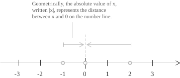

## Field and order structure

The real numbers form a field under addition and multiplication. Both operations are associative and commutative, multiplication distributes over addition, and every nonzero real number has a multiplicative inverse. The additive identity is $0$ and the multiplicative identity is $1.$ These axioms are discussed in properties of real numbers](../properties-of-real-numbers/). The field $\mathbb{R}$ also has a total order relation, denoted $<.$ For any two elements $x,y\in\mathbb{R},$ exactly one of the following three relations holds:

$$
x < y \qquad x = y \qquad y < x
$$

The order is compatible with the field operations:

+ If $x < y,$ then $x + z < y + z$ for every $z \in \mathbb{R}.$
+ If $x < y$ and $z > 0,$ then $xz < yz.$

An ordered field is a field with a total order satisfying these compatibility conditions. Both $\mathbb{Q}$ and $\mathbb{R}$ are ordered fields. What separates the two is the completeness property introduced below.

## The real line

The real numbers have a geometric representation on a line. Fix an arbitrary point and label it $0,$ then fix a point to its right and label it $1.$ Every real number $x$ corresponds to a unique point. Positive numbers lie to the right of $0,$ negative numbers lie to the left, and their distance from the origin is the absolute value](../absolute-value/) $|x|.$

  

This correspondence is a bijection between $\mathbb{R}$ and the points of the line, and it preserves the order. The relation $x < y$ holds if and only if the point corresponding to $x$ lies to the left of the point corresponding to $y.$

## The completeness axiom

The property that distinguishes $\mathbb{R}$ from $\mathbb{Q}$ is completeness. Every Cauchy sequence](../cauchy-sequence/) of rational numbers](../rational-numbers/) converges to a real number, although its limit need not be rational. The missing rational limits are irrational numbers](../irrational-numbers/).

The formulation relies on the notion of an upper bound. A subset $S \subseteq \mathbb{R}$ is bounded above if some real number $M$ satisfies $x \leq M$ for every $x \in S.$ Such a number $M$ is an upper bound of $S.$ Its least upper bound, when it exists, is the supremum $\sup S.$

The completeness axiom of the real numbers can be stated as follows: every non-empty subset of $\mathbb{R}$ that is bounded above has a supremum in $\mathbb{R}.$ The statement is known as the least upper bound property. The rational numbers fail to satisfy it. To see why, consider the following set:

$$
S = \{q \in \mathbb{Q} \mid q^2 < 2\}
$$

This set is non-empty and bounded above within $\mathbb{Q},$ yet it has no least upper bound in $\mathbb{Q}.$ Its supremum in $\mathbb{R}$ is the irrational number $\sqrt{2}.$

The number $\sqrt{2}$ exists by completeness. Formed inside $\mathbb{R},$ the set $\{x \in \mathbb{R} \mid x \geq 0 \text{ and } x^2 \leq 2\}$ is non-empty and bounded above, so it has a supremum $r.$ If $r^2<2,$ there is a positive $h$ such that $h<1$ and $h<(2-r^2)/(2r+1).$ Then $(r+h)^2<2,$ contradicting the fact that $r$ is an upper bound. If $r^2>2,$ there is a positive $h$ such that $h<r$ and $h<(r^2-2)/(2r).$ Then $(r-h)^2>2,$ so $r-h$ is still an upper bound, contradicting the minimality of $r.$ Hence $r^2=2.$

The same construction defines the $n$-th root of every non-negative real number $c$ by:

$$
c^{1/n}:=\sup\{x\in\mathbb{R}\mid x\geq0\text{ and }x^n\leq c\}
$$

For each positive natural number](../natural-numbers/) $n,$ this supremum is the unique non-negative real whose $n$-th power is $c.$ If $x>0$ and $q=a/b$ with $a\in\mathbb{Z}$ and $b\in\mathbb{N}$ positive, rational exponentiation](../powers/) is defined by $x^q=(x^{1/b})^a.$ If $a/b=c/d$ is another representation with $c\in\mathbb{Z}$ and $d\in\mathbb{N}$ positive, then the two candidate values have the same $bd$-th power because $ad=bc,$ so uniqueness of positive roots makes the definition independent of the chosen fraction. It satisfies $x^{q+r}=x^qx^r,$ $(x^q)^r=x^{qr},$ and $x^{-q}=1/x^q$ for rational $q,r.$

A symmetric notion applies to sets bounded below. A subset $S \subseteq \mathbb{R}$ is bounded below if there exists $m \in \mathbb{R}$ such that $x \geq m$ for all $x \in S.$ The greatest lower bound, or infimum, is denoted $\inf S.$ The completeness axiom implies that every non-empty subset of $\mathbb{R}$ bounded below has an infimum in $\mathbb{R}.$

A least upper bound is unique. If $s$ and $t$ were both least upper bounds of the same set, the minimality of $s$ would give $s\leq t,$ while the minimality of $t$ would give $t\leq s.$ Antisymmetry then gives $s=t.$

In the Cauchy construction below, the least upper bound property follows from rational approximation. Bounded rational representatives show directly that the constructed field is Archimedean. If $x=[(x_j)]$ and $|x_j|\leq B$ for every $j,$ then every integer $N>B$ satisfies $x<N.$ Let $E\subseteq\mathbb{R}$ be non-empty and bounded above. For each positive integer $n,$ the integers $k$ for which $k/n$ is an upper bound of $E$ form a non-empty set bounded below. This set has a least element $m_n,$ so $m_n/n$ is an upper bound while $(m_n-1)/n$ is not. For positive integers $n,n',$ the defining inequalities give:

$$
-\frac{1}{n'}<\frac{m_n}{n}-\frac{m_{n'}}{n'}\leq\frac{1}{n}
$$

Thus $(m_n/n)$ is a Cauchy sequence. Its real limit $s$ is an upper bound of $E,$ since every element of $E$ is at most $m_n/n$ for every $n.$ Any upper bound of $E$ is at least $(m_n-1)/n$ for every $n,$ and this second sequence has the same limit $s.$ Hence every upper bound is at least $s,$ so $s=\sup E.$

## The Archimedean property

A consequence of completeness is the Archimedean property of $\mathbb{R}.$ For every real number $x,$ there exists a natural number](../natural-numbers/) $n$ such that $n > x.$ Equivalently, the set of natural numbers $\mathbb{N}$ is not bounded above in $\mathbb{R}.$ The argument runs as follows:

+ Suppose, for contradiction, that $\mathbb{N}$ were bounded above in $\mathbb{R}.$
+ By the completeness axiom, $\mathbb{N}$ would then have a supremum that we call $s = \sup \mathbb{N}.$
+ Since $s - 1 < s,$ the number $s - 1$ is not an upper bound of $\mathbb{N},$ so there exists $n \in \mathbb{N}$ with $n > s - 1.$
+ It follows that $n + 1 > s.$ Since $n + 1 \in \mathbb{N},$ this contradicts $s$ being an upper bound of $\mathbb{N}.$

For $x = 7.4,$ the smallest natural number greater than $x$ is $8.$ The existence of such a natural number depends on the Archimedean property and fails in some ordered fields.

An equivalent quantitative form states that for all positive real numbers $x$ and $\varepsilon,$ there exists a positive integer $M$ such that $M\varepsilon>x.$ Applying the preceding form to $x/\varepsilon$ gives an integer $M>x/\varepsilon.$ Thus repeated addition of any fixed positive quantity eventually exceeds any prescribed real number.

Every real number also has a unique integer part](../floor-and-ceiling-functions/). For each $x\in\mathbb{R},$ the Archimedean property bounds $x$ between two integers, and the integers not exceeding $x$ have a greatest element. Denoting this integer by $\lfloor x\rfloor,$ one has:

$$
\lfloor x\rfloor\leq x<\lfloor x\rfloor+1
$$

No two integers satisfy these inequalities, since two distinct integers differ by at least $1.$

## Dedekind cuts

A Dedekind cut is a subset $A \subseteq \mathbb{Q}$ satisfying three conditions: $A$ is non-empty and $A \neq \mathbb{Q};$ if $q \in A$ and $p < q$ then $p \in A;$ and $A$ has no greatest element. The set $\mathbb{R}$ is then defined as the collection of all Dedekind cuts of $\mathbb{Q}.$

To illustrate, the rational number $r \in \mathbb{Q}$ corresponds to the cut $A_r = \{q \in \mathbb{Q} \mid q<r\}.$ An irrational number such as $\sqrt{2}$ corresponds instead to the cut:

$$
A = \{q \in \mathbb{Q} \mid q\leq0\} \cup \{q \in \mathbb{Q} \mid q>0 \text{ and } q^2<2\}
$$

This set satisfies all three conditions and has no rational supremum. The construction defines the cut $A$ itself as the real number that fills this gap in the rational order.

The algebraic structure of $\mathbb{R}$ is then built directly from set-theoretic operations on cuts. Addition is defined by setting:

$$
A + B = \{p+q \mid p\in A,q\in B\}
$$

The order is given by inclusion, so $A \leq B$ if and only if $A \subseteq B.$ These definitions make $\mathbb{R}$ a totally ordered field. If a non-empty collection $S$ of cuts is bounded above, its supremum is the union $\bigcup_{A \in S}A.$ This union is a cut and is the least upper bound of $S.$

> The Dedekind construction uses only the order structure of $\mathbb{Q}.$ Its definition of real numbers makes every non-empty bounded collection of cuts have a least upper bound.

## Cauchy sequence construction

A second construction of $\mathbb{R}$ starts from a limitation of $\mathbb{Q}.$ Not every Cauchy sequence](../cauchy-sequence/) of rational numbers converges to a rational number. A sequence $(x_n)_{n \in \mathbb{N}}$ in $\mathbb{Q}$ is a Cauchy sequence if for every $\varepsilon \in \mathbb{Q}^+$ there exists $N \in \mathbb{N}$ such that:

$$
m, n \geq N \implies |x_m - x_n| < \varepsilon
$$

The definition does not refer to a limit, which may not exist in $\mathbb{Q}.$ Every Cauchy sequence is bounded. Choose $N$ such that $|x_n-x_N|<1$ for all $n\geq N.$ The tail is bounded by $|x_N|+1,$ and the finitely many preceding terms also have a common bound. One sequence of rational approximations to $\sqrt{2}$ is:

$$
\left(1,\frac{3}{2},\frac{7}{5},\frac{17}{12},\ldots\right)
$$

The sequence is Cauchy in $\mathbb{Q},$ yet its limit lies outside $\mathbb{Q}.$ Two Cauchy sequences $(x_n)$ and $(y_n)$ in $\mathbb{Q}$ are declared equivalent when, for every rational $\varepsilon>0,$ some $N\in\mathbb{N}$ satisfies $|x_n-y_n|<\varepsilon$ for all $n\geq N.$ In the notation introduced after limits have been defined, this condition is:

$$
(x_n) \sim (y_n) \iff \lim_{n \to \infty} |x_n - y_n| = 0
$$

The relation $\sim$ is reflexive and symmetric, and the triangle inequality proves transitivity. The real numbers are then defined as the set of equivalence classes:

$$
\mathbb{R} := C/{\sim}
$$

Here $C$ denotes the collection of all Cauchy sequences in $\mathbb{Q}.$ Addition and multiplication are defined termwise:

$$
[(x_n)] + [(y_n)] = [(x_n + y_n)]
$$

$$
[(x_n)] \cdot [(y_n)] = [(x_n y_n)]
$$

The sum of two Cauchy sequences is Cauchy by the triangle inequality. The product is Cauchy because both sequences are bounded. Choose $M>0$ such that $|x_n|,|y_n|\leq M.$ Then:

$$
|x_ny_n-x_my_m|\leq |x_n||y_n-y_m|+|y_m||x_n-x_m|
$$

Choosing both differences smaller than $\varepsilon/(2M)$ makes the product difference smaller than $\varepsilon.$ The same estimates prove independence from the representatives. If $(x_n)\sim(x_n')$ and $(y_n)\sim(y_n'),$ then:

$$
|(x_n+y_n)-(x_n'+y_n')|\leq|x_n-x_n'|+|y_n-y_n'|
$$

and, after choosing a common bound $M$ for the four sequences:

$$
|x_ny_n-x_n'y_n'|\leq M|x_n-x_n'|+M|y_n-y_n'|
$$

Thus addition and multiplication are well-defined on equivalence classes.

Reciprocation requires a further argument. The positive sequence $10^{-n}$ represents $0,$ while its termwise reciprocals form the unbounded sequence $10^n.$ A nonzero real can also have a representative containing zero, such as $(0,0.9,0.99,0.999,\ldots)$ for $1.$ Termwise inversion therefore requires a representative bounded away from zero.

Every nonzero class has such a representative. If $(x_n)$ is not equivalent to the zero sequence, some $\varepsilon>0$ has the property that $|x_n|\geq\varepsilon$ occurs arbitrarily far along the sequence. Once the Cauchy condition gives $|x_n-x_m|<\varepsilon/2$ for sufficiently large $m,n,$ one such term forces $|x_n|\geq\varepsilon/2$ throughout the tail. Changing finitely many initial terms gives an equivalent sequence with $|x_n|\geq c>0$ for every $n.$ Its reciprocal sequence is Cauchy, since:

$$
\left|\frac{1}{x_n}-\frac{1}{x_m}\right|=\frac{|x_m-x_n|}{|x_nx_m|}\leq\frac{|x_m-x_n|}{c^2}
$$

The estimate also shows that equivalent representatives bounded away from zero have equivalent reciprocal sequences. Hence the formula $[(x_n)]^{-1}=[(x_n^{-1})]$ is well-defined for every nonzero class.

Positivity also requires separation from zero. A class is positive if it has a representative $(x_n)$ for which $x_n\geq c>0$ for every $n,$ and it is negative if it has a representative satisfying $x_n\leq-c<0.$ A positive sequence such as $10^{-n}$ does not meet this condition and represents zero. The Cauchy property shows that every nonzero class is either positive or negative, but not both. The strict order is then defined by $x<y$ when $y-x$ is positive, and $x\leq y$ when $x<y$ or $x=y.$ These definitions are independent of representatives.

The rational numbers embed into $\mathbb{R}$ via $q\mapsto[(q,q,q,\ldots)],$ preserving addition, multiplication, reciprocals, and order.

This construction is complete. Let $(X_m)$ be a Cauchy sequence of real numbers. For each positive integer $m,$ choose $q_m\in\mathbb{Q}$ such that $|X_m-q_m|<1/m.$ Such a rational exists because a representative of $X_m$ is a rational Cauchy sequence. Taking one of its terms after the tail differences are smaller than $1/(2m)$ gives a class distance at most $1/(2m),$ and hence less than $1/m.$ The sequence $(q_m)$ is Cauchy, since:

$$
|q_m-q_n|\leq|q_m-X_m|+|X_m-X_n|+|X_n-q_n|
$$

Let $X=[(q_m)].$ Given $\varepsilon>0,$ take $N$ such that $1/m<\varepsilon/2$ and $|q_n-q_m|<\varepsilon/2$ whenever $m,n\geq N.$ For each $m\geq N,$ the sequence $(q_n-q_m)_n$ represents $X-q_m$ and is eventually bounded in absolute value by $\varepsilon/2.$ Hence $|X-q_m|\leq\varepsilon/2,$ and the triangle inequality gives $|X-X_m|<\varepsilon.$ Thus $X_m\to X,$ so every Cauchy sequence of real numbers has a real limit.

The real number $\sqrt{2},$ for instance, is the equivalence class of any Cauchy sequence of rationals converging to it, such as $(1, 1.4, 1.41, 1.414, \ldots).$ Two such sequences satisfy $(x_n) \sim (y_n)$ and therefore define the same real number. Completeness in this construction means that every Cauchy sequence of real numbers converges to a real number. The Dedekind and Cauchy constructions are isomorphic as complete ordered fields, and they describe exactly the same mathematical object.

## Consequences of completeness

The rational numbers are dense in $\mathbb{R}.$ For every $x,y\in\mathbb{R}$ with $x<y,$ some $q\in\mathbb{Q}$ satisfies $x<q<y.$ The Archimedean property gives a natural number $n$ such that $n(y-x)>1.$ Choosing the least integer $m>nx$ then gives $x<m/n<y.$

If a real number $x$ satisfies $x\leq\varepsilon$ for every $\varepsilon>0,$ then $x\leq0,$ since a positive $x$ would exceed the choice $\varepsilon=x/2.$ Similarly, $|x|\leq\varepsilon$ for all $\varepsilon>0$ implies $x=0.$ This criterion proves an equality by bounding the absolute value of the difference below every positive threshold, and it recurs in the study of limits.

Despite the density of $\mathbb{Q}$ in $\mathbb{R},$ the two sets differ in cardinality. The rational numbers are countable, whereas the real numbers are uncountable. These results and their relation to Cantor's diagonal argument are developed in cardinality and countable sets](../cardinality-and-countable-sets/). Therefore the irrational numbers](../irrational-numbers/) $\mathbb{R}\setminus\mathbb{Q}$ are uncountable.

The following proof of uncountability uses the nested interval theorem. A sequence of closed intervals $I_n = [a_n, b_n]$ is nested when $I_1 \supseteq I_2 \supseteq I_3 \supseteq \cdots.$ Completeness guarantees that their intersection contains at least one point:

$$
\bigcap_{n=1}^{\infty} I_n \neq \emptyset
$$

The left endpoints form a non-decreasing sequence bounded above by every $b_m,$ so they have a supremum $x = \sup_n a_n$ satisfying $a_n \leq x \leq b_n$ for all $n.$ The point $x$ lies in every interval. When the lengths $b_n-a_n$ tend to zero, the intersection is the singleton $\{x\}.$ The rational numbers fail this property. A sequence of nested intervals with rational endpoints shrinking around $\sqrt{2}$ has empty intersection in $\mathbb{Q}.$

Suppose, for contradiction, that the real numbers in $[0,1]$ could be arranged in a list $x_1,x_2,x_3,\ldots.$ Choose a closed interval $I_1\subseteq[0,1]$ that excludes $x_1,$ then a closed interval $I_2\subseteq I_1$ that excludes $x_2,$ and continue so that $x_n\notin I_n$ at every step. The nested interval theorem gives a point $x\in\bigcap_n I_n.$ This point differs from every $x_n$ and is absent from the list, a contradiction.

A second proof, Cantor's diagonal argument, works directly with decimal expansions. Write each number of the supposed list as $x_k=0.d_{k1}d_{k2}d_{k3}\ldots,$ and define $y=0.e_1e_2e_3\ldots$ by choosing $e_k\neq d_{kk}.$ For example, take $e_k=1$ when $d_{kk}\neq1$ and $e_k=2$ when $d_{kk}=1.$ The number $y$ differs from $x_k$ in its $k$-th digit for every $k,$ so it is absent from the list. Choosing digits from $\{1,2\}$ avoids the two decimal expansions of numbers such as $0.4999\ldots=0.5000\ldots.$

The Bolzano-Weierstrass theorem is another consequence of completeness. Every bounded sequence of real numbers has a convergent subsequence. Equivalently, every bounded infinite subset of $\mathbb{R}$ has an accumulation point](../topology-of-the-real-line/).

## Uniqueness of $\mathbb{R}$

The real number system is the unique complete ordered field. Any two complete ordered fields are isomorphic as ordered fields, and the isomorphism between them is unique. Up to a structure-preserving bijection, $\mathbb{R}$ is the unique completion of $\mathbb{Q}.$

> The Euclidean spaces $\mathbb{R}^n$ are vector spaces](../vector-spaces/) over $\mathbb{R}.$ Other fields can also be scalar fields, but the analytic properties discussed here depend on the order and completeness of $\mathbb{R}.$

## Intervals

An interval is a subset $I\subseteq\mathbb{R}$ such that, whenever two points belong to $I,$ every point between them also belongs to $I.$ Intervals may be bounded, such as $(a,b)$ and $[a,b],$ or unbounded, such as $[a,+\infty)$ and $(-\infty,b).$ The real line is the interval $(-\infty,+\infty).$

Intervals of different lengths can have the same cardinality. The map $x\mapsto2x$ is a bijection from $[0,1]$ to $[0,2],$ and the tangent function](../tangent-function/) is a bijection from $(-\pi/2,\pi/2)$ to $\mathbb{R}.$ The intervals $[0,1]$ and $(0,1)$ also have the same cardinality. Length distinguishes these intervals, whereas cardinality does not.
