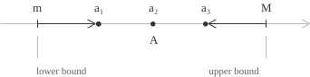
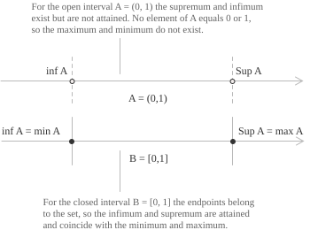

## The completeness axiom

Although real numbers](../real-numbers/) are frequently introduced via their algebraic properties, the essential distinction between $\mathbb{R}$ and $\mathbb{Q}$ lies in their order structure, and in particular in a unique property of that order. Every non-empty subset of $\mathbb{R}$ that is bounded above has a least upper bound lying within $\mathbb{R}$. The property is known as the completeness axiom and characterises the real line. The notions of supremum and infimum are the practical tools for applying it.

## Upper and lower bounds

Consider a non-empty set $A \subseteq \mathbb{R}$. A real number $M$ is an upper bound of $A$ if:

$$
a \leq M \quad \forall \ a \in A
$$

If such a number exists, the set $A$ is bounded above. A real number $m$ is a lower bound of $A$ if:

$$
a \geq m \quad \forall \ a \in A
$$

In this case, $A$ is bounded below. A set is bounded if it is both bounded above and below, that is, there exists $K > 0$ such that:

$$
|a| \leq K \quad \forall \ a \in A
$$

Upper bounds, when they exist, are generally not unique. If $M$ is an upper bound of $A$, then $M + 1$ and $M + 100$ are also upper bounds. The same applies symmetrically to lower bounds. If $m$ is a lower bound of $A$, then $m - 1$ is also a lower bound. The least upper bound is called the supremum, and the greatest lower bound is called the infimum.

  

+ If $A$ is non-empty but not bounded above, the supremum is conventionally defined as $\sup A = +\infty$.
+ If $A$ is not bounded below, the infimum is set as $\inf A = -\infty$.
+ For the empty set, the conventions $\sup \emptyset = -\infty$ and $\inf \emptyset = +\infty$ are employed.

## Supremum

Consider a non-empty subset $A \subseteq \mathbb{R}$ that is bounded above. The supremum of $A$, denoted $\sup A$, is its least upper bound. A real number $s$ is equal to $\sup A$ if and only if both of the following conditions are satisfied. The first condition states that $s$ is an upper bound of $A$:

$$
a \leq s \quad \forall \ a \in A
$$

The second condition ensures that any number strictly less than $s$ is exceeded by some element of $A$:

$$
\forall \\varepsilon > 0 \quad \exists \ a \in A : a > s - \varepsilon
$$

Together, these conditions determine $s$ uniquely. There can be only one least upper bound. If both $s$ and $s'$ satisfy the definition, we have:

$$
s \leq s' \\wedge \ s' \leq s \\to \ s = s'
$$

An equivalent characterisation states that $s = \sup A$ if and only if $s$ is an upper bound of $A$ and there exists a sequence $(a_n) \subseteq A$ such that $a_n \to s$.

> The completeness axiom ensures that $\sup A$ exists in $\mathbb{R}$ whenever $A$ is non-empty and bounded above. The property does not hold in $\mathbb{Q}$. For example, the set $\\ 
{q \in \mathbb{Q} : q^2 < 2\\}$ is bounded above in $\mathbb{Q}$, but its least upper bound is $\sqrt{2}$, which is not a rational number](../rational-numbers/). In this case, the supremum exists, but it does not belong to the space. Such a situation cannot occur in $\mathbb{R}$.

## Infimum

Consider a non-empty subset $A \subseteq \mathbb{R}$ that is bounded below. The infimum of $A$, denoted $\inf A$, is its greatest lower bound. A real number $i$ is equal to $\inf A$ if and only if both of the following conditions are satisfied. The first condition states that $i$ is a lower bound of $A$:

$$
a \geq i \quad \forall \ a \in A
$$

The second condition ensures that any number strictly greater than $i$ is preceded by some element of $A$:

$$
\forall \\varepsilon > 0 \quad \exists \ a \in A : a < i + \varepsilon
$$

Together, these conditions uniquely determine $i$. There can be only one greatest lower bound. If both $i$ and $i'$ satisfy the definition, we have:

$$
i \geq i' \\wedge \ i' \geq i \\to \ i = i'
$$

An equivalent characterisation states that $i = \inf A$ if and only if $i$ is a lower bound of $A$ and there exists a sequence $(a_n) \subseteq A$ such that $a_n \to i$.

A concrete example is the set $\\ 
{ 1/n : n \in \mathbb{N} \\}.$ Each term is positive, so $0$ is a lower bound, and no positive number can be a lower bound, because the Archimedean property supplies an $n$ with $1/n$ below any proposed positive threshold. Hence $\inf \\ 
{ 1/n : n \in \mathbb{N} \\} = 0.$ The value $0$ is not one of the terms, so the set has an infimum but no minimum.

## Supremum and maximum, infimum and minimum

The relationship between supremum and maximum, as well as between infimum and minimum, is frequently misunderstood. The maximum of a set $A$ is an element of $A$ that is greater than or equal to every other element. When a maximum exists, we have:

$$
\max A = \sup A
$$

The supremum does not necessarily belong to the set $A$. Consider $A = (0, 1)$. Every element of $A$ is strictly less than $1$, so $\sup A = 1$. Since $1 \notin A$, the set $A$ has no maximum. The number $1$ is the least upper bound, but it is not an element of $A$. Similarly, $\inf A = 0$, yet $0 \notin A$, so $A$ has no minimum. By contrast, for the closed interval $B = [0,1]$ we have:

$$
\sup B = \max B = 1 \qquad \inf B = \min B = 0
$$

since the boundary points are included in the set.

  

In general, the following implications hold:

$$
\max A \text{ exists} \\to \\max A = \sup A
$$

$$
\min A \text{ exists} \\to \\min A = \inf A
$$

The converse does not hold in general. Whether a function actually attains its supremum is a non-trivial question. The Weierstrass theorem](../weierstrass-theorem/) gives a sufficient condition: if a function is continuous on a closed and bounded interval, then the supremum and infimum are attained, and the maximum and minimum exist. Outside these conditions, the question must be examined case by case.

## Supremum and infimum of functions

The concepts of supremum and infimum extend naturally to functions. For a function $f : D \to \mathbb{R}$, the supremum of $f$ over $D$ is the supremum of its image:

$$
\sup_{x \in D} f(x) = \sup \\ 
{ f(x) : x \in D \\}
$$

Similarly, the infimum is defined as:

$$
\inf_{x \in D} f(x) = \inf \\ 
{ f(x) : x \in D \\}
$$

These quantities are the least upper bound and greatest lower bound of the values assumed by $f$, and neither is necessarily attained.

+ A real number $s$ is equal to $\sup_{x \in D} f(x)$ if and only if $f(x) \leq s$ for all $x \in D$, and for every $\varepsilon > 0$ there exists $x \in D$ such that $f(x) > s - \varepsilon$.
+ Symmetrically, a real number $i$ is equal to $\inf_{x \in D} f(x)$ if and only if $f(x) \geq i$ for all $x \in D$, and for every $\varepsilon > 0$ there exists $x \in D$ such that $f(x) < i + \varepsilon$.

The supremum and infimum of a function are not necessarily attained. For the function $f(x) = x$ defined on the open interval $(0, 1)$, $\sup_{x \in (0,1)} f(x) = 1$, yet there is no $x \in (0, 1)$ such that $f(x) = 1$. If the supremum is attained at some point $x_0 \in D$, that is, $f(x_0) = \sup_{x \in D} f(x)$, it coincides with the maximum of $f$ over $D$. The same relationship holds between the infimum and the minimum.

> Supremum and infimum are bounds that the function may approach but need not attain, whereas maximum and minimum are values that the function actually reaches at specific points of $D$.

## Algebra of suprema and infima

Suprema and infima behave simply under translation and scaling of a set, which often simplifies their computation. For a non-empty bounded set $A \subseteq \mathbb{R}$ and a real number $c,$ write $c + A = \\ 
{ c + a : a \in A \\}$ and $cA = \\ 
{ ca : a \in A \\}.$ Translating a set shifts both bounds by the same amount:

$$
\sup(c + A) = c + \sup A \qquad \inf(c + A) = c + \inf A
$$

Scaling by a positive factor scales the bounds while preserving their roles:

$$
\sup(cA) = c \sup A \qquad \inf(cA) = c \inf A \qquad (c > 0)
$$

Scaling by a negative factor exchanges the two, since multiplication by a negative number reverses the order:

$$
\sup(cA) = c \inf A \qquad \inf(cA) = c \sup A \qquad (c < 0)
$$

Each identity is verified by checking that the right-hand side satisfies the two defining conditions of the bound on the left. The choice $c = -1$ gives the useful special case $\sup(-A) = -\inf A,$ which turns any statement about infima into one about suprema.

A comparison of two sets follows the same reasoning. Suppose $A$ and $B$ are non-empty and every element of $A$ is at most every element of $B,$ that is $a \leq b$ for all $a \in A$ and $b \in B.$ Each $a$ is then a lower bound for $B,$ so $a \leq \inf B,$ and $\inf B$ is in turn an upper bound for $A.$ Taking the least upper bound gives:

$$
\sup A \leq \inf B
$$

The conclusion stays non-strict even when the hypothesis is sharpened to $a < b$ for every pair. With $A = \\ 
{ 0 \\}$ and $B = \\ 
{ 1/n : n \in \mathbb{N} \\}$ one has $a < b$ throughout, yet both extrema equal $0,$ so a strict separation $\sup A < \inf B$ cannot be expected.

## The approximation property

The $\varepsilon$-characterisation of the supremum and infimum is more than a definitional detail. It is the form in which these concepts most frequently appear in proofs, and is often presented as a standalone property. If $s = \sup A$, then for every $\varepsilon > 0$ there exists an element $a \in A$ such that:

$$
s - \varepsilon < a \leq s
$$

Equivalently, no number strictly less than $s$ is an upper bound for $A$. The analogous statement applies to the infimum: if $i = \inf A$, then for every $\varepsilon > 0$ there exists $a \in A$ such that:

$$
i \leq a < i + \varepsilon
$$

The property is used throughout analysis whenever one needs to extract elements of a set arbitrarily close to its supremum or infimum, and it appears naturally in existence arguments such as the proof of the Bolzano-Weierstrass theorem and the construction of the Riemann integral](../riemann-integrability-criteria/).
