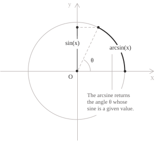
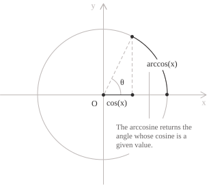
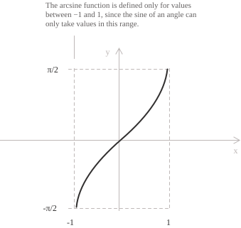
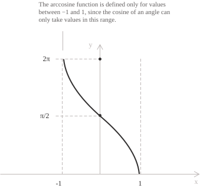

## Arcsine

The arcsine is the inverse of the sine function. Given a number $x \in [-1, 1]$ (i.e., the range of values the sine function can attain), $\arcsin(x)$ is defined as the angle $\theta$ in the interval $[-\pi/2, \pi/2]$ whose sine is equal to $x$. In general, an inverse function](../inverse-function/) reverses the operation of the original: if a function $f$ maps a value $x$ to a value $y$, then its inverse $f^{-1}$ maps $y$ back to $x$. The sine function takes an angle and returns a real number in $[-1, 1]$ and the arcsine does the opposite, returning the angle whose sine equals the given value. This inverse relationship is expressed by the identity:

$$
\sin(\arcsin(x)) = x \quad \forall x \in [-1, 1]
$$

  

In formal terms, the definition of the arcsine is the following:

$$
\arcsin(x) = \theta \quad \iff \quad \sin(\theta) = x \quad \text{and} \quad \theta \in \left[-\frac{\pi}{2}, \frac{\pi}{2}\right]
$$

The restriction of $\theta$ to the interval $\left[-\pi/2, \pi/2 \right]$ is necessary because the sine function is not injective on its full domain. Without this restriction, the inverse would not be well-defined.

- - -

Consider, for example, the computation of $\arcsin(1/2)$. We seek the angle $\theta \in \left[-\pi/2, \pi/2\right]$ such that $\sin(\theta) = 1/2$. From the standard values of the sine function, we know that:

$$
\sin\!\left(\frac{\pi}{6}\right) = \frac{1}{2}
$$

Since $\frac{\pi}{6}$ belongs to the interval $\left[-\pi/2, \pi/2\right]$, it satisfies all the conditions required by the definition. We conclude that:
$$\arcsin\!\left(\frac{1}{2}\right) = \frac{\pi}{6}$$

## Common values of the arcsine

The following table collects the standard values of $\arcsin(x)$ for the most frequently encountered inputs:

$$
\begin{aligned}
x &= -1          &\quad& \arcsin(-1) = -\pi/2 \\
x &= -\sqrt{3}/2 &\quad& \arcsin(-\sqrt{3}/2) = -\pi/3 \\
x &= -1/2        &\quad& \arcsin(-1/2) = -\pi/6 \\
x &= 0           &\quad& \arcsin(0) = 0 \\
x &= 1/2         &\quad& \arcsin(1/2) = \pi/6 \\
x &= \sqrt{3}/2  &\quad& \arcsin(\sqrt{3}/2) = \pi/3 \\
x &= 1           &\quad& \arcsin(1) = \pi/2
\end{aligned}
$$

## Arccosine

The arccosine is the inverse of the cosine function. Given a number $x \in [-1, 1]$ (i.e., the range of values the cosine function can attain), $\arccos(x)$ is defined as the angle $\theta$ in the interval $[0, \pi]$ whose cosine is equal to $x$. As with the arcsine, the restriction of the codomain to $[0, \pi]$ is necessary to ensure that the inverse is well-defined, since the cosine function is not injective on its full domain. The corresponding identity is:

$$
\cos(\arccos(x)) = x \quad \text{for all } x \in [-1, 1]
$$

  

In formal terms, the definition of the arccosine is the following:

$$
\arccos(x) = \theta \quad \text{if and only if} \quad \cos(\theta) = x \quad \text{and} \quad \theta \in [0, \pi]
$$

## Common values of the arccosine

The following table collects the standard values of $\arccos(x)$ for the most frequently encountered inputs:

$$
\begin{aligned}
x &= -1        &\quad& \arccos(-1) = \pi \\
x &= -\sqrt{3}/2 &\quad& \arccos(-\sqrt{3}/2) = 5\pi/6 \\
x &= -1/2      &\quad& \arccos(-1/2) = 2\pi/3 \\
x &= 0         &\quad& \arccos(0) = \pi/2 \\
x &= 1/2       &\quad& \arccos(1/2) = \pi/3 \\
x &= \sqrt{3}/2  &\quad& \arccos(\sqrt{3}/2) = \pi/6 \\
x &= 1         &\quad& \arccos(1) = 0
\end{aligned}
$$

## Properties of the arcsine and arccosine

The arcsine and arccosine functions are related by the following identity, which holds for every $x \in [-1, 1]$:

$$
\arcsin(x) + \arccos(x) = \frac{\pi}{2}
$$

This identity reflects the complementary nature of the two functions: since the sine and cosine of complementary angles are equal, the angle whose sine is $x$ and the angle whose cosine is $x$ always sum to $\pi/2$.

A second property worth noting concerns the composition of a function with its inverse. One direction is straightforward: applying the arcsine after the sine, or the arccosine after the cosine, recovers the original value, provided the argument lies in the appropriate interval. Formally:

$$
\sin(\arcsin(x)) = x \quad \forall x \in [-1, 1]
$$

$$
\cos(\arccos(x)) = x \quad \forall x \in [-1, 1]
$$

The opposite composition, however, does not hold in general. For an arbitrary angle $\theta$, one has:

$$
\arcsin(\sin(\theta)) = \theta \quad \iff  \quad \theta \in \left[-\frac{\pi}{2}, \frac{\pi}{2}\right]
$$

$$
\arccos(\cos(\theta)) = \theta \quad \iff \quad \theta \in [0, \pi]
$$

> Outside these intervals, the arcsine and arccosine return the unique representative of $\theta$ within their respective ranges, not $\theta$ itself. This asymmetry is a direct consequence of the domain restrictions imposed to make the inverses well-defined, and it is what distinguishes a true inverse from a mere left or right inverse.

## Arcsine and arccosine functions

The arcsine function $f(x) = \arcsin(x)$ assigns to each value $x \in [-1, 1]$ the angle $\theta \in \left[-\pi2, \pi/2\right]$ whose sine equals $x$. Its graph is a continuous, strictly increasing curve.

  

+ Domain: $x \in [-1, 1]$
+ Range: $y \in [-\pi/2, \pi/2]$
+ Periodicity: the arcsine function is not periodic.
+ Parity: the function is odd, satisfying $\arcsin(-x) = -\arcsin(x)$.

The arccosine function $f(x) = \arccos(x)$ assigns to each value $x \in [-1, 1]$ the angle $\theta \in [0, \pi]$ whose cosine equals $x$. Its graph is a continuous, strictly decreasing curve.

  

+ Domain: $x \in [-1, 1]$
+ Range: $y \in [0, \pi]$
+ Periodicity: the arccosine function is not periodic.
+ Parity: the function is neither odd nor even, but satisfies the identity $\arccos(-x) = \pi - \arccos(x)$.

> A detailed treatment of the arcsine function](../arcsine-function/) and the arccosine function](../arccosine-function/), including notable values, limits, derivatives, and integrals, is provided in their respective entries.
