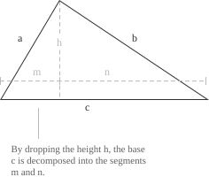

## Definition

The law of cosines relates the sides of any triangle through the angle opposite to one of them. It can be viewed as a generalisation of the Pythagorean theorem](../pythagorean-theorem/), valid not only for right triangles but for every triangle: the square of a side equals the sum of the squares of the other two sides, minus a corrective term that accounts for how open the angle between them is. For a triangle with sides $a, b, c$ and angle $\theta$ opposite to side $c$ the law states:

$$
c^2 = a^2 + b^2 - 2ab \cos(\theta)
$$

When $\theta = 90^\circ$ the cosine term vanishes and the formula reduces exactly to the Pythagorean theorem, which confirms that the law of cosines is a strict generalisation of that result. For any other angle, the corrective term either subtracts from or adds to the sum $a^2 + b^2$, depending on whether $\theta$ is acute or obtuse.

  

To derive the formula, drop the altitude $h$ from the vertex opposite to $c$ to the side $b$. This divides $b$ into two segments: $m = a\cos(\theta)$ and $n = b - a\cos(\theta)$, while the altitude itself satisfies $h = a\sin(\theta)$. Applying the Pythagorean theorem to the right triangle formed by $n$, $h$ and $c$ gives:

$$
\begin{aligned}
c^2 &= n^2 + h^2 \\
&= (b - a\cos(\theta))^2 + (a\sin(\theta))^2 \\
&= b^2 - 2ab\cos(\theta) + a^2\cos^2(\theta) + a^2\sin^2(\theta) \\
&= b^2 - 2ab\cos(\theta) + a^2(\cos^2(\theta) + \sin^2(\theta))
\end{aligned}
$$

Since the Pythagorean identity](../pythagorean-identity/) gives $\sin^2(\theta) + \cos^2(\theta) = 1$, the expression simplifies to:

$$
c^2 = a^2 + b^2 - 2ab\cos(\theta)
$$

> The law of cosines is often used in conjunction with the law of sines](../law-of-sines/), which provides a complementary approach to solving triangles when different combinations of sides and angles are known.

## Example 1

Consider a triangle with sides $a = 8$, $b = 6$ and included angle $\theta = 60^\circ$. The goal is to determine the length of the third side $c$. Substituting the known values into the law of cosines gives:

$$
\begin{aligned}
c^2 &= a^2 + b^2 - 2ab\cos(\theta) \\
&= 64 + 36 - 2(8)(6)\cos(60^\circ) \\
&= 64 + 36 - 96 \cdot \frac{1}{2} \\
&= 100 - 48 \\
&= 52
\end{aligned}
$$

Taking the positive square root, one obtains $c = \sqrt{52} = 2\sqrt{13} \approx 7.21$.

The length of the third side is approximately $7.21$ units.

## Example 2

Consider a triangle with sides $a = 5$, $b = 7$ and $c = 9$. The goal is to determine the angle $\theta$ opposite to side $c$. Solving the law of cosines for $\cos(\theta)$ gives:

$$
\cos(\theta) = \frac{a^2 + b^2 - c^2}{2ab}
$$

Substituting the known values:

$$
\begin{aligned}
\cos(\theta) &= \frac{25 + 49 - 81}{2(5)(7)} \\
&= \frac{-7}{70} \\
&= -0.1
\end{aligned}
$$

Since $\cos(\theta) < 0$, the angle $\theta$ is obtuse. Taking the inverse cosine](../arccosine-function/) yields:

$$
\theta = \arccos(-0.1) \approx 95.7^\circ
$$

The angle opposite to the longest side is approximately $95.7^\circ$.

## Heron's formula

The law of cosines provides a direct route to Heron's formula, which expresses the area of a triangle in terms of the three sides alone, without any reference to angles. For a triangle with sides $a$, $b$, $c$ and area $K$, the formula states:

$$
K = \sqrt{s(s-a)(s-b)(s-c)}
$$

The quantity $s$ is the semi-perimeter of the triangle:

$$s = \frac{a+b+c}{2}$$

The derivation starts from the expression of the area in terms of two sides and the included angle:

$$
K = \frac{1}{2}ab\sin(\theta)
$$

Here $\theta$ denotes the angle opposite to the side $c$, that is, the angle between the sides $a$ and $b$. Squaring both sides and applying the Pythagorean identity](../pythagorean-identity/) to rewrite $\sin^2(\theta)$ as $1 - \cos^2(\theta)$ gives:

$$
4K^2 = a^2b^2(1 - \cos^2(\theta)) = a^2b^2(1 - \cos(\theta))(1 + \cos(\theta))
$$

Solving the law of cosines for $\cos(\theta)$ yields:

$$\cos(\theta) = \frac{a^2 + b^2 - c^2}{2ab}$$

Substituting this value in the two factors produces:

$$
\begin{aligned}
1 - \cos(\theta) &= \frac{2ab - a^2 - b^2 + c^2}{2ab} = \frac{c^2 - (a - b)^2}{2ab} \\
1 + \cos(\theta) &= \frac{2ab + a^2 + b^2 - c^2}{2ab} = \frac{(a + b)^2 - c^2}{2ab}
\end{aligned}
$$

Each numerator factors as a difference of two squares](../notable-products/):

$$
\begin{aligned}
c^2 - (a - b)^2 &= (c - a + b)(c + a - b) \\
(a + b)^2 - c^2 &= (a + b - c)(a + b + c)
\end{aligned}
$$

Substituting these factorisations back into the expression for $4K^2$ and cancelling the common factor $a^2b^2$ in numerator and denominator gives:

$$
16K^2 = (a + b + c)(-a + b + c)(a - b + c)(a + b - c)
$$

Introducing the semi-perimeter $s = \frac{a + b + c}{2}$, the four factors take the compact form $2s$, $2(s - a)$, $2(s - b)$, $2(s - c)$, and the identity becomes:

$$
16K^2 = 16\ s(s - a)(s - b)(s - c)
$$

Dividing by $16$ and taking the positive square root produces Heron's formula in the form stated above.

> The derivation shows that Heron's formula is not an independent result but a purely algebraic consequence of the law of cosines and the Pythagorean identity. The angle has been eliminated through the combined use of these two relations, and only the three sides survive in the final expression.

## Example 3

Consider a triangle with sides $a = 13$, $b = 14$ and $c = 15$. The semi-perimeter is:

$$
s = \frac{13 + 14 + 15}{2} = 21
$$

The three differences with the sides of the triangle are:

$$
s - a = 8, \quad s - b = 7, \quad s - c = 6
$$

Substituting into Heron's formula gives:

$$
\begin{aligned}
K &= \sqrt{21 \cdot 8 \cdot 7 \cdot 6} \\
  &= \sqrt{7056} \\
  &= 84
\end{aligned}
$$

The area of the triangle is $84$ square units. The result is exact and has been obtained without computing any angle, which illustrates the practical advantage of Heron's formula in situations where only the three sides are known.

## Vector interpretation

The law of cosines can be written in terms of vectors and the inner product](../inner-product-spaces/). Consider a triangle with vertex $O$, and let $\vec{u}$ and $\vec{v}$ denote the two sides of length $a$ and $b$ issuing from $O$, so that $a = \|\vec{u}\|$ and $b = \|\vec{v}\|$. The third side of the triangle, of length $c$, is then represented by the vector $\vec{v} - \vec{u}$, which joins the endpoints of $\vec{u}$ and $\vec{v}$. Expanding the squared norm of this vector through the bilinearity of the inner product gives:

$$
\begin{aligned}
\|\vec{v} - \vec{u}\|^2 &= (\vec{v} - \vec{u}) \cdot (\vec{v} - \vec{u}) \\
&= \|\vec{v}\|^2 - 2\vec{u} \cdot \vec{v} + \|\vec{u}\|^2
\end{aligned}
$$

The geometric definition of the inner product states that:

$$\vec{u} \cdot \vec{v} = \|\vec{u}\|\|\vec{v}\|\cos\theta$$

$\theta$ is the angle between the two vectors at $O$, which coincides with the angle between the sides $a$ and $b$ of the triangle. Substituting this identity into the expansion above gives:

$$
c^2 = a^2 + b^2 - 2ab\cos\theta
$$

From this point of view the law of cosines is a reformulation of the identity that defines the inner product in terms of lengths and angles. The corrective term $-2ab\cos\theta$ that distinguishes a generic triangle from a right one is nothing other than $-2\vec{u} \cdot \vec{v}$, and the Pythagorean case corresponds to the situation in which the two vectors are orthogonal, so that $\vec{u} \cdot \vec{v} = 0$.
